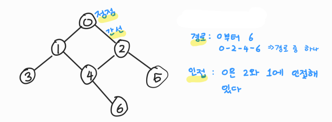
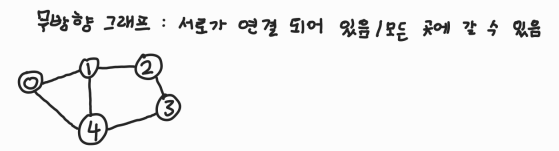
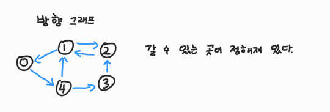
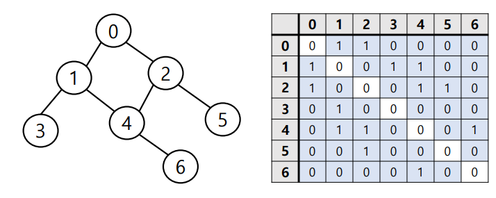

# 📋 Algorithm - 그래프

[그래프에 대한 이해](#%EF%B8%8F-그래프에-대한-이해)

[그래프의 종류](#%EF%B8%8F-그래프의-종류)

[그래프의 표현](#%EF%B8%8F-그래프의-표현)


##  ✔️ 그래프에 대한 이해

> 정점 (Vertex) 또는 노드 (Node)와 이를 연결하는 간선 (Edge)들의 집합으로 이루어진 비선형 자료구조

- 정점 (Vertex) : 간선으로 연결되는 객체이며, 노드(Node)라고도 한다
- 간선 (Edge) : 정점 간의 관계(연결)을 표현하는 선을 의미한다
- 경로 (Path) : 시작 정점부터 도착 정점까지 거치는 정점을 나열한 것을 의미한다
- 인접 (Adjacency) : 두 개의 정점이 하나의 간선으로 직접 연결된 상태를 의미한다




## ✔️ 그래프의 종류

> 무방향 그래프 (Undirected Graph)



- 방향이 없는 가장 일반적인 그래프
- 간선을 통해 양방향의 정점 이동 가능
- 차수 (Degree) : 하나의 정점에 연결된 간선의 개수
- 모든 정점의 차수의 합 = 간선 수 X 2 (무방향 그래프는 서로 왕복할 수 있음. 그래서 2를 곱한다)


> 유방향 그래프 (Directed graph)



- 간선의 방향이 있는 그래프
- 간선의 방향이 가리키는 정점으로 이동 가능
- 차수 (Degree) : 진입 차수와 진출 차수로
  - 진입 차수 (In-degree) : 외부 정점에서 한 점으로 들어오는 간선의 수
  - 진출 차수 (Out-degree) : 한 정점에서 외부 정점으로 나가는 간선의 수


## ✔️ 그래프 표현



### 인접 행렬 (Adjacent matrix)

```python
n = 7 # 정점의 개수
m = 7 # 간선의 개수

graph = [[0] * n for _ in range(n)]

for _ in range(m):
    v1, v2 = map(int, input().split())
    graph[v1][v2] = 1
    graph[v2][v1] = 1
    
# [[0, 1, 1, 0, 0, 0, 0]
# [1, 0, 0, 1, 1, 0, 0]
# [1, 0, 0, 0, 1, 1, 0]
# [0, 1, 0, 0, 0, 0, 0]
# [0, 1, 1, 0, 0, 0, 1]
# [0, 0, 1, 0, 0, 0, 0]
# [0, 0, 0, 0, 1, 0, 0]]
```

- 입력값

`0 1` / `0 2` / `1 3` / `1 4` / `2 4` / `2 5` / `4 6`

- 방향이 무방향임으로 `graph[v1][v2] = 1`  와`graph[v2][v1] = 1`를 해준다
  - v1 과 v2 를 뒤집은 것


### 인접 리스트 (Adjacent list)

```python
n = 7 # 정점의 개수
m = 7 # 간선의 개수

graph = [[] for i in range(N)]

for _ in range(m):
    v1, v2 = map(int, input().split())
    graph[v1].append(v2)
    graph[v2].append(v1)
    
# [[1, 2]
#  [0, 3, 4]
#  [0, 4, 5]
#  [1]
#  [1, 2, 6]
#  [2]
#  [4]]
```

- 입력값

`0 1` / `0 2` / `1 3` / `1 4` / `2 4` / `2 5` / `4 6`

방향이 무방향임으로 `graph[v1].append(v2)` 와 `graph[v2].append(v1)`를 해준다

- v1 과 v2 를 뒤집은 것
