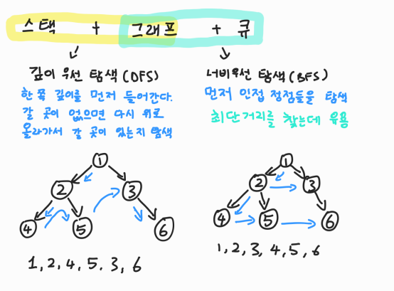

# 📋 Algorithm - 깊이 우선 탐색

[그래프 탐색 알고리즘](#%EF%B8%8F-그래프-탐색-알고리즘)

[깊이 우선 탐색 DFS](#%EF%B8%8F-깊이-우선-탐색-DFS)

[DFS의 동작과정](#%EF%B8%8F-DFS의-동작과정)

[DFS의 구현 방식](#%EF%B8%8F-DFS의-구현-방식)


##  ✔️ 그래프 탐색 알고리즘

- `데이터 구조`는 `알고리즘`의 재료가 되어 **문제를 해결**하는데 사용된다
- 그래프 자료구조는 **탐색 알고리즘**에 활용된다


### 탐색 알고리즘이란?

> 시작 정점에서 간선을 타고 이동할 수 있는 모든 정점을 찾는 알고리즘




## ✔️ 깊이 우선 탐색 DFS

> 시작 정점으로부터 갈 수 있는 하위 정점까지 가장 깊게 탐색하고, 더 이상 갈 곳이 없다면 마지막 갈림길로 돌아와서 다른 정점을 탐색하며 결국 모든 정점을 방문하는 순회 방법이다

- 모든 정점을 방문할 때 유리하다
  - 경우의 수, 순열과 조합 문제에서 많이 사용한다
- 너비 우선 탐색 (BFS)에 비해 코드 구현이 간단하다
  - 하지만 모든 정점을 방문할 필요가 없거나 최단 거리를 구하는 경우에는 BFS가 유리하다


## ✔️ DFS의 동작과정

#### DFS를 하기 전에, 일단 탐색을 진행할 그래프가 필요

- 인접 행렬 또는 인접 리스트 방식으로 표현할 수 있다

- 각 정점을 방문했는지 여부를 판별할 방문 체크 리스트가 필요하다
  - 방문을 안 한 곳을 False, 방문을 한 곳을 True

```python
visited = [False] * n # n은 정점의 개수
```

|   정점 i   |   0   |   1   |   2   |   3   |   4   |  5   |
| :--------: | :---: | :---: | :---: | :---: | :---: | :--: |
| visited[i] | False | False | False | False | False |      |

- 인접 리스트에서, 인덱스를 방문하면서, False인 visited[i]를 True로 바꾼다


[DFS의 사이클]

1. 현재 정점 방문처리
2. 인접한 모든 정점 확인
3. 방문하지 않은 인접 정점 이동


## ✔️ DFS의 구현 방식

```python
visited = [False] * n # n은 정점의 개수
graph = [
    [1,2],
    [0, 3, 4],
    [0, 4, 5],
    [1],
    [1, 2, 6],
    [2],
    [4]
]


def dfs(start):
    stack = [start]
    # 현재 정점 방문 처리
    visited[start] = True
    
    # while문으로 스택이 없어질 때까지 진행을 한다
    # while문이 끝났다는 것은, 모든 연결된 정점들이 확인이 되었다는 것
    while stack:
    	# 현재 정점을 스택에서 가지고 온다
    	current = start.pop()
    	
        # graph에서 current 인덱스인 값들을 가지고 온다
    	for adj in graph[current]:
            # visited[adj] 가 False면 True로 변환하고, 스택에 넣는다
            if visited[adj] == False:
                visited[adj] = True
                stack.append(adj)
                # while문이 계속 돌아갈 수 있도록
```

