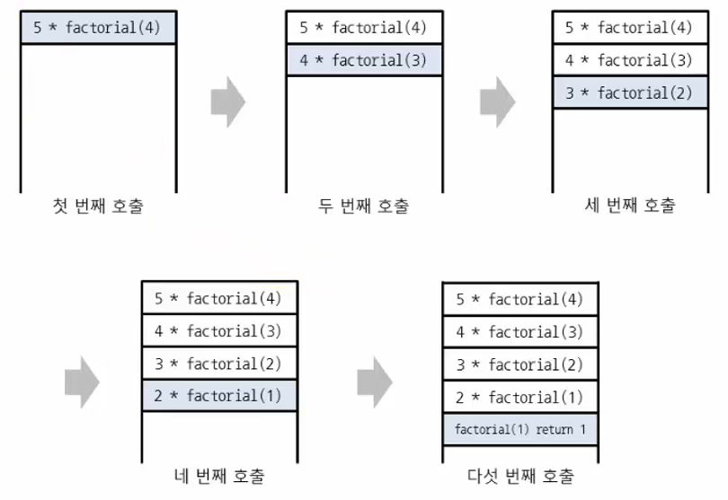
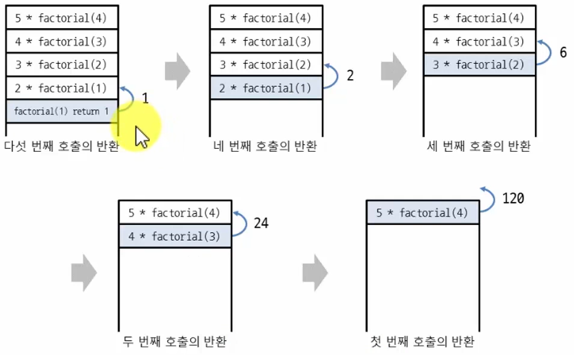
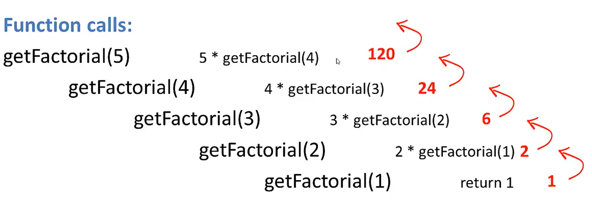

# 📋 Algorithm - 재귀함수

> **자기 자신을 다시 호출하는 함수**
>
> 스택처럼 함수 데이터를 넣고, 하나씩 반환하면서 값을 출력한다

#### 예시

`'나' → 사람 1 → 사람 2 → 사람 3 → 사람 4`

- 한 명씩 거쳐가면서, 앞에 사람이 몇 명인지 물어본다

`'나' ← 사람 1 ← 사람 2 ← 사람 3 ← 사람 4`

- 사람 4에 도달하면, 사람 4가 사람 3한테 자신 밖에 없다고 얘기한다
- 그럼 사람 3은, 자신 앞에 한 명이 있다고 사람 2한테 얘기한다
  - 이것을 반복하면 '나' 앞에 사람이 4명이 있다는 것을 알 수 있다


#### 여기서 제일 중요한 것은, 종료 조건 (내 앞에 아무도 없다)와 진행 조건 (앞에 사람이 있으니 물어본다)가 있다!

 

예시)

```python
def recursive_function():
    print('재귀 함수를 호출합니다.')
    recursive_function()
    # 반복적으로 출력을 하기 위해
    
recursive_function()

# 하지만 파이썬에서는 제한 없이 출력하면, 나중에 에러 매세지가 뜨고, 종료된다
# 컴퓨터 메모리는 제한이 있다.
```

- `recursive_function()` 이라는 함수명을 만든다
- `print('재귀 함수를 호출합니다.')` 를 해서 출력을 한 후
- 다시 `recursive_function()` 함수를 `def`안에 사용하면, `'재귀 함수를 호출합니다'` 가 반복적으로 출력이 된다


### 재귀 함수의 종료 조건

> 재귀 함수를 문제 풀이에서 사용할 때는 재귀 함수의 종료 조건을 반드시 명시해야 한다
>
> 종료 조건을 제대로 명시하지 않으면 **함수가 무한히 호출** 된다

종료 조건을 포함한 예시)

```python
def recursive_function(i):
    # 100번째 호출을 했을 때 종료되는 종료 조건
    if i == 100:
        return
    print(i, '번째 재귀함수에서', i + 1, '번째 재귀함수를 호출합니다.')
    recursive_function(i + 1)
    print(i, '번째 재귀함수를 종료합니다')
    
recursive_function(1)
```


### 팩토리얼 구하기

```python
def factorial(N):
    if N <= 1:
        return 1
    else:
        return N * factorial(N - 1)
        # N! = N * (N-1)!
        # N과 factorial 함수에 n - 1을 넣어서 반환된 값을 곱한다
        
factorial(5)
# 120
```

- `return N * factorial(N - 1)` 부분에서, `factorial(N - 1)` 부분은 자기 자신의 함수를 다시 불러온다
  - 즉 처음에는 `5 * 4` 에서 `5는 N `이고 `4는 factorial(N - 1)`이다
  - 그 이후로 `factorial(N - 1)` 을 곱하면 된다


#### 재귀함수 호출




#### 재귀함수 반환







### 재귀 함수 사용의 유의 사항

- 재귀 함수를 잘 활용하면 복잡한 알고리즘을 간결하게 작성할 수 있다
  - 단, 오히려 다른 사람이 이해하기 어려운 형태의 코드가 될 수도 있으므로 신중하게 사용해야 한다
- 모든 재귀 함수는 반복문을 이용하여 동일한 기능을 구현할 수 있다
- 재귀 함수가 반복문보다 유리한 경우도 있고 불리한 경우도 있다
- 컴퓨터가 함수를 연속적으로 호출하면 컴퓨터 메모리 내부의 스택 프레임에 쌓인다
  - 그래서 스택을 사용해야 할 때 구현상 스택 라이브러리 대신에 재귀 함수를 이용하는 경우가 많다

