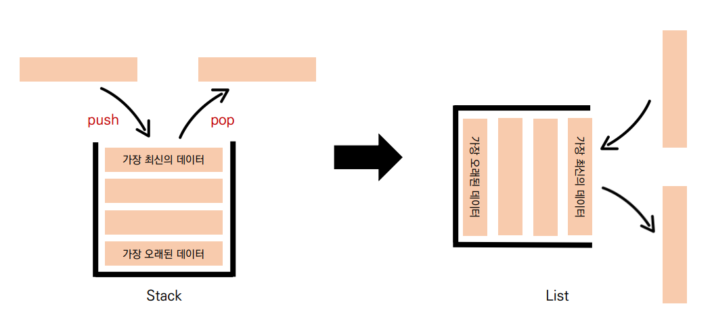
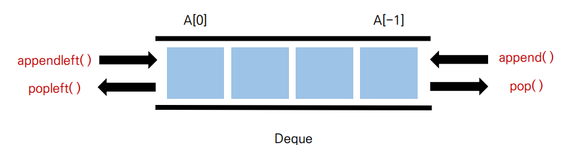

# 📋 Algorithm - 스택, 큐

[코딩 테스트를 위한 데이터 구조와 알고리즘](#%EF%B8%8F-코딩-테스트를-위한-데이터-구조와-알고리즘)

[스택 (Stack)](#%EF%B8%8F-스택-stack)

[큐 (Queue)](#%EF%B8%8F-큐-queue)


## ✔️ 코딩 테스트를 위한 데이터 구조와 알고리즘

> Arry (배열), Linked List (연결리스트), Hash (해시), Stack (스택), Queue (큐),  Priority Queue (우선순위 큐), Heap (힙), Tree (트리), Graph (그래프)

> [기본] 완전탐색, 재귀, 시뮬레이션, 그리디
>
> [심화] DFS, BFS, 백트래킹, 이진탐색, DP, 다익스트라, 크루스칼, 프림


### 🚨🚨 왜 써야하는지? 

> 데이터 구조를 배우는 이유: 왜 만들어졌고, 언제 써야할지 알아내는 것


##  ✔️ 스택 Stack

> LIFO (Last In First Out) 후입 선출 → 마지막에 들어간 것이 먼저 나오는 것
>
> 데이터를 한 쪽에서만 넣고 빼는 자료구조

- Push : 데이터를 스택 안에 넣는 것
- Pop : 데이터를 스택에서 빼는 것 (스택에서는 제일 마지막으로 push 된 것이 pop 된다)


### ✍️ 왜 Stack을 써야 할까?

>  뒤집기, 되돌리기, 되돌아가기

- 데이터가 반대로 돌아가야 할 때
- 예) Browser에 뒤로 돌아가기 (브라우저 히스토리) / ctrl + z


> 마무리 되지 않은 일을 임시 저장

- 일을 마무리 하지 못 하면 스택에 임시 저장하고, 다른 일을 하다가, 다시 stack에서 가지고 올 수 있다
- 예) 괄호매칭, 함수 호출(재귀 호출), 백트래킹, DFS (깊이 우선 탐색)


#### **파이썬은 리스트(List)로 스택을 간편하게 사용할 수 있다**

> 데이터를 `append()` 로 push 하고, `pop()`으로 pop한다
>
> 여기서 `pop()` 은 마지막 데이터를 빼기 때문에 시간 복잡도가 O(1)




## ✔️ 큐 Queue

> FIFO, First In First Out, 선입선출
>
> 가장 오래된 데이터가 제일 먼저 나오는 가료구조

- Dequeue : 데이터를 빼는 것
- Enqueue : 데이터를 넣는 것


#### 큐 자료구조도 파이썬 리스트(List)로 간편하게 사용 할 수 있다

> `append()`로 데이터를 넣는다
>
> `pop(0)`로 가장 오래된 데이터를 뺀다. 하지만 `pop()`이 마지막 인덱스를 빼는 것이 아니기 때문에 시간 복잡도가 O(N)이다
>
> 즉 `pop(0)`을 그대로 사용하면, 비효율적이다.


### Deque, Double-Ended Queue

- 양 방향으로 삽입과 삭제가 자유로운 큐



```python
from collections import deque
# deque를 불러온다

n = [1, 2, 3, 4, 5]
queue = deque(n)
# 리스트 `n`을 deque 함수 안에 넣고, queue 변수로 만든다

queue.popleft() # → 바로 제일 앞에 데이터를 없애준다
```

