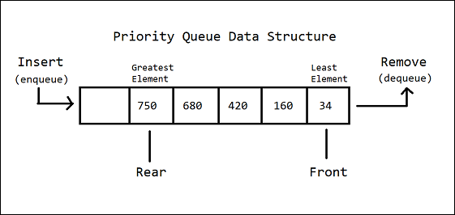
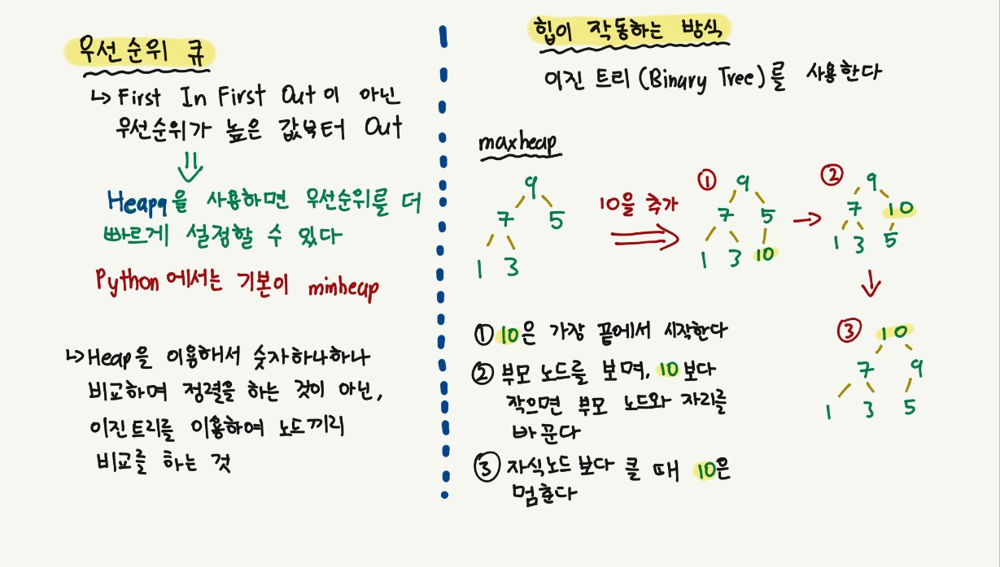
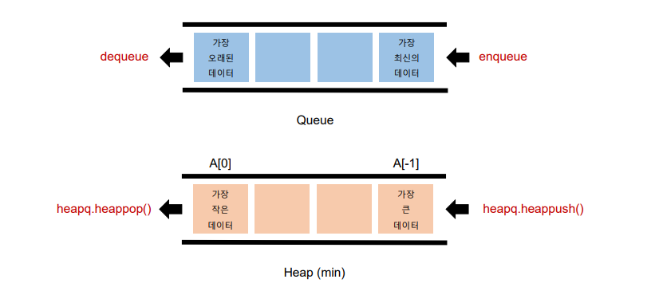

# 📋 Algorithm - 힙, 셋

[힙 (Heap)](#%EF%B8%8F-힙-heap)

​	[우선순위 큐 Priority Queue](#우선순위-큐-priority-queue)

​	[힙의 특징 Heap](#힙의-특징-heap)

[셋 (set)](#%EF%B8%8F-셋-set)


##  ✔️ 힙 Heap

#### 우선순위 큐 Priority Queue

> 우선순위 (중요도, 크기 등 순서 이외의 기준)를 기준으로 가장 우선순위가 높은 데이터가 가장 먼저 나가는 방식



- **순서가 아닌 우선순위를 기준으로 가져올 요소를 결정(dequeue)하는 큐**
  - **가중치가 있는 데이터**
    - 큰 데이터를 먼저 처리하거나, 작은 데이터를 먼저 처리하는 것
  - **작업 스케줄링**
    - 늦게 들어왔지만, 더 중요해서 더 빠르게 끝내야 할 경우
  - **네트워크**


### 우선순위 큐를 구현하는 방법

- **배열 (Array)**
  - 정렬을 한 후 `O(N)`, 데이터를 빼거나 `O(1)`
  - 데이터를 넣은 후 `O(1)`, 나오는 우선순위 대로 뺀다 `O(N)`

- **연결 리스트 (Linked List)**

- **힙(Heap)**

| 연산 종류                | Enqueue (추가) | Dequeue     |
| ------------------------ | -------------- | ----------- |
| 배열 (Array)             | O(1)           | O(N)        |
| (정렬된 배열)            | O(N)           | O(1)        |
| 연결리스트 (Linked List) | O(1)           | O(N)        |
| (정렬된 연결리스트)      | O(N)           | O(1)        |
| **힙(Heap)**             | **O(logN)**    | **O(logN)** |



### 힙의 특징 Heap

> 최대값 또는 최소값을 빠르게 찾아내도록 만들어진 데이터 구조
>
> 완전 이진 트리의 형태로 <u>느슨한 정렬 상태를 지속적으로 유지</u>한다
>
> 힙 트리에서는 중복 값을 허용한다

#### 🚨뒤에는 모르지만 항상 가장 앞이 heap[0]이 가장 작다.🚨

- **파이썬 힙은 '최소힙 (minheap)'이다**


### 힙은 언제 사용하나

> 1. 데이터가 지속적으로 정렬되야 하는 경우
> 2. 데이터에 삽입/삭제가 빈번할때


### Heapq 모듈

> Minheap (최소 힙)으로 구현되어 있음 (가장 작은 값이 먼저 옴)
>
> 삽입, 삭제, 수정, 조회 **연산의 속도가 리스트보다 빠르다**

| 연산 종류   | 힙(Heap) | 리스트(List) |
| ----------- | -------- | ------------ |
| Get Item    | O(1)     | O(1)         |
| Insert Item | O(logN)  | O(1) or O(N) |
| Delete Item | O(logN)  | O(1) or O(N) |
| Search Item | O(N)     | O(N)         |



```python
import heapq
# 힙을 불러온다

numbers = [5, 3, 2, 4, 1]

heapq.heapify(numbers)
# numbers를 heap으로 만들어준다

heapq.heappop(numbers)
# heap으로 만든 numbers에서 제일 앞에 있는 값을 뺀다

heapq.heappush(numbers, 10)
# heap에 10을 추가한다
```

**heapq은 destructive method이다**

- 원본을 회손하고, 원래 자료에서 heap을 만드는 것이다
- 해당 메서드에 변수를 주면 `None` 이 출력된다


## ✔️ 셋 Set

> '집합'을 나타내는 데이터 구조로 Python에서는 기본적으로 제공되는 데이터 구조
>

### 셋은 언제 사용해야할까

**1. 데이터 중복이 없어야 할 때 (고유값들로 이루어진 데이터가 필요할때)**

**2. 정수가 아닌 데이터의 삽입/삭제/탐색이 빈번히 필요할 때**


### 셋 연산의 시간 복잡도

| 연산 종류                          | 시간복잡도 | 연산        |
| ---------------------------------- | ---------- | ----------- |
| 탐색                               | O(1)       |             |
| 추가                               | O(1)       | `.add()`    |
| 제거                               | O(1)       | `.remove()` |
| 합집합 (Union)                     | O(N)       | `+`         |
| 교집합 (Intersection)              | O(N)       | `-`         |
| 차집합 (Difference)                | O(N)       | `&`         |
| 대칭 차집합 (Symmetric Difference) | O(N)       | `^`         |


