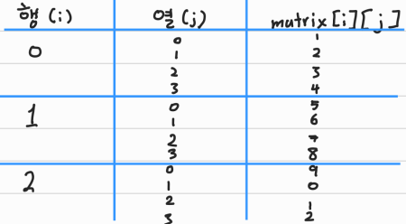
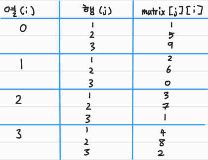
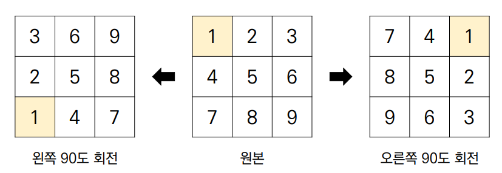

# 📋 Algorithm - 이차원 리스트

[순회](#%EF%B8%8F-순회)

[전치](#%EF%B8%8F-전치)

[회전](#%EF%B8%8F-회전)


##  ✔️ 순회

> 이차원 리스트를 단순히 출력

```python
matrix = [
    [1, 2, 3, 4],
    [5, 6, 7, 8],
    [9, 0, 1, 2]
]

print(matrix)
# [[1, 2, 3, 4],[5, 6, 7, 8], [9, 0, 1, 2]]
```


> 인덱스를 통해 각각 출력하기

```python
matrix = [
    [1, 2, 3, 4],
    [5, 6, 7, 8],
    [9, 0, 1, 2]
]

print(matrix[0][0], matrix[0][1], matrix[0][2], matrix[0][3])
print(matrix[1][0], matrix[1][1], matrix[1][2], matrix[1][3])
print(matrix[2][0], matrix[2][1], matrix[2][2], matrix[2][3])

# 1 2 3 4
# 5 6 7 8
# 9 0 1 2
```


> 이중 for문을 이용한 **행 우선 순회**

```python
matrix = [
    [1, 2, 3, 4],
    [5, 6, 7, 8],
    [9, 0, 1, 2]
]

for i in range(3):	# 행
    for j in range(4):	# 열
        print(matrix[i][j], end = ' ')
    print()

# 1 2 3 4
# 5 6 7 8
# 9 0 1 2   
```

- `for i in range(3)` 이 기준점이 된다.
  - 즉 `for j in range(4)` 에서 다 돌 때까지, `i`는 멈춰있는다




> 이중 for문을 이용한 열 우선 순회

```python
matrix = [
    [1, 2, 3, 4],
    [5, 6, 7, 8],
    [9, 0, 1, 2]
]

for i in range(4): # 열
    for j in range(3): # 행
        print(matrix[j][i], end = ' ')
    print()

# 1 5 9
# 2 6 0
# 3 7 1
# 4 8 2
```

- `for i in range(4)` , 열이 기준이 되어 순회한다
  - `for j in range(3)` 행에서 순회를 다 돌면 다시 `i`로 간다
  - `matrix[j][i]`로 있는건 여기서 `행, 열` 순으로 인덱스를 써야 하기 때문




> 행 우선 순회를 이용해 이차원 리스트 총합 구하기

```python
matrix = [
    [1, 1, 1, 1],
    [1, 1, 1, 1],
    [1, 1, 1, 1]
]

total = 0

for i in range(3):
    for j in range(4):
        total += matrix[i][j]

print(total)
# 12

--------------------------------------------------------
total = sum(map(sum, matrix))
# 이렇게도 구할 수 있다

print(total)
# 12
```


> 최대값, 최소값 구하기

```python
# 최대값

matrix = [
    [0, 5, 3, 1],
    [4, 6, 10, 8],
    [9, -1, 1, 5]
]

max_value = 0

for i in range(3):
    for j in range(4):
        if matrix[i][j] > max_value:
            max_value = matrix[i][j]

print(max_value)
# 10

------------------------------------------------------------
# 최소값

matrix = [
    [0, 5, 3, 1],
    [4, 6, 10, 8],
    [9, -1, 1, 5]
]

min_value = 0

for i in range(3):
    for j in range(4):
        if matrix[i][j] < min_value:
            min_value = matrix[i][j]

print(min_value)
# -1
```


## ✔️ 전치

> 전치 (Transpose)란 행렬의 행과 열을 서로 맞바꾸는 것을 의미

```python
matrix = [
    [1, 2, 3, 4],
    [5, 6, 7, 8],
    [9, 0, 1, 2]
]

# 원래 행열과 반대인 행렬로 되어 있는 리스트르 만든다
transpose_matrix = [[0] * 3 for _ in range(4)]

for i in range(4):
    for j in range(3):
        transpose_matrix[i][j] = matrix[j][i]
        # 행과 열을 바꾸는 것
        
# traspose_matrix
# [[1, 5, 9]
# [2, 6, 0]
# [3, 7, 1]
# [4, 8, 2]]
```


## ✔️ 회전

>이차원 리스트를 왼쪽, 오른쪽으로 90도 회전하는 경우가 존재한다



```python
# 왼쪽으로 90도 회전
matrix = [
    [1, 2, 3],
    [4, 5, 6],
    [7, 8, 9]
]

n = 3
rotated_matrix = [[0] * n for i in range(n)]

for i in range(n):
    for j in range(n):
        rotated_matrix[i][j] = matrix[j][n - i - 1]
-------------------------------------------------------

# 오른쪽으로 90도 회전
matrix = [
    [1, 2, 3],
    [4, 5, 6],
    [7, 8, 9]
]

n = 3
rotated_matrix = [[0] * n for i in range(n)]

for i in range(n):
    for j in range(n):
        rotated_matrix[i][j] = matrix[n - j - 1][i]
```

