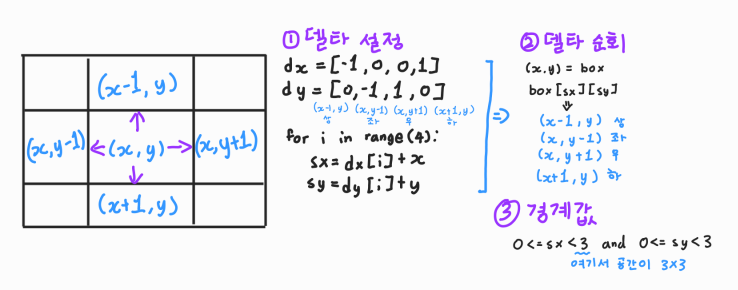

# 📋 Algorithm - 완전탐색 1

[무식하게 풀기](#%EF%B8%8F-무식하게-풀기)

[델타 탐색](#%EF%B8%8F-델타-탐색)


##  ✔️ 무식하게 풀기

> 모든 경우의 수를 탐색해서 문제를 해결
>
> 알고리즘의 기초이다

- Brute-Force 라고도 한다
- 단순 조건문과 반복문을 이용해서 풀 수 있다
- **아이디어를 어떻게 코드로 구현할 것인지가 중요하다**


## ✔️ 델타 탐색

> 이차원 리스트에서 원소들을 순회하며, 상하좌우에 위치한 다른 지점을 조회하거나 이동하는 방식

1. **델타 설정 **
2. **델타 순회** 
3. **경계값** : 이차원 리스트 밖으로 탐색을 안 하기 위해 (out of range)



```python
# 델타값 정의 (상하좌우)
dx = [-1, 1, 0, 0]
dy = [0, 0, -1, 1]

# 이차원 리스트 순회
for x in range(n):
    for y in range(m):
        
        # 델타값을 이용해 상하좌우 이동
        for i in range(4):
            sx = dx[i] + x
            sy = dy[i] + y
            
            # 범위를 벗어나지 않으면 갱신
           if 0 <= sx < n and 0 <= sy < n:
            x = sx
            y = sy
```

