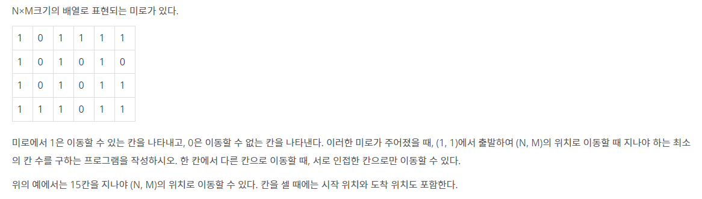

# ✍️ 문제풀이

[2178 미로 탐색](#2178-미로-탐색)

[1926 그림](#1926-그림)


## 백준 풀이

### 2178 미로 탐색



```python
# 또는 도착 위치 (n - 1, m - 1)
n, m = map(int, input().split())

maze = [list(map(int, input())) for _ in range(n)]

visited = [[0] * m for _ in range(n)]

# delta search
dr = [-1, 1, 0, 0]
dc = [0, 0, -1, 1]
# 좌표를 스택에 넣어서 dfs를 한다

stack = [(0, 0)]
visited[0][0] = 1

while len(stack) != 0:
    row, column = stack.pop(0)
    # 맨 앞에 있는 것을 빼낸다

    if row == n - 1 and column == m - 1:
        break

    for i in range(4):
        sr = dr[i] + row
        sc = dc[i] + column

        if 0 <= sr < n and 0 <= sc < m:
            if visited[sr][sc] == 0 and maze[sr][sc] == 1:
                stack.append((sr, sc))
                visited[sr][sc] = visited[row][column] + 1

print(visited[n - 1][m - 1])
```

#### 🚨🚨 Main Point 🚨🚨

**DFS를 하면서, 델타 탐색을 한다**

- 기존 DFS랑 다른 것은, `stack`에서 제일 앞의 값을 빼낸다
  - `stack.pop(0)` 👉 항상 `pop()`을 맨 뒤에서 한다고 생각하지 말기!

- 그리고 빼낸 값에서 델타 탐색을 한다
  - 같은 값이 있고, `visited`에 `0` 이면, 해당 `visited`에는 1을 더하고, 좌표를 stack에 넣은다


### 1926 그림

```python
n, m = map(int, input().split())

portrait = [list(map(int, input().split())) for _ in range(n)]

visited = [[False] * m for _ in range(n)]

# delta 탐색 (4면)
dr = [-1, 0, 0, 1]
dc = [0, -1, 1, 0]

portrait_size = []

for row in range(n):
    for column in range(m):

        if portrait[row][column] == 1 and visited[row][column] == False:
            stack = [(row, column)]
            visited[row][column] = True

            size_cnt = 1

            while stack:
                r, c = stack.pop()

                for i in range(4):
                    sr = r + dr[i]
                    sc = c + dc[i]

                    if 0 <= sr < n and 0 <= sc < m:
                        if visited[sr][sc] == False and portrait[sr][sc] == 1:
                            stack.append((sr, sc))
                            visited[sr][sc] = True
                            size_cnt += 1
        
            portrait_size.append(size_cnt)

if len(portrait_size) == 0:
    print(len(portrait_size))
    print(0)
else:
    print(len(portrait_size))
    print(max(portrait_size))
```

#### 🚨🚨 Main Point 🚨🚨

**미로와 비슷하다. DFS 안에 델타 탐색을 하기!**

- DFS를 하면서 작품의 크기를 구하고, DFS가 끝나면 리스트 안에 넣는다
