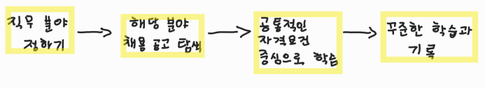

# 📝 특별 강의

[7월 8일](#7월-8일)

## ✔️ 7월 8일

- 요즘은 회사에 들어가지 않아도 **기술을 배우고 활용할 수 있는 시대**

  📌 **프로젝트**를 잘 관리하는게 중요해졌다 (Github를 통해)

### 취업을 위한 학습 전략 수립

학습 공식 👉 *공고*  -  *내가 가진 스킬*  =  *내가 없는 스킬*  =  *학습해야 하는 것*

### 취업 절대 공식

1. Github TIL을 1.5년 이상 지속
2. (나의 언어로) 타인에게 설명할 수 있는 SW역량
3. 유저가 실사용 하는 프로젝트를 개발하고 유지 (어플리케이션 아니면 웹사이트 만들어보기)

### 준비?

#### 🚨🚨🚨**꾸준히 할것**🚨🚨🚨

