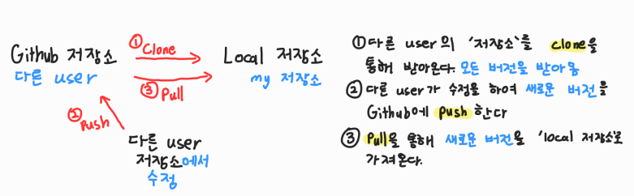
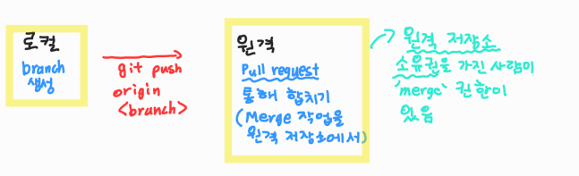
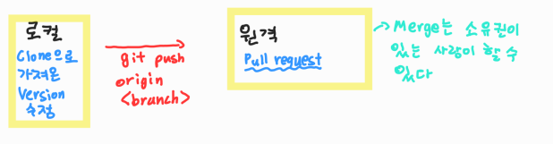

# 📝 Github (Branch)

[Branch란?](#branch란)

[병합 시나리오](#병합-시나리오)

[Branch 사용](#branch-사용)

[Clone (복제)](#clone-복제)

[Github Flow](#github-flow)


## ✔️ Branch란?

> Branch의 목적은 독립적인 버전(커밋)을 만드는 것
>
> Branch Merge: 독립적인 버전들을 하나로 합치는 것

- `메인 프로젝트`를 방해 안 하면서, 프로젝트 안에 있는 부분들을 수정할 수 있다

- 이후 `merge`를 통해 `부분 프로젝트`를 `메일 프로젝트`와 병합할 수 있다

  📌협업할 때 유용


## ✔️ 병합 시나리오


​	🚨**상황 1.** 혼자서 모든 프로젝트를 진행. 따라서 파일 간 충돌할 가능성이 없음 

​	🚨**상황 2.** 프로젝트를 진행하는데, ***각자 다른 파일을 수정***. 충돌하지 않는다.      					

​	🚨**상황 3.** 프로젝트를 진행하는데, ***똑같은 파일 수정***. 이 파일은 충돌하고, 직접 수작업으로 충돌					  한 것을 해결해야 한다.

`branch`를 `merge`한 경우 **상황 1과 상황 2**는 충돌하지 않는다

반대로 **상황 3**은 충돌하는데, `git status`를 통해 어떤게 충돌하는지 알 수 있고, 해결 후 `merge` 진행이 가능하다.


## ✔️ Branch 사용

```bash
$ git branch								# 브랜치 조회

$ git branch <branch name>			 		# 브랜치 생성

$ git checkout <branch name>				# <브랜치 이름>으로 이동
	# 브랜치를 생성하고, 그 브랜치로 들어가서 파일을 수정한다

$ git checkout -b <branch name>		 
	# $ git branch <branch 이름> + $ git checkout <branch 이름>
	# 새로운 브랜치를 생성하고, 그 브랜치로 이동할 것

$ git merge <branch name>			 		# <브랜치 이름>, master와 병합

$ git branch -d <branch name>		 		# <브랜치 이름> 삭제
	# 브랜치만 없어진다
	# 왠만하면 병합하고 지운다
```

1. **브랜치를 생성한다**
2. **생성한 브랜치에 들어간다**
3. **브랜치에서 파일을 수정 후, add, commit을 한다**

4. **그 후 master로 이동한 후 `merge`한다**
5. **브랜치를 삭제한다**


## ✔️ Clone (복제)

> Clone은 원격 저장소에 저장된 저장소를 로컬 저장소에 가지고 오는 것이다
>
> Pull과 다른점은, Pull은 `커밋된 버전`만 받아오고 / Clone은 `저장소`를 받아온다


- 여기서 조장은 `로컬 저장소`에서 `원격 저장소`에 파일을 `push`한다
- 조원은 `clone`을 통해 조장이 올려놓은 저장소, 즉 모든 버전(커밋)을 조원의 `로컬 저장소`에 가지고 올 수 있다




- **다른 user**의 `저장소`에서 `clone`을 통해 **내 로컬 저장소**에 다른 **user의 저장소**를 가지고 온다
- **다른 user**가 이후 새로운 커밋을 하여, `원격 저장소`에 `push`한다
- **나**는 `pull`을 통해 **다른 user**가 업데이트한 커밋도 가지고 올 수 있다


## ✔️ Github Flow

> 1. Featured Branch Workflow - 원격 저장소의 소유권을 본인이 소유
>
> 2. Forking Workflow - 원격 저장소의 소유권이 타인에게 있는 경우


### 🌿Featured Branch Workflow



- 로컬 저장소에서 `branch`를 만들어 `git push origin <branch name>`으로 `push`한다
- 원격 저장소 소유권이 본인임으로, **Pull Request**에서 본인이 `merge`를 할 수 있다


### 🌿Forking Workflow



1. 다른 user의 원격 저장소에서 **FORK**를 한다 (우측 상단에 `fork`)
2. **Fork**한 저장소의 주소를 `clone`을 통해 내 로컬 저장소에 가져온다
3. `branch`를 생성
4. `branch`에 파일 수정 및 추가 (add, commit)
5. `git push origin <branch>`
6. 원격 저장소에서 `compare&pull request`(초록색 버튼)를 누른 후, `pull request`를 요청한다
7. 원격 저장소의 소유주가 `merge`를 할 수 있다