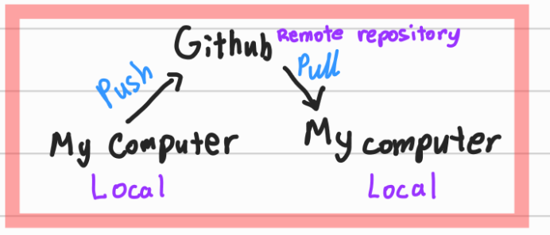

# 📝 Github


## ✔️ Github이란?

> Git과 같은 version (커밋)을 관리한다
>
> Github = Remote Repository (원격 저장소)


## ✔️ How it works?

> Github는 Remote (원격) Repository (저장소)이다
>
> 커밋을 보내고 받을 수 있다



1. 커밋을 원격 저장소에 보내는 것을 `PUSH`
2. 커밋을 원격 저장소에서 받으면 `PULL`


### 📌 원격 저장소 (Github)에 커밋을 PUSH 하는 방법

> 1. 먼저 원격 저장소를 만든다 (Github 내에 new repository)
> 2. 로컬 저장소의 version을 원격 저장소로 PUSH 한다

`https://github.com/jejoonlee/test.git`

이 주소에 jejoonlee = Github의 username   /   test.git = 저장소 이름

```bash
$ git remote add origin https://github.com/jejoonlee/test.git
	# remote = 원격저장소   /   add = 추가하다   /   origin = origin으로
	# 깃아 원격저장소에 origin으로 추가
	
$ git push <원격저장소이름> <브랜치이름>
	# 원격저장소 이름 = origin   /   브랜치이름 = master
	
$ git remote -v
	#원격저장소 확인
```

👉 `$ git remote add origin ....` 한번만 세팅해 놓으면 됨

👉`$ git push origin master` 버전이 수정될때마다 원격저장소에 보내고 싶으면, 입력을 해야 한다

​	🚨다 하기 전에 꼭, `git init` , `git add .` , `git commit` 을 할 것 

​	🚨 .git → 각각 원격 저장소를 만들어야 한다


## ✔️ .gitignore

> 버전이랑 상관없는 파일이 있을 때 사용

- .gitignore 파일을 만든다 `$ touch .gitignore`
- 생성된 파일 안에 버전 관리가 필요 없는 파일/폴더 이름을 넣으면 된다
- BUT, 이미 커밋을 하면 수정된 것이 track이 된다

[.gitignore](https://www.toptal.com/developers/gitignore/)