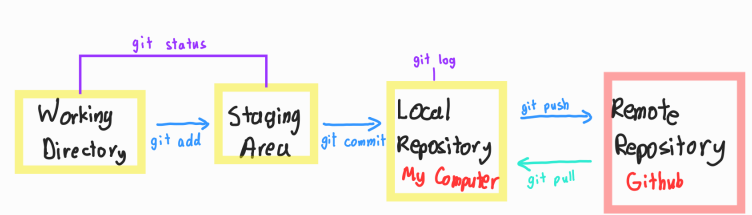
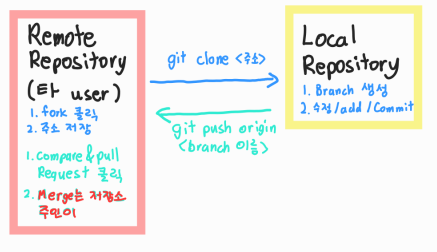

# 📝 Git 정리

[CLI 명령어](#cli-명령어)

[Git 기초 명령어 (로컬 저장소 내)](#git-기초-명령어-로컬-저장소-내)

[Git 기초 명령어 (로컬 저장소에서 원격 저장소로)](#git-기초-명령어-로컬-저장소에서-원격-저장소로)

[Git Summary](#git-summary)

[Forking Workflow](#forking-workflow)

## ✔️ CLI 명령어

| 명령어     | 내용                    | 상세                                       |
| ---------- | ----------------------- | ------------------------------------------ |
| pwd        | print working directory | 현재 directory(폴더/파일) 출력             |
| cd         | change directory        | 디렉토리 이동 (cd .. = 뒤로가기)           |
| ls         | list                    | 목록                                       |
| mkdir      | make direction          | 폴더 생성                                  |
| touch      | touch                   | 파일 생성                                  |
| /          |                         | 뛰어 쓰기 공백                             |
| rm / rm -r | remove                  | 파일 지우기 / rm -r 폴더이름 = 폴더 지우기 |

## ✔️Git 기초 명령어 (로컬 저장소 내)

| 명령어                                              | 내용                                                         |
| --------------------------------------------------- | ------------------------------------------------------------ |
| `$ git config --global user.name 'Github username'` | Git 최초 설정                                                |
| `$ git config --global user.email 'Github email'`   | Git 최초 설정                                                |
| `$ git config --global --list`                      | 설정 확인                                                    |
| `$ git init`                                        | .git 폴더 생성 (이후 master 표기 됨)                         |
| `$ git status`                                      | 상태 확인 (modified, untracked, staged로 파일의 현 상태 확인) |
| `$ git add .`                                       | working directory에서 staging area(임시 장소)로 보내기       |
| `$ git commit -m '메세지'`                          | 커밋을 통해 버전으로 기록 (로컬 저장소에 저장)               |
| `$ git log`                                         | 저장소에 기록된 커밋 조회                                    |
| `$ git log -1`                                      | 최근 한 개의 커밋                                            |
| `$ git log --oneline`                               | 커밋을 한 줄로                                               |
| `$ git log -2 --oneline `                           | 최근 두 개의 커밋을 한 줄씩                                  |
|                                                     |                                                              |

## ✔️Git 기초 명령어 (로컬 저장소에서 원격 저장소로)

| 명령어                                       | 내용                                                         |
| -------------------------------------------- | ------------------------------------------------------------ |
| `$ git remote add origin <원격 저장소 주소>` | 버전을 보낼 원격 저장소 세팅 (한번만 세팅하면 됨)            |
| `$ git push <원격저장소이름> <브랜치이름>`   | 주로 `git push origin master` 이고, 버전을 원격 저장소로 `push` 한다 |
| `$ git remote -v`                            | 원격 저장소 확인                                             |
|                                              |                                                              |
| `$ git branch`                               | 브랜치 조회                                                  |
| `$ git branch <branch name>`                 | 브랜치 생성                                                  |
| `$ git checkout <branch name>`               | <브랜치 이름>으로 이동                                       |
| `$ git checkout -b <branch name>`            | 브랜치를 생성하고, 브랜치로 이동                             |
| `$ git merge <branch name>`                  | <브랜치 이름>, master와 병합                                 |
| `$ git branch -d <branch name>`              | <브랜치 이름> 삭제                                           |

## ✔️Git Summary 

## ✔️Forking Workflow

