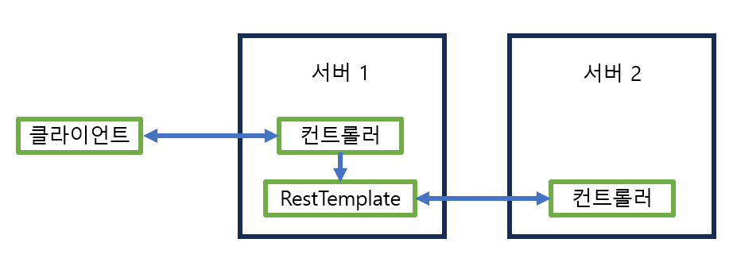

# 스프링 부트 핵심 가이드


# [스프링 부트 핵심 가이드] Chapter 12장. 서버 간 통신


#### 최근 서비스들은 마이크로 서비스 아키텍처 (MSA)를 주로 채택하고 있다

- 이 뜻은 어플리케이션이 가지고 있는 기능 (서비스)이 하나의 비즈니스 범위만 가지는 형태이다
- 이런 MSA를 도와주는 RestTemplate과 WebCilent가 있다


## RestTemplate이란?


#### 스프링에서 HTTP 통신 기능을 손쉽게 사용하도록 설계된 템플릿이다

- 서버와의 통신을 단순화한 템플릿을 사용하여 RESTful 원칙을 따르는 서비스를 편리하게 만들 수 있다

- 기본적으로 동기 방식이고, 비동기 방식으로 바꾸기 위해서는 AsyncRestTemplate을 사용하면 된다
- 하지만 RestTemplate은 중단된 상태라서 WebClient 방식도 알아두는게 좋다


#### RestTemplate의 특징

- HTTP 프로토콜의 메서드에 맞는 여러 메서드를 제공한다
- RESTful 형식을 갖춘 템플릿이다
- HTTP 요청 후 JSON, XML, 문자열 등의 다양한 형식으로 응답을 받을 수 있다
- 블로킹 (Blocking) I/O 기반의 동기 방식을 사용한다
- 다른 API를 호출할 때 HTTP 헤더에 다양한 값을 설정할 수 있다


#### RestTemplate의 동작 원리

.png)

- 어플리케이션에서 RestTemplate을 선언하고 URI와 HTTP 메서드, Body 등을 설정한다
- 외부 API로 요청을 보내게 되면 RestTemplate에서 HttpMEssageConverter를 통해 RequestEntity를 요청 메세지로 변환한다
- RestTemplate에서는 변환된 요청 메세지를 ClientHttpRequestFactory를 통해 ClientHttpRequest로 가져온 후 외부 API로 요청을 보낸다
- 외부에서 요청에 대한 응답을 받으면 RestTemplate은 ResponseErrorHandler로 오류를 확인하고, 오류가 있으면 ClientHttpResponse에서 응답 데이터를 처리한다
- 응답 데이터가 정상적이라면 다시 한번 HttpMessageConverter를 거쳐 자바 객체로 변환해서 어플리케이션으로 반환한다


#### RestTemplate의 대표적인 메서드

| 메서드          | HTTP 형태 | 설명                                                         |
| --------------- | --------- | ------------------------------------------------------------ |
| getForObject    | GET       | GET 형식으로 요청한 결과를 객체로 반환                       |
| getForEntity    | GET       | GET 형식으로 요청한 결과를 ResponseEntity 결과를 반환        |
| postForLocation | POST      | POST 형식으로 요청한 결과를 헤더에 저장된 URI로 반환         |
| postForObject   | POST      | POST 형식으로 요청한 결과를 객체로 반환                      |
| postForEntity   | POST      | POST 형식으로 요청한 결과를 ResponseEntity 형식으로 반환     |
| delete          | DELETE    | DELETE 형식으로 요청                                         |
| put             | PUT       | PUT 형식으로 요청                                            |
| patchForObject  | PATCH     | PATCH 형식으로 요청한 결과를 객체로 반환                     |
| optionsForAllow | OPTIONS   | 해당 URI에서 지원하는 HTTP 메서드를 조회                     |
| exchange        | any       | HTTP 헤더를 임의로 추가할 수 있고, 어떤 메서드 형식에서도 사용할 수 있음 |
| execute         | any       | 요청과 응답에 대한 콜백을 수정                               |


## RestTemplate 사용하기


#### 서버 프로젝트 생성하기

- 서버 프로젝트를 하나 만들고 RestTemplate을 통해 요청을 보내는 방식
- 실습 환경에서는 한 컴퓨터 안에 두 개의 프로젝트를 가동시켜야 해서, 톰캣의 포트를 9090으로 변경한다
  - application.properties에서 server.port=9090


##### CrudController

```java
@RestController
@RequestMapping("/api/v1/crud-api")
public class CrudController {

    // 아무 파라미터가 없는 경우
    @GetMapping
    public String getName(){
        return "Flature";
    }

    // PathVariable
    @GetMapping(value = "/{variable}")
    public String getVariable(@PathVariable String variable){
        return variable;
    }

    // RequestParam 사용 경우
    @GetMapping("/param")
    public String getNameWithParam(@RequestParam String name){
        return "Hello. " + name + "!";
    }

    // 요청 파라미터와 요청 바디를 같이 받는 경우
    @PostMapping
    public ResponseEntity<MemberDto> getMember(
            @RequestBody MemberDto request,
            @RequestParam String name,
            @RequestParam String email,
            @RequestParam String organization
    ){
        System.out.println(request.getName());
        System.out.println(request.getEmail());
        System.out.println(request.getOrganization());

        MemberDto memberDto = new MemberDto();
        memberDto.setName(name);
        memberDto.setEmail(email);
        memberDto.setOrganization(organization);

        return ResponseEntity.status(HttpStatus.OK).body(memberDto);
    }

    // 임의의 HTTP 헤더를 받도록 함
    @PostMapping(value = "/add-header")
    public ResponseEntity<MemberDto> addHeader(@RequestHeader("my-header") String header,
                                               @RequestBody MemberDto memberDto){
        System.out.println(header);
        return ResponseEntity.status(HttpStatus.OK).body(memberDto);
    }
}
```


##### MemberDto

```java
@Setter
@Getter
public class MemberDto {
    
    private String name;
    private String email;
    private String organization;

    @Override
    public String toString() {
        return "MemberDto{" +
                "name='" + name + '\'' +
                ", email='" + email + '\'' +
                ", organization='" + organization + '\'' +
                '}';
    }
}
```


#### RestTemplate 구현하기





- RestTemplate은 별도의 유틸리티 클래스를 생성하거나, 서비스 또는 비즈니스 계층에서 구현된다
- 앞서 생성한 서버 프로젝트에 요청을 날리기 위해 서버의 경할을 수행하면서 달느 서버로 요청을 보내는 클라이언트의 역할도 수행하는 새로운 프로젝트를 생성해야 한다
- 위에 구현한 서버 프로젝트는 **서버2**가 된다
- RestTemplate은 spring-boot-starter-web 모듈에 포함되어 있는 기능으로 별도의 의존성 추가는 필요가 없다


##### GET 형식의 RestTemplate 작성

```java
@Service
public class RestTemplateService {

    public String getName(){
        URI uri = UriComponentsBuilder
                .fromUriString("http://localhost:9090")
                .path("/api/v1/crud-api")
                .encode()
                .build()
                .toUri();

        RestTemplate restTemplate = new RestTemplate();
        ResponseEntity<String> responseEntity = restTemplate.getForEntity(uri, String.class);

        return responseEntity.getBody();
    }
    
    public String getNameWithPathVariable(){
        URI uri = UriComponentsBuilder
                .fromUriString("http://localhost:9090")
                .path("/api/v1/crud-api/{name}")
                .encode()
                .build()
                .expand("Flature") // 복수의 값을 넣어야 할 경우 ,를 추가하여 구분
                .toUri();
        
        RestTemplate restTemplate = new RestTemplate();
        ResponseEntity<String> responseEntity = restTemplate.getForEntity(uri, String.class);
        
        return responseEntity.getBody();
    }
    
    public String getNameWithParameter(){
        URI uri = UriComponentsBuilder
                .fromUriString("http://localhost:9090")
                .path("/api/v1/crud-api/param")
                .queryParam("name", "Flature")
                .encode()
                .build()
                .toUri();
        
        RestTemplate restTemplate = new RestTemplate();
        ResponseEntity<String> responseEntity = restTemplate.getForEntity(uri, String.class);
        
        return responseEntity.getBody();
    }
}
```


- RestTemplate을 생성 시 보통 UriComponentsBuilder를 사용한다
  - 파라미터를 연결하여 URI를 만듬
- **fromUriString()** 에서 호출부의 URL을 입력한다
- **path()** 메서드에 세부 경로를 입력한다
- **encode()** 메서드에서는 인코딩 문자셋을 설정하는데 UTF-8이 기본값이다
- **build()** 메서드를 통해 빌더를 생성을 종료하고 UriComponents 타입이 리턴된다
  - 이것을 toURI 메서드를 통해 URI 타입으로 리턴 받음
  - URI 객체를 사용하지 않고 String 타입의 URI를 사용한다면 toUriString() 메서드로 대체해서 사용하면 된다
- 생성한 URI는 외부 API를 요청하는데 사용된다
  - **getForEntity()** 의 파라미터로 사용하였다
- **path()** 메서드 내에 입력한 세부 URI 중 중괄호 ({}) 부분을 사용해 개발 단계에서 쉽게 이해할 수 있는 변수명을 입력하고 **expand()** 메서드에서 순서대로 값을 입력하면 된다
  - 여러 개를 넣어야 하는 경우에는 콤마(,)로 구분해서 나열한다
- queryParam 메서드를 통해 (키, 값) 형식으로 파라미터가 추가가 가능하다


#### POST 형식의 RestTemplate 작성

```java
public ResponseEntity<MemberDto> postwithParamAndBody(){
        URI uri = UriComponentsBuilder
                .fromUriString("http://localhost:9090")
                .path("/api/v1/crud-api")
                .queryParam("name", "Flature")
                .queryParam("email", "flature@wikibooks.co.kr")
                .queryParam("organization", "WikiBooks")
                .encode()
                .build()
                .toUri();

        MemberDto memberDto = new MemberDto();
        memberDto.setName("flature!!");
        memberDto.setEmail("flature@gmail.com");
        memberDto.setOrganization("Around Hub Studio");

        RestTemplate restTemplate = new RestTemplate();
        ResponseEntity<MemberDto> responseEntity = restTemplate.postForEntity(
                uri, memberDto, MemberDto.class
        );

        return responseEntity;
    }

    public ResponseEntity<MemberDto> postWithHeader(){
        URI uri = UriComponentsBuilder
                .fromUriString("http://localhost:9090")
                .path("/api/v1/crud-api/add-header")
                .encode()
                .build()
                .toUri();

        MemberDto memberDto = new MemberDto();
        memberDto.setName("flature");
        memberDto.setEmail("flature@wikibooks.co.kr");
        memberDto.setOrganization("Around Hub Studio");

        RequestEntity<MemberDto> requestEntity = RequestEntity
                .post(uri)
                .header("my-header", "wikibooks API")
                .body(memberDto);

        RestTemplate restTemplate = new RestTemplate();
        ResponseEntity<MemberDto> responseEntity = restTemplate.exchange(
                requestEntity, MemberDto.class
        );

        return responseEntity;
    }
```


- 첫 메서드 **postwithParamAndBody()** 은 POST 형식으로 외부 API에 요청할 때 Body 값과 파라미터 값을 담는 두 가지 방법을 보여준다
  - `URI uri = UriComponentsBuilder.` 부분은 파라미터에 값을 추가하는 작업
  - 그 외에 밑에 부분은 RequestBody에 값을 담는 작업이 수행된다
- 두 번째 메서드는 헤더를 추가하는 예제다
  - 대부분의 **외부 API는 토큰키를 받아 서비스 접근을 인증하는 방식으로 작동**한다
  - 이때 토큰값을 **보통 헤더에 담는다**
- 헤더 설정을 위해선 보통 **RequestEntity**를 정의해서 사용하는 방법이 가장 편하다
  - **post()** 로 URI 설정
  - **header()** 메서드에서 키 일므과 값을 설정
- **exchange()** 메서드는 모든 형식의 HTTP 요청 생성 가능
  - **post()** 메서드 대신 다른 형식의 메서드로 정의만 하면 **exchange()** 메서드로 쉽게 사용할 수 있어 대부분 사용한다


##### Swagger 설정

```java
@Configuration
@EnableSwagger2
public class SwaggerConfiguration {

    @Bean
    public Docket api(){
        return new Docket(DocumentationType.SWAGGER_2)
                .apiInfo(apiInfo())
                .select()
                .apis(RequestHandlerSelectors.basePackage("com.springboot.rest"))
                .paths(PathSelectors.any())
                .build();
    }

    private ApiInfo apiInfo(){
        return new ApiInfoBuilder()
                .title("Spring Boot Open API Test with Swagger")
                .description("설명 부분")
                .version("1.0.0")
                .build();
    }
}
```


##### 컨트롤러 작성

```java
@RestController
@RequestMapping("/rest-template")
public class RestTemplateController {

    private final RestTemplateService restTemplateService;

    public RestTemplateController(RestTemplateService restTemplateService){
        this.restTemplateService = restTemplateService;
    }

    @GetMapping
    public String getName(){
        return restTemplateService.getName();
    }

    @GetMapping("/path-variable")
    public String getNameWithPathVariable(){
        return restTemplateService.getNameWithPathVariable();
    }

    @GetMapping("/parameter")
    public String getNameWithParameter(){
        return restTemplateService.getNameWithParameter();
    }

    @PostMapping
    public ResponseEntity<MemberDto> postDto(){
        return restTemplateService.postWithParamAndBody();
    }

    @PostMapping("/header")
    public ResponseEntity<MemberDto> postWithHeader(){
        return restTemplateService.postWithHeader();
    }

}
```


#### RestTemplate 커스텀 설정

- RestTemplate은 HTTPClient를 추상화하고 있다
  - HttpClient의 종류에 따라 기능에 차이가 다소 있지만, 가장 큰 차이는 커넥션 풀 (Connection Pool)이다
  - RestTemplate은 기본적으로 커넥션 풀을 지원하지 않는다 (즉,  호출할 때마다 포트를 열어 커넥션을 생성하게 되는 것이다)
    - TIME_WAIT 상태가 된 소켓을 다시 사용하려고 접근한다면 재사용을 못한다
- 이를 해결하기 위해 커넥션 풀 기능을 확성화해서 재사용 가능하도록 아파치에서 제공하는 HttpClient로 대체해서 사용하는 방식이 있다


```xml
# 아파치의 HttpClient를 사용하기 위해 의존성 추가

<dependency>
            <groupId>org.apache.httpcomponents</groupId>
            <artifactId>httpclient</artifactId>
</dependency>
```


```java
// 커스텀 RestTemplate 객체 생성 메서드
public RestTemplate restTemplate(){
        HttpComponentsClientHttpRequestFactory factory = new HttpComponentsClientHttpRequestFactory();
        
        HttpClient client = HttpClientBuilder.create()
                .setMaxConnTotal(500)
                .setMaxConnPerRoute(500)
                .build();

        CloseableHttpClient httpClient = HttpClients.custom()
                .setMaxConnTotal(500)
                .setMaxConnPerRoute(500)
                .build();
        
        factory.setHttpClient(httpClient);
        factory.setConnectTimeout(2000);
        factory.setReadTimeout(5000);
        
        RestTemplate restTemplate = new RestTemplate(factory);
        
        return restTemplate;
    }
}
```

- RestTemplate의 생성자를 보면 다음과 같이 ClientHttpRequestFactory를 매개변수로 받는 생성자가 존재한다


```java
// RestTemplate 생성자
public RestTemplate(ClientRequestFactory requestFactory) {
    this();
    setRequestFactory(requestFactory);
}
```


- ClientHttpRequestFactory는 함수형 인터페이스 (Functional interface)로, 대표적인 구현체로서 **SimpleClientHttpRequestFactory**와 **HttpComponentsClientHttpRequestFactory**가 있다
- 별도 구현체를 설정해서 전달하지 않으면 HTttpAccessor에 구현돼 있는 내용에 의해 SimpleClientHttpRequestFactory를 사용하게 된다 
- 별도 HttpComponentsClientHttpRequestFactory 객체를 생성해서 ClientHttpRequestFactory를 사용하면 timeout을 설정할 수 있다
- 커넥션 풀을 설정하기 위해 HttpClient를 HttpComponentsClientHttpRequestFactory에 설정 가능하다
  - HttpClient를 생성하는 방법
    - HttpClient.builder.create() 메서드 사용하기
    - HttpClients.custom() 메서드 사용하기
  - setHttpClient인자로 전달해서 설정이 가능하다
    - 이 경우 factory 객체를 RestTemplate로 초기화하는 과정에서 인자로 전달한다


## WebClient란?


#### 일반적으로 실제 운영환경에 적용되는 어플리케이션은 정식 버전으로 출시된 스프링 부트 버전보다 낮은 경우가 많다

- 특히 RestTemplate을 많이 사용하지만, 최신 버전에는 지원이 중단이 되어 WebClient를 사용할 것을 권고하고 있다


#### Spring WebFlux는 Http 요청을 수행하는 클라이언트로 WebClient를 제공한다


#### WebClient는 리엑터 (Reactor) 기반으로 동작하는 API이고, 스레드와 동시성 문제를 벗어나 비동기 형식으로 사용할 수 있다

- 논블로킹 (Non-blocking) I/O를 지원한다
- 리액티브 스트림 (Reactive Streams)의 백 프레셔 (Back Pressure)를 지원한다
- 적은 하드웨어 리소스로 동시성을 지원한다
- 함수형 API를 지원한다
- 동기, 비동기 상호 작용을 지원한다
- 스트리밍을 지원한다


#### WebClient 구성

- WebClient를 사용하려면 WebFlux 모듈에 대한 의존성을 추가해야 한다
  - WebFlux는 클라이언트와 서버 간 리엑티브 어플리케이션을 지원하기 위해 스프링 프레임워크 5에서 추가된 모듈이다

```xml
<dependency>
    <groupId>org.springframework.boot</groupId>
    <artifactId>spring-boot-starter-webflux</artifactId>
</dependency>
```


#### WebClient 사용하기


- **WebClient 구현**
  - WebClient를 생성하는 방법은 두 가지가 있다
    - create() 메서드 이용
    - builder() 이용
- WebClient를 사용한 GET 요청 예제

```java
@Service
public class WebClientService {
    public String getName() {
        WebClient webClient = WebClient.builder()
                .baseUrl("http://localhost:9090")
                .defaultHeader(HttpHeaders.CONTENT_TYPE, MediaType.APPLICATION_JSON_VALUE)
                .build();

        return webClient.get()
                .uri("/api/v1/crud-api")
                .retrieve()
                .bodyToMono(String.class)
                .block();
    }

    public String getNameWithPathVariable(){
        WebClient webClient = WebClient.create("http://localhost:9090");

        ResponseEntity<String> responseEntity = webClient.get()
                .uri(uriBuilder -> uriBuilder.path("/api/v1/crud-api/{name}")
                        .build("Flature"))
                .retrieve().toEntity(String.class).block();

        return responseEntity.getBody();
    }

    public String getNameWithParameter(){
        WebClient webClient = WebClient.create("http://localhost:9090");
        
        return webClient.get().uri(uriBuilder -> uriBuilder.path("/api/v1/crud-api")
                .queryParam("name", "Flature")
                .build())
                .exchangeToMono(clientResponse -> {
                    if(clientResponse.statusCode().equals(HttpStatus.OK)){
                        return clientResponse.bodyToMono(String.class);
                    } else{
                        return clientResponse.createException().flatMap(Mono::error);
                    }
                })
                .block();
    }
}
```


- 첫 번째 메서드, **getName()** 메서드는 builder() 를 활용해 WebClient를 만들고, 다른 두 개의 메서드는 create()를 활용해 WebClient를 생성한다


##### 첫 번째 메서드 (getName)

- builder()를 통해 baseUrl() 메서드에서 기본 URL를 설정하고 defaultHeader() 메서드로 헤더의 값을 설정한다
- builder()를 사용할 경우 확장할 수 있는 메서드
  - **defaultHeader()** : WebClient의 기본 헤더 설정
  - **defaultCookie()** : WebClient의 기본 쿠키 설정
  - **defaultUriVariable()** : WebClient의 기본 URI 확장값 설정
  - **filter()** : WebClient에서 발생하는 요청에 대한 필터 설정
- 이미 빌드된 WebClient는 변경이 불가하지만, 복사는 가능하다

```java
WebClient webClient = WebClient.create("http://localhost:9090");
WebClient clone = webClient.mutate().build();
```

- WebClient는 HTTP 메서드를 get(), post(), put(), delete() 등의 네이밍이 명확한 메서드로 설정할 수 있다
- URI를 확장하는 방법으로 uri() 메서드를 사용할 수 있다
- retrieve() 메서드는 요청에 대한 응답을 받았을 때 그 값을 추출하는 방법이다
  - bodyToMono() 메서드를 통해 리턴 타입을 설정해서 문자열 객체를 받아오게 된다
- WebClient는 기본적으로 논블로킹 (Non-Blocking) 방식으로 동작하기 때문에 기존에 사용하던 코드의 구조의 블로킹 구조로 바꿔줄 필요가 있다
  - block()이라는 메서드를 추가해서 블로킹 형식을 동작하게 할 수 있다


##### 두 번째 메서드 (getNameWithPathVariable())

- PathVariable 값을 추가해 요청을 보내는 예제
- uri() 메서드 내부에 uriBuilder를 사용해 path를 설정하고 build() 메서드에 추가할 값을 넣는 것으로 pathVariable을 추가할 수 있다
  - 아래와 같이 간략하게 작성할 수 있다

```java
ResponseEntity<String> responseEntity1 = webClient.get()
	.uri("/api/v1/crud-api/{name}", "Flature")
    .retrieve()
    .toEntity(String.class)
    .block()
```

- bodyToMono() 메서드가 아닌 toEntity()를 사용하는 예제다
  - toEntity()를 사용하면 ResponseEntity 타입으로 응답을 전달 받을 수 있다


##### 세 번째 메서드 (getNameWithParameter())

- 쿼리 파라미터를 함께 전달하는 방법
- 쿼리 파라미터를 요청에 담기 위해 uriBuilder를 사용하며, queryParam() 메서드를 사용해 전달하는 값을 설정한다
- retrieve() 대신 exchange() 메서드를 사용
  - exchange() 메서드는 지원 중단이 외어 exchangeToMono() 또는 exchangeToFlux()를 사용해야 한다
  - 응답 결과 코드에 따라 응답을 설정할 수 있다
  - clientReponse 결과값으로 상태값에 따라 if문 분기를 만들어 상황에 따라 결과값을 다르게 전달할 수 있다


#### POST 요청 예제

```java
public ResponseEntity<MemberDto> postParamAndBody(){
        WebClient webClient = WebClient.builder()
                .baseUrl("http://localhost:9090")
                .defaultHeader(HttpHeaders.CONTENT_TYPE, MediaType.APPLICATION_JSON_VALUE)
                .build();

        MemberDto memberDto = new MemberDto();
        memberDto.setName("flature!!");
        memberDto.setEmail("flature@gmail.com");
        memberDto.setOrganization("Around Hub Studio");

        return webClient.post().uri(uriBuilder -> uriBuilder.path("/api/v1/crud-api")
                .queryParam("name", "Flature")
                .queryParam("email", "flature@wikibooks.co.kr")
                .queryParam("organization", "Wikibooks")
                .build())
                .bodyValue(memberDto)
                .retrieve()
                .toEntity(MemberDto.class)
                .block();
    }

    public ResponseEntity<MemberDto> postWithHeader(){
        WebClient webClient = WebClient.builder()
                .baseUrl("http://localhost:9090")
                .defaultHeader(HttpHeaders.CONTENT_TYPE, MediaType.APPLICATION_JSON_VALUE)
                .build();

        MemberDto memberDto = new MemberDto();
        memberDto.setName("flature!!");
        memberDto.setEmail("flature@gmail.com");
        memberDto.setOrganization("Around Hub Studio");

        return webClient
                .post()
                .uri(uriBuilder -> uriBuilder.path("/api/v1/crud-api/add-header")
                        .build())
                .bodyValue(memberDto)
                .header("my-header", "Wikibooks API")
                .retrieve()
                .toEntity(MemberDto.class)
                .block();
    }
```

- WebClient를 생성하고 사용하는 방법은 GET 요청을 만드는 방법과 다르지 않다
- 단, POST 방식에서는 HTTP 바디 값을 담는 방법과 커스텀 헤더를 추가하는 방법이다
- 첫 메서드에서, return 부분에서 webClient에서 post() 메서드를 통해 POST 메서드 통신을 정의하고, uri()는 uriBuilder로 path와 parameter를 설정했다
  - 그 후 bodyValue() 메서드를 통해 HTTP 바디 값을 설정하고, HTTP 바디에는 일반적으로 데이터 객체 (DTO, VO 등)을 파라미터로 전달한다
- 두 번째 메서드 **postWithHeader()** 메서드는 POST 요청을 보낼 때 헤더를 추가해서 보내는 예제다
  - header() 메서드를 사용해 헤더에 값을 추가한다
  - 일반적으로 임의로 추가한 헤더에는 외부 API를 사용하기 위해 인증된 토큰값을 담아 전달한다

