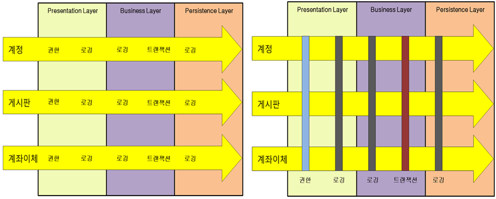

# 스프링 부트 핵심 가이드


.png)


# [스프링 부트 핵심 가이드] Chapter 1. 스프링 부트란?


## 1.1 스프링 프레임워크


#### 📌스프링 프레임워크 (Spring Framework)는 자바 (Java) 기반의 엔터프라이즈급 어플리케이션 프레임워크다

- 자바로 어플리케이션 개발을 할 때 필요한 기능들을 제공하고, 쉽게 사용할 수 있도록 도와주는 도구다

- 엔터프라이즈급 개발이란, 대규모 데이터를 처리하는 환경에서 개발을 하는 것이다 (예. 카카오 같은 대기업에서 데이터를 처리할 때)


#### ✔️ 제어 역전(IoC : Inversion of Control)

- 일반적으로 자바 개발을 할 때에는 사용하려는 객체를 선언하고 해당 객체의 의존성을 생성한 후 객체에서 제공하는 기능을 사용한다

```java
@RestController
public class NoDIController{
    
    // Example 클래스를 통해 example 객체를 만든다
    private Example example = new Example();
    
    @GetMapping("/index")
    public String getHello() {
        // 위에서 만든 객체 example의 메서드 getHello() 기능을 사용한다
        return example.getHello();
    }
}
```


- 스프링에서는 제어 역전(IoC)을 특징으로 동작을 한다
  - 객체를 직접 생성하지 않고, 객체의 생명주기 관리를 **외부**에 위임한다
  - 외부는 스프링 컨테이너 (Spring Container) 또는 IoC 컨테이너를 의미한다
  - 즉 객체의 관리, 또는 제어권을 컨테이너에 맡기면서 제어 역전이라고 한다
  - 제어 역전(IoC)를 통해서 의존성 주입 (DI: Dependency Injection), 관점 지향 프로그래밍 (AOP: Aspect-Oriented Programming)이 가능해진다
  - 제어 역전을 통해서 개발자는 비즈니스 로직을 작성하는 데 더 집중을 할 수 있다


#### ✔️ 의존성 주입(DI : Dependency Injection)

- 제어 역전의 방법 중 하나다
  - 생성자를 통해 의존성을 주입할 수 있다
  - 필드 객체 선언을 통해 의존성을 주입할 수 있다
  - setter 메서드를 통해 의존성을 주입할 수 있다
- 스프링 같은 경우 **@Autowired**라는 어노테이션(annotation)을 통해 의존성을 주입할 수 있다 (스프링 4.3 이후 생성자를 통해 의존성 주입할 때에 @Autowired를 생략할 수 있게 되었다)


```java
// =========== 생성자를 통한 의존성 주입 ==============
@RestController
public class DIController{
    
	Example example;
    
    @Autowired
    public DIController(Example example) {
        this.example = example;
    }
    
    @GetMapping("/index")
    public String getHello() {
        return example.getHello();
    }
}

// =========== 필드 객체 선언을 통한 의존성 주입 ==============
@RestController
public class DIController{
    
    @Autowired
    private Example example;
}

// =========== setter 메서드를 통한 의존성 주입 ==============
@RestController
public class DIController{
    
	Example example;
    
    @Autowired
    public void setExample(Example example) {
        this.example = example;
    }
}
```


#### ✔️ 관점 지향 프로그래밍 (AOP : Aspect-Oriented Programming)

- 스프링에서 AOP는 매우 중요한 특징이다

- AOP는 OOP, 즉 관점 지향 프로그래밍은 객체 지향 프로그래밍을 더 잘 사용할 수 있도록 돕는 개념이다

- AOP는 OOP처럼 모듈화된 객체를 다시 사용할 수 있게 만들어 개발자가 비즈니스 로직을 구현하는 데만 집중할 수 있게 도와준다

- AOP는 관점을 기준으로 묶어서 개발하는 방식이다

  - 여기서 기능이라고 하면 **핵심 기능**과 **부가 기능**으로 구분해서 보는 것을 의미한다
  - **핵심 기능** : 비즈니스 로직을 구현할 때에 비즈니스 로직이 처리하려는 목적 기능을 말한다
  - **부가 기능** : 핵심 기능에서 추가하는 부가 기능

  



- 왼쪽은 OOP 방식으로 계정, 게시판, 계좌이체 기능이 모두 다른 기능으로, 각자 로직이 구현되어 있다
- 오른쪽이 AOP 방식으로, 여러 비즈니스 로직에서 반복되는 부가 기능을 하나의 공통 로직으로 처리하도록 모듈화를 해서 삽입을 한다


- AOP를 구현하는 방법은
  - 컴파일 과정에서 삽입하는 방식
  - 바이코드를 메모리에 로드하는 과정에 삽입하는 방식
  - 프락시 패턴을 이용한 방식이 있다


#### ✔️ 스프링 프레임워크의 다양한 모듈

> 스프링 프레임워크는 기능별로 약 20여 개의 모듈로 구성되어 있다


#### ✔️ 스프링 프레임워크 vs 스프링 부트

> 스프링 부트는 스프링 프로젝트 중 하나다

- 스프링은 기능은 많지만, 설정이 복잡한 편이다
- 그래서 스프링 부트는 이러한 복잡한 설정을 하지 않아도 개발을 쉽게 할 수 있도록 도와준다


**의존성 관리**

- 스프링 프레임워크에서는 개발에 필요한 각 모듈의 의존성을 직접 설정해야 한다
- 스프링 부트에서는 `spring-boot-starter` 라는 의존성을 제공한다
  - **spring-boot-starter-web** : 스프링 MVC를 사용하는 RESTful 어플리케이션을 만들기 위한 의존성이다. 내장 Tomcat이 포함되어 있어 jar 형식으로 실행이 가능하다
  - **spring-boot-starter-test** : JUnit, Jupiter, Mockito 등의 테스트용 라이브러리를 포함한다
  - **spring-boot-starter-jdbc** : HikariCP 커넥션 풀을 활용한 JDBC 기능을 제공한다
  - **spring-boot-starter-security** : 스프링 시큐리티 (인증, 권한, 인가 등) 기능을 제공한다
  - **spring-boot-starter-data-jpa** :하이버네이트를 활용한 JPA 기능을 제공한다
  - **spring-boot-starter-cache** : 스프링 프레임워크의 캐시 기능을 지원한다


##### 자동 설정

- 자동 설정은 어플리케이션에 추가된 라이브러리를 실행하는데 필요한 환경 설정을 자동으로 찾아준다


##### 내장 WAS

- 스프링 부트의 각 웹 어플리케이션에는 내장 WAS (Web Application Server)가 존재한다
- spring-boot-starter-web 같은 경우 Tomcat을 내장한다


##### 모니터링

- 스프링 부트는 액추에이터 (Spring Boot Actuator)라는 자체 모니터링 도구가 있다
- 스레드, 메모리, 세션 등의 주요 요소들을 모니터링 한다


