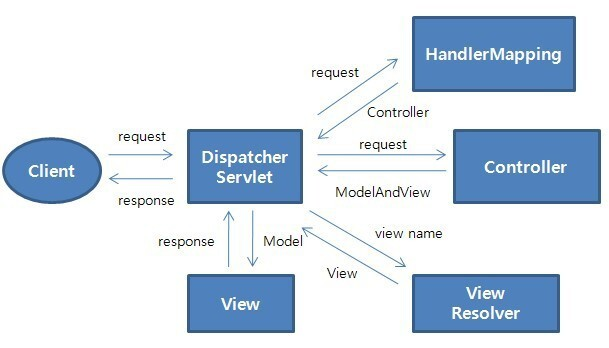
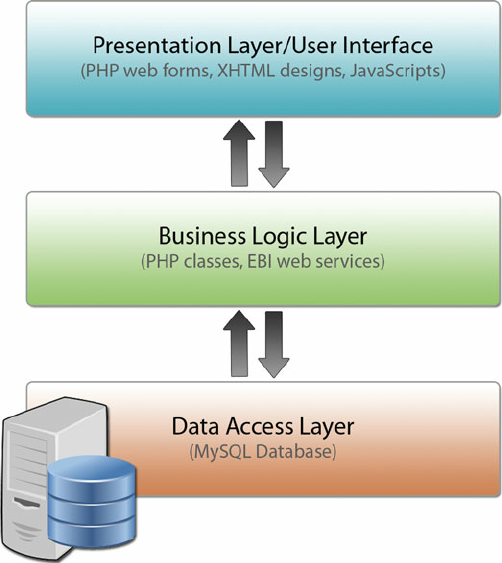

# 스프링 부트 핵심 가이드


.png)


# [스프링 부트 핵심 가이드] Chapter 2. 개발에 앞서 알면 좋은 기초 지식


## 2.1 서버 간 통신


##### 어플리케이션을 업데이트 또는 유지보수 할 때에, 블로그, 카페, 메일 등의 기능을 통합을 하면, 어플리케이션 자체를 닫아야 한다

- 즉 업데이트 또는 유지보수 할 때에는 유저들이 어플리케이션 자체를 못 사용한다는 것


##### MSA, Microservice Architecture를 통해 위의 상황을 해결했다

- 블로그, 카페, 메일 같은 기능들을 기능별로 따로 프로젝트를 만들어서 개발을 하는 것이다
- 그렇게 되면, 블로그 기능을 업데이트 또는 유지보수 할 때에 다른 기능들은 사용할 수 있게 된다


##### MSA를 사용하여 어플리케이션을 개발할 때에는 서버 간 통신을 해야 한다

- 그렇게 나온 프로토콜이 HTTP/HTTPS 방식이다


## 2.2 스프링 부트의 동작 방식


##### 스프링 부트에서 spring-boot-starter-web 모듈을 사용하면 기본적으로 톰캣 (Tomcat)을 사용하는 스프링 MVC 구조를 기반으로 동작한다



- 서블릿은 클라이언트의 요청을 처리하고 결과를 반환하는 자바 웹 프로그래밍 기술이다
  - 이것을 서블릿 컨테이너에서 관리를 한다


1. 요청이 들어오면 먼저 **DispatcherServlet**으로 들어간다
2. **HandlerMapping**을 통해 URI에 매핑된 핸들러를 탐색한다 (Controller)
3. **HandlerAdapter**는 Controller를 호출한다
4. **HandlerAdapter**에 컨트롤러의 응답이 돌아오면 **ModelAndView로** 응답을 가공해 반환한다
5. **View** 형식으로 리턴하는 컨트롤러를 사용할 때는 **ViewResolver**를 통해 **View**를 받아 리턴한다


## 2.3 레이어드 아키텍처

> 어플리케이션의 컴포넌트를 유사 관심사를 기준으로 레이어로 묶어 수평적으로 구성한 구조다
>
> 3 또는 4 계층이 있다




#### Presentation Layer (Web Layer)

- 클라이언트의 요청을 해석하고 응답하는 역할을 한다
- UI나 API를 제공한다


#### Business Logic Layer (Service Layer)

- 어플리케이션이 제공하는 기능을 정의하고 세부 작업을 수행하는 도메인 객체를 통해 업무를 위임하는 역할을 수행한다
- DDD (Domain-Driven Design) 기반의 아키텍처에서는 비즈니스 로직에 도메인이 포함되기도 하고, 별도로 도메인 계층을 두기도 한다


#### Data Access Layer (Repository Layer)

- 데이터베이스를 접근하는 작업을 수행한다


#### 레이어드 아키텍처는 어플리케이션 간의 관계를 설명하는 데도 사용할 수 있다


### 스프링 레이어드 아키텍처

.png)

#### Presentation Layer (Web Layer)

- UI 계층이라고도 한다
- 클라이언트로부터 데이터와 함께 요청을 받고 처리 결과를 응답해준다


#### Business Logic Layer (Service Layer)

- 핵심 로직을 구현하는 계층이다
- 트랜잭션 처리나 유효성 검사 등의 작업도 수행한다


#### Data Access Layer (Repository Layer)

- 데이터베이스에 접근해야 하는 작업을 수행한다
- DAO라고도 컴포넌트를 표현하지만 Spring Data JPA에서는 Repository로 대체할 수 있다


> 스프링에서 JPA를 사용하면 @Entity를 정의한 클래스가 도메인 객체가 된다


## 2.4 디자인 패턴


#### 📌 소프트웨어를 설계할 때 자주 발생하는 문제들을 해결하기 위해 고안된 해결책


### 디자인 패턴의 종류


#### 생성 패턴

- 객체 생성에 사용되는 패턴으로, 객체를 수정해도 호출부가 영향을 받지 않게 한다

```
추상 팩토리 : 구체적인 클래스를 지정하지 않고 상황에 맞는 객체를 생성하기 위한 인터페이스를 제공하는 패턴
빌더 : 객체의 생성과 표현을 분리해 객체를 생성하는 패턴
팩토리 매서드 : 객체 생성을 서브클래스로 분리해서 위임하는 패턴
프로토타입 : 원본 객체를 복사해 객체를 생성하는 패턴
싱글톤 : 한 클래스마다 인스턴스 하나만 생성해서 인스턴스가 하나임을 보장하고 어느 곳에서도 접근할 수 있게 제공하는 패턴
```


#### 구조 패턴

- 객체를 조합해서 더 큰 구조를 만드는 패턴이다

```
어댑터 : 클래스의 인터페이스를 의도하는 인터페이스로 변환하는 패턴
브리지 : 추상화와 구현을 분리해서 각각 독립적으로 변형케 하는 패턴
컴포지트 : 여러 객체로 구성된 복합 객체와 단일 객체를 클라이언트에서 구별 없이 다루는 패턴
데코레이터 : 객체의 결합을 통해 기능을 유연하게 확장할 수 있게 하는 패턴
퍼사드 : 서브시스템의 인터페이스 집합들에 하나의 통합된 인터페이스를 제공하는 패턴
플라이웨이트 : 특정 클래스의 인스턴스 한 개를 가지고 여러 개의 '가상 인스턴스'를 제공할 때 사용하는 패턴
프락시 : 특정 객체를 직접 참조하지 않고 객체를 대행(프락시)하는 객체를 통해 접근하는 패턴
```


#### 행위 패턴

- 객체 간의 알고리즘이나 책임 분배에 관한 패턴이다

```
책임 연쇄 : 요청 처리 객체를 집합으로 만들어 결합을 느슨하게 만드는 패턴
커맨드 : 실행될 기능을 캡슐화해서 주어진 여러 기능을 실행하도록 클래스를 설계하는 패턴
인터프리터 : 주어진 언어의 문법을 위한 표현 수단을 정의하고 해당 언어로 구성된 문장을 해석하는 패턴입니다.
이터레이터 : 내부 구조를 노출하지 않으면서 해당 객체의 집합 원소에 순차적으로 접근하는 방법을 제공하는 패턴
미디에이터 : 한 집합에 속한 객체들의 상호작용을 캡슐화하는 객체를 정의하는 패턴
메멘토 : 객체의 상태 정보를 저장하고 필요에 따라 상태를 복원하는 패턴
옵저버 : 객체의 상태 변화를 관찰하는 관찰자들, 즉 옵저버 목록을 객체에 등록해 상태가 변할 때마다 메서드 등을 통해 객체가 직접 옵저버에게 통지하는 패턴
스테이트 : 상태에 따라 객체가 행동을 변경하게 하는 패턴
스트레티지 : 행동을 클래스로 캡슐화해서 동적으로 행동을 바꿀 수 있게 하는 패턴
템플릿 메서드 : 일정 작업을 처리하는 부분을 서브 클래스로 캡슐화해서 전체 수행 구조는 바꾸지 않으면서 특정 단계만 변경해서 수행하는 패턴
비지터 : 실제 로직을 가지고 있는 객체(visitor)가 로직을 적용할 객체(element)를 방문하며 실행하는 패턴
```


## 2.5 REST API


#### REST API를 통해 클라이언트는 서버에 접근하고 자원을 조작할 수 있다.


#### REST (Representation State Transfer)의 약자고, 주고 받는 자원에 이름을 규정하고 URI에 명시해 HTTP 메서드 (GET, POST, PUT, DELETE)을 통해 자원의 상태를 주고 받는다.


#### API는 Application Programming Interface로, 서버 또는 프로그램 사이를 연결한다.


#### REST API는 REST 아키텍처를 따르는 시스템/어플리케이션 인터페이스라고 볼 수 있다. REST 아키텍처를 구현하는 웹 서비스는 'RESTful하다'라고 표현한다


#### 유니폼 인터페이스

- 프로그래밍 언어 상관 없이, 플랫폼 및 기술에 종속되지 않고 타 언어, 플랫폼, 기술 등과 호환해 사용할 수 있다


#### 무상태성

- 서버에 상태 정보를 따로 보관하지 않는다
- 클라이언트가 여러 요청을 보내든 여러 클라이언트가 각각 하나의 요청을 보내든 개별적으로 처리한다
- 서비스는 서버가 불필요한 정보를 관리하지 않으므로 비즈니스 로직의 자유도가 높고 설계가 단순하다


#### 캐시 가능성

- 캐싱이 가능해지면 클라이언트에서 캐시에 응답과 요청을 저장해두고 같은 요청에 대해서 해당 데이터를 가져다 사용한다


#### 레이어 시스템

- REST 서버는 네트워크 상의 여러 계층으로 구성될 수 있다


#### 클라이언트-서버 아키텍처

- 서버는 API를 제공하고, 클라이언트는 사용자 정보를 관리하는 구조로 분리해 설계한다
- 서로에 대한 의존성을 낮출 수 있다


#### REST의 URI 설계 규칙

- URL의 마지막에 '/'를 포함하지 않는다
  - http://localhost.com/home
- 언더바(_)는 사용하지 않고, 하이픈(-)을 사용한다
  - http://localhost.com/home/company-info
- URL에는 행위(동사)가 아닌 결과(명사)를 포함한다
  - http://localhost.com/home/12
- URL는 소문자로 작성한다
- 파일의 확장자는 URI에 포함하지 않는다
  - HTTP에서 제공하는 Accept 헤더를 사용하는 것이 좋다


