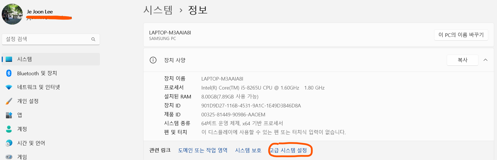
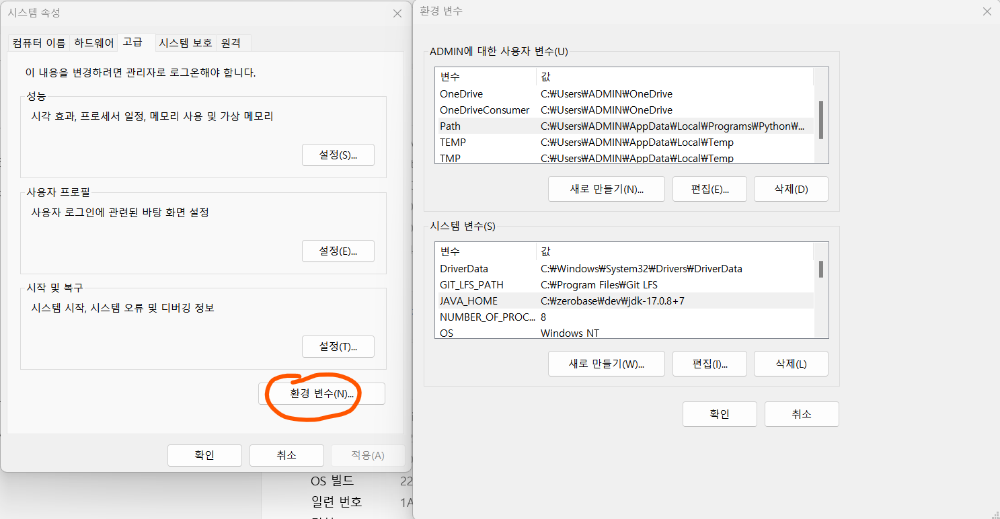

# 스프링 부트 핵심 가이드

.png)

# [스프링 부트 핵심 가이드] Chapter 3. 개발 환경 구성

### 자바 JDK 설치 (Java Development Kit)

- 자바 개발을 위해 설치가 필요한 키트다

1. OpenJDK 를 검색해서 JDK를 설치한다
   - https://jdk.java.net/java-se-ri/11-MR2 - Java 11 버전이지만, 왼쪽 창에 다른 버전들도 다운로드 받을 수 있다
2. 환경 설정
   - 윈도우 [제어판] - [시스템 및 보안] - [시스템]에 들어간다
   - [고급 시스템 설정]을 들어간다
   - [고급 시스템 설정]에서 [환경 변수] 버튼을 클릭한다
   - [시스템 변수]에서 [새로 만들기] 버튼을 클릭한다
   - JDK가 설치된 위치를 찾아 bin 경로를 넣어 준다
     - 개인적으로 bin 경로를 넣지 않아도, 작동하고 있다

### 인텔리제이 IDEA 설치

- 인텔리제이 IDEA는 제트브레인에서 제작한 자바용 통합 개발 환경 (IDE)다
- 개인적으로 이클립스보다 더 깔끔하고, 사용하기 편리하다
  - 전에 Python을 하면서 VSCode를 사용했는데, UI가 비슷해서 그런 것 같다

- https://www.jetbrains.com/idea/
  - 커뮤니티 버전과 얼티밋 버전이 있다
  - **학생일 경우, 또는 학생 메일이 있을 경우, 그것을 사용하여 얼티밋 버전을 무료로 사용하자**

