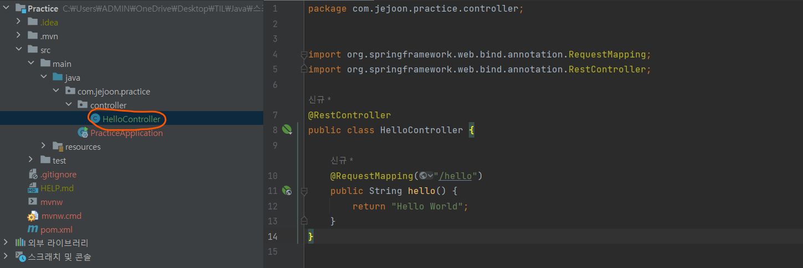

# 스프링 부트 핵심 가이드

# [스프링 부트 핵심 가이드] Chapter 4. 스프링 부트 애플리케이션 개발하기

## 프로젝트 생성

> #### 두 가지 방법이 있다
>
> - Spring Initializr 라는 사이트를 통해 프로젝트를 생성한다
> - Intellij IDEA에서 프로젝트를 생성한다

### 인텔리제이 IDEA에서 프로젝트 생성

**인텔리제이에는 Spring Initializr가 내장이 되어 있다**

- 외부에서 프로젝트를 만드는 것이 아닌, 인텔리제이에서 바로 프로젝트를 생성하고 개발할 수 있다

##### 1. 인텔리제이에서 New Project를 클릭하기

##### 2. 왼쪽 바에 언어와 빌더 등이 있는데 Spring Initializer 선택하기

- **Name** : 프로젝트 이름
- **Location** : 프로젝트를 생성할 위치
- **Language** : JVM (Java Virtual Machine) 상에서 동작하는 언어
- **Type** : 빌드 툴을 선택
- **Group** : 프로젝트를 정의하는 식별자 정보인 그룹을 설정
- **Artifact** : 세부 프로젝트를 식별하는 정보를 기입
- **Package name** : Group과 Artifact를 설정하면 자동으로 입력이 된다
- **Project SDK** : 주로 자바와 같은 버전을 선택한다  
- **Java** : 자바 버전 (Spring boot 버전에서 작동이 안 되는 자바 버전이 있을 수 있다)
- **Packaging** : 어플리케이션을 쉽게 배포하고 동작하게 할 파일들의 패키징 옵션이다. 주로 Jar를 선택하지만, HTML, CSS 도 사용하려면 War을 선택한다

##### 3. 의존성 추가

- 추후에 추가를 할 수 있다

### 스프링 공식 사이트에서 프로젝트 생성

- https://start.spring.io

##### Intellij, 위에 내용과 비슷한 세팅을 하면 된다

##### 단 스프링 공식 사이트에서 프로젝트 생성한다는 것은, 프로젝트를 따로 만드는 것이다

- 압축 파일을 풀고, 프로젝트에 들어가야 한다

## pom.xml (Project Object Model)

#### 메이븐의 기능을 사용하기 위해 작성하는 파일이다

- Gradle은 application.properties 또는 application.yml이 있다

#### 빌드 관리 도구는 JVM이나 WAS가 프로젝트를 인식하고 실행할 수 있도록, 우리가 작성한 소스코드와 프로젝트 파일들을 빌드해준다

- 개발 규모가 커질 수록 라이브러리가 많아지고, 라이브러리 간에 호환성을 확인해야 하는데, 빌드 관리 도구가 알아서 문제를 해결해 준다

#### 메이븐은 자바 기반의 프로젝트를 빌드하고 관리하는 데에 사용하는 도구다 (Gradle도 같다)

- **프로젝트 관리** : 프로젝트 버전과 아티팩트를 관리
- **빌드 및 패키징** : 의존성을 관리하고 설정된 패키지 형식으로 빌드 수행
- **테스트** : 빌드를 수행하기 전에 단위 테스트를 통해 작성된 어플리케이션 코드의 정상 동작 여부 확인
- **배포** : 빌드가 완료된 패키지를 원격 저장소에 배포

#### 메이븐의 기능은 생명주기 순서에 따라 관리되고 동작한다

- **기본 생명주기 (Default Lifecycle)**
  - **validate** : 프로젝트를 빌드하는 데 필요한 모든 정보를 사용할 수 있는지 검토
  - **compile** : 프로젝트의 소스코드를 컴파일한다
  - **test** : 단위 테스트 프레임워크를 사용해 테스트 실시
  - **package** : 컴파일한 코드를 가져와서 JAR 등의 형식으로 패키징을 수행
  - **verify** : 패키지가 유효하며 일정 기준을 충족하는지 확인
  - **install** : 프로젝트를 사용하는 데 필요한 패키지를 로컬 저장소에 설치
  - **deploy** : 프로젝트를 통합 또는 릴리스 환경에서 다른 곳에 공유하기 위해 원격 저장소에 패키지를 복사
- **클린 생명주기 (Clean Lifecycle)**
  - **clean** : 이전 빌드가 생성한 모든 파일을 제거한다
- **사이트 생명주기 (Site Lifecycle)**
  - **site** : 메이븐의 설정 파일 정보를 기반으로 프로젝트의 문서 사이트를 생성
  - **site-deploy** : 생성된 사이트 문서를 웹 서버에 배포

## Hello World 출력하기

#### 1. controller 패키지를 만든다

- 왼쪽 프로젝트 바에, main/java/com.Example.hello 루트에 오른쪽 클릭을 한다
- [New] -> [Java Class]를 누르고 HelloController를 입력하면 HelloController 클래스를 만들 수 있다

> 컨트롤러에 포함된 로직에서는 어플리케이션의 사용자 또는 클라이언트가 입력한 값에 대한 응답을 수행한다
>
> 특별한 경우를 제외한 모든 요청은 컨트롤러를 통해 진행된다

#### 2. 아래 코드를 작성한다

#### 3. 어플리케이션을 실행하고 콘솔을 확인한다

- Tomcat started on port(s): 8080 (http) with context path 가 뜨면 로컬 포트 8080에 해당 어플리케이션이 실행됬다는 것

#### 4. http://localhost:8080/hello 를 실행하면 Hello World가 출력된 것을 볼 수 있다

