# 스프링 부트 핵심 가이드


# [스프링 부트 핵심 가이드] Chapter 5. API를 작성하는 다양한 방법


#### 각 HTTP 메서드에 해당하는 API를 개발할 예정이다

- GET / POST / PUT / DELETE 가 있다


## GET API 만들기


#### 주로 어플리케이션에서 데이터를 조회할 때에 사용하는 API이다

- 아래에서는 http://localhost:8080/api/v1/get-api/name 주소로 실행이 된다
- 새로 메서드를 만들때마다, 어플리케이션을 실행해야 한다

```java
@RestController
@RequestMapping("/api/v1/get-api")
public class GetController {

    // http://localhost:8080/api/v1/get-api/name
    @GetMapping("/name")
    public String getName() {
        return "Je Joon";
    }
}
```

#### 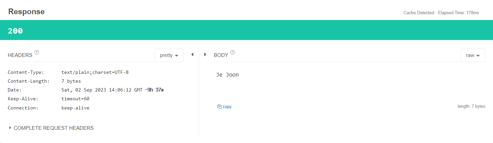


#### @PathVariable을 사용

- `http://localhost:8080/api/v1/get-api/var1/{name}` 로 실행이 된다
- 여기서 {name} 부분에 변수가 들어가고, 아래에서는 그 변수가 출력이 된다
- name 이 "Alex" 면 "Alex"가 반환된다

```java
@RestController
@RequestMapping("/api/v1/get-api")
public class GetController {

    // http://localhost:8080/api/v1/get-api//var1/{name}
    @GetMapping("/var1/{name}")
    public String getVar(@PathVariable String name) {
        return name;
    }

}
```

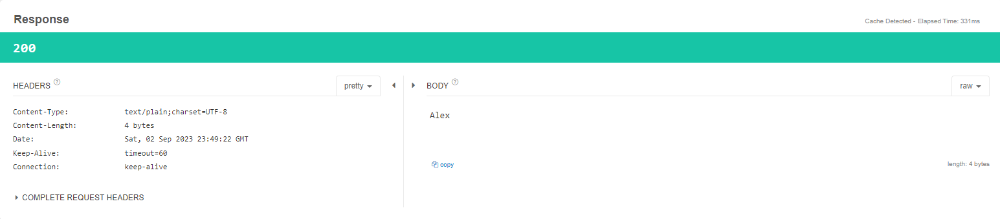


#### @RequestParam 사용

- http://localhost:8080/api/v1/get-api/request?name=val1&organization=val2;
- 키와 값을 기준으로 요청을 하는 것이다
- request? 를 하는데 name은 val1 이어야 하고, organization은 val2이어야 한


```java
@RestController
@RequestMapping("/api/v1/get-api")
public class GetController {
    @GetMapping("/request")
    public String getParam(
            @RequestParam String name,
            @RequestParam String organization
    ) {
        return name + " " + organization;
    }

}
```

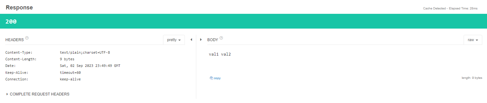


> #### URL과 URI의 차이
>
> - URL은 웹 주소를 의미하고, 리소스가 어디에 있는지 알려주기 위한 경로를 의미한다.
> - URI은 특정 리소스를 식별할 수 있는 식별자를 의미한다


#### DTO 객체를 활용한 GET 메서드

- DTO는 Data Transfer Object로 다른 레이어 간의 데이터 교환에 활용이 된다
  - 각 클래스 및 인터페이스를 호출하면서 전달하는 매개변수로 사용되는 데이터 객체
  - 즉 별도의 로직이 포함되지 않는다


- DTO 패키지를 생성하고, 클래스를 생성한다
- lombok를 이용하여 생성자, Setter, Getter를 만들었다

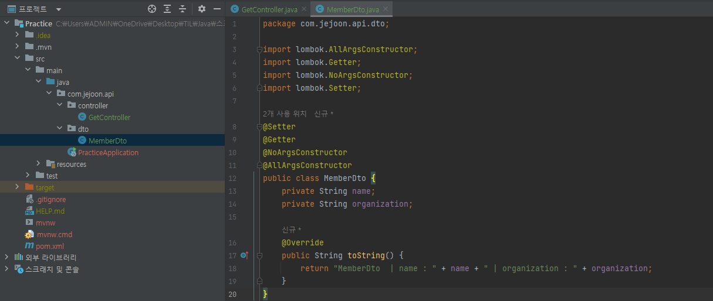


- http://localhost:8080/api/v1/get-api/request2?name=Alex&organization=Joon 
- 컨트롤러에는 아래와 같이 코드를 짰다
- MemberDto에서 만든 속성들 name, organization을 키 값으로 사용하여, URL에서 그 안의 값을 넣어주면 된다

```java
@RestController
@RequestMapping("/api/v1/get-api")
public class GetController {

    @GetMapping("/request2")
    public String getRequestDto(MemberDto memberDto) {
        return memberDto.toString();
    }
}
```

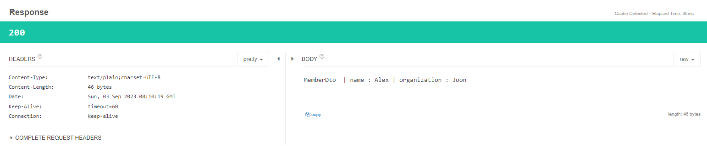


## POST API 만들기


#### 주로 데이터베이스에 데이터를 저장할 때 사용된다


#### POST를 사용했을 때에는 URL 경로에 데이터 정보가 나오지 않고, HTTP Body에 담겨 서버로 전달 된다


#### URI가 GET API에 비해 간단하다


#### http://localhost:8080/api/v1/post-api/member 를 작성하고, Body에 name과 organization에 대한 값을 넣어서 요청을 보내면 된다


```java
@RestController
@RequestMapping("/api/v1/post-api")
public class PostController {

    @PostMapping("/member")
    public String postMember(
            @RequestBody MemberDto memberDto
            ) {
        return memberDto.toString();
    }
}
```

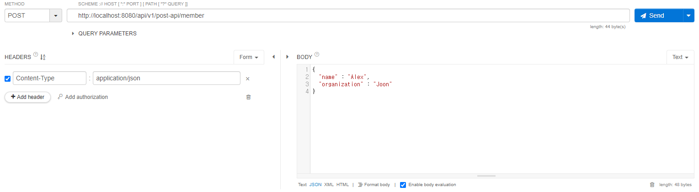

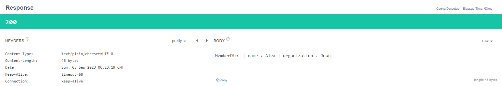


- 위에 보면 Body로 JSON 형태로 key와 값을 요청했


## PUT API 만들기


#### 데이터베이스 같은 저장소에 존재하는 데이터 값을 업데이트하는데 사용이 된다


#### 실제 DB에 반영하는 과정은 다르지만, 컨트롤러 클래스를 구현하는 방법은 POST와 거의 동일 하다


#### PostMapping 어노테이션 대신 PutMapping으로 바꾼다


```java
@RestController
@RequestMapping("/api/v1/put-api")
public class PutController {

    @PutMapping("/member")
    public String putMember(
            @RequestBody MemberDto memberDto
    ) {
        return memberDto.toString();
    }

    @PutMapping("/member2")
    public String putMember2(
            @RequestBody MemberDto memberDto
    ) {
        return memberDto.toString();
    }
}
```


#### 첫 코드는 http://localhost:8080/api/v1/put-api/member 를 통해서 요청을 보냈다

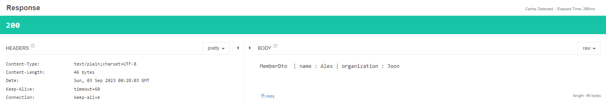


#### 두 번째 코드는 http://localhost:8080/api/v1/put-api/member2 를 통해서 요청을 보냈다

- 데이터 내용이 바뀐 것을 볼 수 있

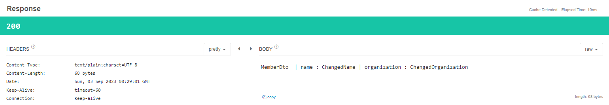


### ResponseEntity를 활용한 PUT 메서드 구현

- 스프링 프레임워크에는 HttpEntity라는 클래스가 있다
- 그리고 ReponseEntity는 HttpEntity를 상속받아 구현한 클래스 이다
- 해당 클래스는 PUT 말고도 다른 메서드에도 모두 사용할 수 있다

```java
@RestController
@RequestMapping("/api/v1/put-api")
public class PutController {

    @PutMapping("/member3")
    public ResponseEntity<MemberDto> postMemberDto2(
            @RequestBody MemberDto memberDto
    ) {
        return ResponseEntity.status(HttpStatus.ACCEPTED).body(memberDto);
    }
}
```


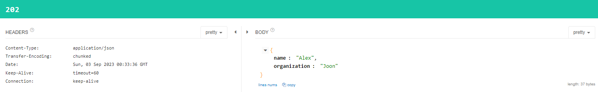


#### 위에 모든 성공 케이스를 보면 모두 Http 200을 반환했지만, 이번엔 Http 202을 반환했다

- 이는 HttpStatus.Accepted는 응답 코드 202를 가지고 있기 때문이다


## DELETE API 만들기


#### DB 등의 저장소에 있는 데이터를 삭제할 때 사용된다


#### 서버는 클라이언트로부터 데이터를 식별할 수 있는 값을 받아 DB나 캐시에 있는 데이터를 조회하고 삭제하는 역할을 수행한다


#### 단 데이터를 삭제 또는 수정하는 것은 매우 민감할 수 있기 때문에, 추후에 인증 절차도 넣는 것을 매우 권장한다


#### 이와 같이 간단하게 만들어도 된다

```java
@RestController
@RequestMapping("/api/v1/delete-api")
public class DeleteController {
    
    @DeleteMapping("/{var1}")
    public String deleteVariable(@PathVariable String var1) {
        return var1;
    }
    
    @DeleteMapping("/request")
    public String deleteRequestParam(@RequestParam String name) {
        return name;
    }
}
```


## REST API 명세를 문서화하기 - Swagger

> #### API를 개발할 때에, API를 사용할 다른 개발자, 사용자들을 위해 REST API를 문서화해야 한다
>
> - 해당 API가 어떤 로직을 수행하는지 설명하고 이 로직을 수행하기 위해 어떤 값을 요청하며, 이에 따른 응답값으로는 무엇을 받을 수 있는지 정리한 자료다
>
> #### 하지만, API를 개발할 때에, API는 계속 업데이트가 된다
>
> - 그래서 Swagger 같은 오픈소스를 사용하면, 자동으로 API에 대한 명세를 문서화 시켜준다
> - 개발자가 직접하면, 시간이 너무 오래 걸린다


#### pom.xml 파일에 Swagger 의존성을 추가한

```java
<dependency>
    <groupId>io.springfox</groupId>
    <artifactId>springfox-swagger2</artifactId>
    <version>2.9.2</version>
</dependency>
<dependency>
    <groupId>io.springfox</groupId>
    <artifactId>springfox-swagger-ui</artifactId>
    <version>2.9.2</version>
</dependency>
```


#### config 패키지를 만들고 SwaggerConfiguration 클래스를 생성한다

- 책대로 했더니 계속 **spring boot Caused by: java.lang.NullPointerException: null** 에러가 나왔다
- 그래서 아래 **WebMvcConfigurationSupport** 을 상속 받았다
  - addResourceHandlers의 아래 코드를 작성하니, 제대로 나왔다

```java
@EnableSwagger2
@Configuration
public class SwaggerConfiguration extends WebMvcConfigurationSupport {
    @Bean
    public Docket api() {
        return new Docket(DocumentationType.SWAGGER_2)
                .select()
                .apis(RequestHandlerSelectors.basePackage("com.jejoon.api"))
                .paths(PathSelectors.any())
                .build().apiInfo(apiInfo());
    }

    private ApiInfo apiInfo() {
        return new ApiInfoBuilder()
                .title("프로젝트/어플리케이션 제목을 넣습니다")
                .description("내용을 설명합니다")
                .version("1.0")
                .build();
    }

    @Override
    public void addResourceHandlers(ResourceHandlerRegistry registry) {
        registry.addResourceHandler("/swagger-ui/**").addResourceLocations("classpath:/META-INF/resources/webjars/springfox-swagger-ui/");
}
```

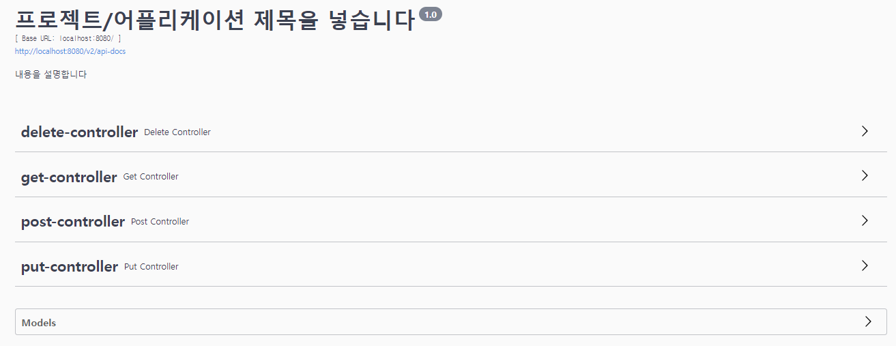


#### 추가로 아래와 같이 구현한 API에 어노테이션을 넣으면, 추가로 설명이 가능하다

- @ApiOperation 사용

```java
@RestController
@RequestMapping("/api/v1/get-api")
public class GetController {
    
    @ApiOperation(value="Get 메서드 예제", notes="@RequestParam을 활용한 GET 메서드")
    @GetMapping("/request")
    public String getParam(
            @RequestParam String name,
            @RequestParam String organization
    ) {
        return name + " " + organization;
    }

}
```

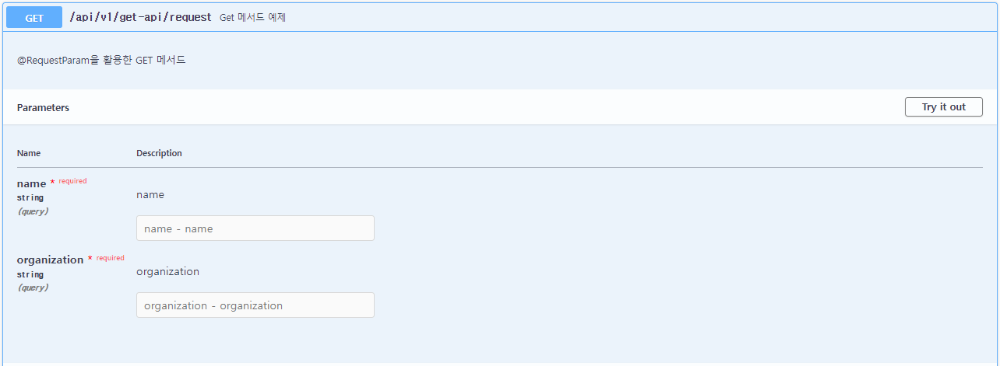


#### 추가로 Try it out 버튼을 누르면 해당 API를 테스트 할 수 있다


## 로깅 라이브러리 - Logback

> #### 로깅은 어플리케이션이 동작하는 동안 시스템의 상태나 동작 정보를 시간 순으로 기록하는 것이다


#### 사용자나 고객에게 필요한 기능은 아니지만, 개발자로서 문제를 해결할 때 원인을 분석하는 데 꼭 필요한 요소다


#### 이 때 사용되는 프레임워크가 LogBack이고 spring-boot-start-web 라이브러리에 내장되어 있다


#### Logback의 특징

- 크게 5개의 로그 레벨을 설정할 수 있다
  - **Error** : 로직 수행 중에 시스템에 심각한 문제가 발생해서 어플레케이션의 작동이 불가한 경우
  - **Warn** : 시스템 에러의 원인이 될 수 있는 경고 레벨을 의미
  - **Info** : 어플레케이션의 상태 변경과 같은 정보 전달을 위해 사용
  - **Debug** : 어플리케이션의 디버깅을 위한 메세지를 표시하는 레벨을 의미
  - **Trace** : Debug보다 더 상세한 메세지를 표현하기 위한 레벨을 의미
- 실제 운영 환경과 개발 환경에서 각각 다른 출력 레벨을 설정해서 로그를 확인할 수 있다
- Logback의 설정 파일을 일정 시간마다 스캔해서 어플리케이션을 재가동하지 않아도 설정을 변경할 수 있다
- 별도의 프로그램 지원 없이도 자체적으로 로그 파일을 압축할 수 있다
- 저장된 로그 파일에 대한 보관 기간 등을 설정해서 관리할 수 있다


#### 로그백은 logback-spring.xml을 따로 만들어야 한다

- resources 하단에 넣는다


#### 아래와 같은 내용을 넣는다 (원하는 데로 바꿀 수 있다)

```java
<?xml version="1.0" encoding="UTF-8" ?>
<configuration>
    <property name="LOGS_PATH" value="./logs"/>
    <property name="LOGS_LEVEL" value="INFO"/>
    <property name="LOG_PATTERN"
              value="[%d{yyyy-MM-dd HH:mm:ss}:%-4relative] %highlight(%-5level) - %msg%n"/>

    <appender name="CONSOLE" class="ch.qos.logback.core.ConsoleAppender">
        <encoder>
            <pattern>${LOG_PATTERN}</pattern>
        </encoder>
    </appender>

    <!--  File appender : 파일에 저장을 어떻게 할지 (저장된 파일의 개수를 설정 가능)  -->
    <appender name="FILE" class="ch.qos.logback.core.rolling.RollingFileAppender">
        <file>${LOGS_PATH}/log_file.log</file>
        <encoder class="ch.qos.logback.classic.encoder.PatternLayoutEncoder">
            <pattern>[%d{yyyy-MM-dd HH:mm:ss}:%-3relative][%thread] %-5level %logger{35} - %msg%n</pattern>
            <charset>UTF-8</charset>
        </encoder>
        <rollingPolicy class="ch.qos.logback.core.rolling.TimeBasedRollingPolicy">
            <fileNamePattern>${LOGS_PATH}/%d{yyyy-MM-dd}_%i.log</fileNamePattern>
            <timeBasedFileNamingAndTriggeringPolicy class="ch.qos.logback.core.rolling.SizeAndTimeBasedFNATP">
                <maxFileSize>10MB</maxFileSize>
            </timeBasedFileNamingAndTriggeringPolicy>
            <maxHistory>60</maxHistory>
        </rollingPolicy>
    </appender>


    <root level="${LOGS_LEVEL}">
        <appender-ref ref="CONSOLE"/>
        <appender-ref ref="FILE"/>
    </root>
</configuration>
```


#### Appender

- 로그의 형태를 설정하고 어떤 방법으로 출력할지 설정을 한다
- Appender 자체는 하나의 인터페이스를 의미하고, 하위에 여러 구현체가 존재한다
  - **ConsoleAppender** : 콜솔에 로그를 출력
  - **FileAppender** : 파일에 로그를 저장
  - **RollingFileAppender** : 여러 개의 파일을 순회하면서 로그를 저장
  - **SMTPAppender** : 메일로 로그를 전송
  - **DBAppender** : DB에 로그를 저장

- filter 요소로 각 Appender가 어떤 레벨로 로그를 기록하는지 지정한다


|      패턴       |                        의미                        |
| :-------------: | :------------------------------------------------: |
| $Logger{length} |                    로거의 이름                     |
|    %-5level     |          로그 레벨. -5는 출력 고정폭의 값          |
| %msg(%message)  |                    로그 메시지                     |
|       %d        |                   로그 기록 시간                   |
|       %p        |                     로깅 레벨                      |
|       %f        |         로깅을 발생한 어플리케이션 파일명          |
|       %M        |             로깅이 발생한 메서드 이름              |
|       %I        |            로깅이 발생한 호출자의 정보             |
|     %thread     |                   현재 스레드명                    |
|       %t        |               로깅이 발생한 스레드명               |
|       %c        |               로깅이 발생한 카테고리               |
|       %C        |               로깅이 발생한 클래스명               |
|       %m        |                    로그 메세지                     |
|       %n        |                       줄바꿈                       |
|       %r        | 어플리케이션 실행 후 로깅이 발생한 시점까지의 시간 |
|       %L        |         로깅이 발생한 호출 지점의 라인 수          |


#### Root

- 설정 파일에 정의된 Appender를 활용하려면 Root 영역에서 Appender를 참조해서 로깅 레벨을 설정한다


#### 로그 적용하기

```java
@RestController
@RequestMapping("/api/v1/get-api")
public class GetController {

    private final Logger LOG = LoggerFactory.getLogger(GetController.class);

    @GetMapping("/name")
    public String getName() {
        LOG.info("getName 메서드가 호출되었습니다");
        return "Je Joon";
    }

    @GetMapping("/var1/{name}")
    public String getVar(@PathVariable String name) {
        LOG.info("getVar 메서드가 호출되었습니다");
        return name;
    }
}
```

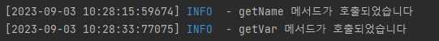


