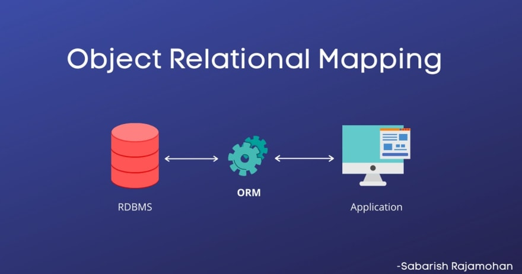
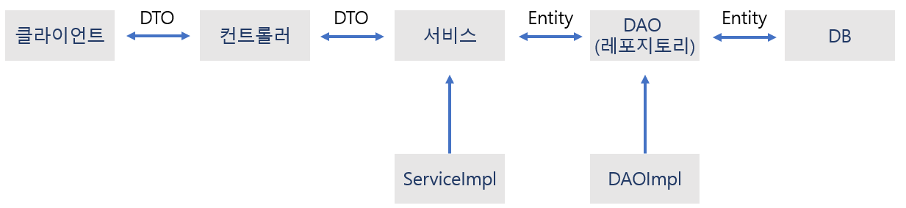

# 스프링 부트 핵심 가이드


# [스프링 부트 핵심 가이드] Chapter 6. 데이터 베이스 연동


#### 어플리케이션은 데이터를 주고 받는 것이 주 목적이다


#### 특히 엔터프라이즈급 어플리케이션에서는 데이터베이스가 꼭 필요하다


## Maria DB 설치

> #### https://mariadb.org/download 에서 마리아DB를 설치할 수 있다


#### 그 외에도 MySQL 같이 다양한 데이터 베이스가 있다


## ORM


#### Object Relational Mapping으로 자바와 같은 객체 지향 언어에서 의미하는 객체와 RDB (Relational Database)의 테이블을 자동을 매핑하는 방법이다





### 장점


#### ORM을 사용하면서 데이터베이스 쿼리를 객체지향적으로 조작할 수 있다

- 쿼리문 전체를 작성하지 않아도 된다 (개발 비용이 줄어든다)
- 객체지향적으로 데이터베이스에 접근할 수 있다

#### 재사용 및 유지보수가 편하다

- ORM을 통해 매핑된 객체는 모두 독립적으로 작성되어 있어 재사용이 가능하다
- 객체들은 각 클래스로 나뉘어 있어 유지보수가 수월하다

#### 데이터베이스에 대한 종속성이 줄어든다

- ORM을 통해 자동 생성된 SQL문은 객체를 기반으로 데이터베이스 테이블을 관리하기 때문에 데이터베이스에 종속적이지 않는다
- 데이터 베이스를 교체하는 상황에서도 비교적 적을 리스크를 부담한다


### 단점


#### ORM만으로 온전한 서비스를 구현하기에는 한계가 있다

- 복잡한 쿼리문을 사용할 때에는 ORM으로 구현하기 어렵다
- 복잡한 쿼리문을 ORM만으로 구성하게 되면 속도 저하 등의 성능 문제가 발생한다


#### 어플리케이션의 객체 관점과 데이터베이스의 관계 관점의 불일치가 발생한다

- **세분성 (Granularity)** 
  - ORM의 자동 설계 방법에 따라 데이터베이스에 있는 테이블의 수와 어플리케이션의 엔티티 클래스의 수가 다른 경우가 생긴다 
  - 클래스가 테이블 수보다 많아질 수 있다
- **상속성 (Inheritance)** 
  - RDBMS에는 상송이라는 개념이 없다
- **식별성 (Identity)** 
  - RDBMS는 기본키(primary key)로 동일성을 정의한다. 하지만 자바는 두 객체의 값이 같아도 다르다고 판단할 수 있다
- **연관성 (Association)**
  - 객체지향 언어는 객체를 참조함으로써 연관성을 나타내지만 RDBMS에는 외래키(foreign key)를 삽입함으로써 연관성을 표현한다. 
  - 객체 지향 언어는 객체를 참조할 때에 방향성이 존재하지만, RDBMS에는 외래키를 삽입하면 양방향의 관계만 가진다
- **탐색 (Navigation)**
  - 자바와 RDBMS는 값(객체)에 접근하는 방식이 다르다
  - 자바는 특정 값에 접근하기 위해 객체 참조 같은 연결 수단을 활용한다
  - RDBMS에는 쿼리를 최소화하고 조인(JOIN)을 통해 여러 테이블을 로드하고 값을 추출하는 접근 방식을 채택하고 있다


## JPA


#### Java Persistence API로 자바 진영의 ORM 기술 표준으로 채택된 인터페이스 모음이다

- ORM 중의 하나다


#### JPA는 내부적으로 JDBC를 사용한다

- JDBC만 사용하게 되면 쿼리문을 직접 작성해야 한다
- 하지만 JPA를 추가함으로서, ORM을 작성하고 JPA가 개발자 대신 적절한 SQL을 생성하여 데이터베이스를 조작해서 객체를 자동 매핑하는 역할을 수행할 수 있다


#### JPA 기반 구현체는 세가지가 있다

- Hibernate / EclipseLink / DataNucleus

.png)


## 하이버네이트 (Hibernate)


#### 자바의 ORM 프레임워크로, JPA가 정의하는 인터페이스를 구현하고 있는 JPA 구현체 중 하나다


#### 하이버네이트의 기능을 편하게 사용하도록 모듈화한 Spring Data JPA가 있다


### Spring Data JPA

> JPA를 편리하게 사용할 수 있도록 지원하는 스프링 하위 프로젝트 중 하나다


#### CRUD 처리에 필요한 인터페이스를 제공한다


#### 엔티티 매니저를 직접 다루지 않고 레포지토리를 정의해 사용함으로써 스프링이 적합한 쿼리를 동적으로 생성하는 방식으로 데이터를 조작한다


## 영속성 컨텍스트


#### 영속성 컨텍스트 (Persistence Context)는 어플리케이션과 데이터베이스 사이에서 엔티티와 레코드의 괴리를 해소하는 기능과 객체를 보관하는 기능을 수행한다

- 어플리케이션의 엔티티 객체가 영속성 컨텍스트에 들어오면 JPA는 그 정보를 데이터 베이스에 반영하는 작업을 수행한다
- 영속성 컨텍스트는 세션이 종료되면 없어진다


#### 엔티티 매니저 (Entity Manager)

- 엔티티를 관리하는 객체다
- 엔티티 매니저는 DB에 접근해서 CRUD 작업을 수행한다
- Spring Data JPA를 사용하면 레포지토리를 사용하여 DB에 접근한다
- 엔티티 매니저는 EntityManagerFactory가 만든다 (스프링 부트에서 자동 설정 기능이 있다)


#### 엔티티 생명주기

- **비영속 (New)**
  - 영속성 컨텍스트에 추가되지 않은 엔티티 객체의 상태
- **영속 (Managed)**
  - 영속성 컨텍스트에 의해 엔티티 객체가 관리되는 상태
- **준영속 (Detached)**
  - 영속성 컨텍스트에 의해 관리되던 엔티티 객체가 컨텍스트와 분리된 상태
- **삭제 (Removed)**
  - 데이터베이스에서 레코드를 삭제하기 위해 영속성 컨텍스트에서 삭제 요청 한 상태


#### application.properties

```java
// 연동 하려는 데이터 베이스
spring.datasource.driver-class-name=com.mysql.cj.jdbc.Driver

// mysql 경로 명시와 DB명
spring.datasource.url=jdbc:mysql://localhost:3306/springboot?useSSL=false&characterEncoding=UTF-8&serverTimezone=UTC

// DB 계정
spring.datasource.username=root
spring.datasource.password=12345

// hibernate 활성화할 수 있는 선택 사항
spring.jpa.hibernate.ddl-auto=create
spring.jpa.show-sql=true
spring.jpa.properties.hibernate.format_sql=true
```

**spring.jpa.hibernate.ddl-auto**

> 어플리케이션 운영 환견에서는 create, create-drop, updated 기능을 사용하지 않는다

- **create** 
  - 어플리케이션이 가동되고 SessionFactory가 실행될 때 기존 테이블을 지우고 새로 생성
- **create-drop**
  - create와 동일한 기능을 수행하나 어플리케이션을 종료하는 시점에서 테이블을 지운다
- **update**
  - SessionFactory가 실행될 때 객체를 검사해서 변경된 스키마를 갱신
  - 기존 저장된 데이터는 유지
- **validate**
  - update처럼 객체를 검사하지만 스키마는 건드리지 않는다
  - 검사 과정에서 DB의 테이블 정보와 객체의 정보가 다르면 에러 발생
- **none**
  - ddl-auto 기능을 사용하지 않는다


**spring.jpa.show-sql**

- 하이버네이트가 생성한 쿼리문을 출력하는 옵션이다


## 엔티티 설계

```java
@Setter
@Getter
@Entity
@Table(name="product")
public class Product {
    
    @Id
    @GeneratedValue(strategy = GenerationType.IDENTITY)
    private Long number;
    
    @Column(nullable = false)
    private String name;
    
    @Column(nullable = false)
    private Integer price;
    
    @Column(nullable = false)
    private Integer stock;
    
    private LocalDateTime createdAt;
    
    private LocalDateTime updatedAt;
}
```


**@Table(name="product")**

- DB의 테이블 이름


**@Entity** 

- 해당 클래스가 엔티티인 것을 명시하는 어노테이션이다
- 이 클래스는 테이블과 일대일로 매칭이 된다


**@Id**

- 엔티티 클래스의 필드는 테이블 컬럼과 매핑이 된다
- @Id는 테이블의 기본값 역할로 사용된다


**@GenerateValue**

- 일반적으로 @Id와 함께 사용이 된다
- 해당 필드의 값을 어떤 방식으로 자동으로 생성할지 결정할 때 사용
- **@GeneratedValue(strategy = GenerationType.AUTO)**
  - 기본값을 사용하는 데이터베이스에 맞게 자동 생성
- **@GeneratedValue(strategy = GenerationType.IDENTITY)**
  - 데이터베이스의 AUTO_INCREMENT를 사용해 기본값을 생성
- **@GeneratedValue(strategy = GenerationType.SEQUENCE)**
  - @SequenceGenerator 어노테이션으로 식별자 생성기를 설정하고 이를 통해 값을 자동 주입
  - name, sequenceName, allocationSize를 활용
- **@GeneratedValue(strategy = GenerationType.TABLE)**
  - 어떤 DBMS를 사용하더라도 동일하게 동작하기를 원할 경우 사용


**@Column**

- 엔티티 클래스의 필드는 자동으로 테이블 컬럼으로 매핑된다
- 그래서 해당 어노테이션은 필수는 아니다
- **name** : DB의 칼럼명을 설정하는 속성
- **nullable** : 레코드를 생성할 때 컬럼 값에 null 처리가 가능한지를 명시하는 속성
- **length** : DB에 저장하는 데이터의 최대 길이를 설정
- **unique** : 해당 칼럼을 유니크로 설정


**@Transient**

- 엔티티 클래스에는 선언돼 있는 필드지만 DB에서는 필요 없을 경우


## 레포지토리 인터페이스 설계


#### Spring Data JPA는 JpaRepository를 기반으로 더욱 쉽게 데이터베이스를 사용할 수 있는 아키텍처를 제공한다


#### JpaRepository를 상속하는 인터페이스를 생성하면 기존의 다양한 메서드를 손쉽게 활용할 수 있다


#### JpaRepository<엔티티 클래스 명, 엔티티 id 타입>

```java
import com.springboot.jpa.data.entity.Product;
import org.springframework.data.jpa.repository.JpaRepository;

@Repository
public interface ProductRepository extends JpaRepository<Product, Long> {
}
```


#### 일반적으로 CRUD (Create, Read, Update, Delete)에서 따로 생성해서 사용하는 메서드는 대부분 Read 부분에 해당하는 Select 쿼리밖에 없다


#### 메서드에 이름을 붙일 때는 첫 단어를 제외한 이후 단어들의 첫 글자를 대문자로 설정해야 JPA에서 정상적으로 인식하고 쿼리를 자동으로 만들어준다


## DAO 설계


#### DAO (Data Access Object)는 DB에 접근하기 위한 로직을 관리하는 객체다

- 스프링 데이터 JPA에서 DAO의 개념은 레포지토리가 대체하고 있다


#### 규모가 작은 서비스에서는 DAO를 별도로 설계하지 않고 바로 서비스 레이어에서 DB에 접근해서 구현하기도 한다


#### DAO를 서비스 레이어와 레포지토리의 중간 계층을 구성하는 역할로 사용할 수 있다

- 실제 업무에 필요한 비즈니스 로직을 개발하다 보면 데이터를 다루는 중간 계층을 두는 것이 유지보수 측면에서 용이한 경우가 많다


#### 메서드 리턴 값으로 DTO 객체로 전달을 해야할지 엔티티 객체로 전달해야 할지에 대한 것은 회사마다 다르다


#### ProductDao 인터페이스

```java
public interface ProductDAO {

    Product insertProduct(Product product);

    Product selectProduct(Long number);

    Product updateProductName(Long number, String name) throws Exception;

    void deleteProduct(Long number) throws Exception;
}
```


#### ProductDAOImpl

- 스프링의 관리하는 빈으로 등록하기 위해 **@Componet** 또는 **@Service** 어노테이션을 지정해야 한다
- DAO 객체에서도 DB에 접근하기 위해 레포지토리 인터페이스를 사용해 의존성 주입을 받는다
- **selectProduct()**
  - **getById()**
    - 프락시 객체를 통해 최초로 데이터에 접근하는 시점이 된다
    - 데이터가 존재하지 않는 경우 EntityNotFoundException이 발생한다
  - **findById()**
    - find() 매서드를 호출한다
    - 영속성 콘텍스트에 값이 존재하지 않는다면 실제 DB에서 데이터를 조회한다
    - 리턴 값으로 Optional 객체를 전달한다
- **updateProduct()**
  - update라는 키워드를 사용하지 않는다
  - find() 메서드를 통해 DB에서 값을 가지고 오면, 가져온 객체가 영속성 컨텍스트에 추가된다
  - 영속성 컨텍스트가 유지된 상황에서 객체의 값을 변경하고 다시 save()를 실행하면 JPA에서는 더티 체크라고 하는 변경 감지를 수행한다
- **deleteProduct()**
  - 삭제하고자 하는 데이터와 매핑 된 영속 객체를 영속성 컨텍스트에 가져온다
  - 그리고 객체를 가지고 오면 delete() 메서드를 통해 해당 객체를 삭제하게끔 삭제 요청을 한다

```java
@Component
public class ProductDAOImpl implements ProductDAO {

    private final ProductRepository productRepository;

    public ProductDAOImpl(ProductRepository productRepository) {
        this.productRepository = productRepository;
    }

    // .save() 를 사용해서 DB에 저장을 한다
    @Override
    public Product insertProduct(Product product) {
        Product savedProduct = productRepository.save(product);
        return savedProduct;
    }

    // .getById 를 통해서 number와 매칭하는 Id인 product의 데이터를 조회한다
    @Override
    public Product selectProduct(Long number) {
        Product selectedProduct = productRepository.getById(number);
        return selectedProduct;
    }

    @Override
    public Product updateProductName(Long number, String name) throws Exception {
        Optional<Product> selectedProduct = productRepository.findById(number);
        
        Product updatedProduct;
        if (selectedProduct.isPresent()) {
            Product product = selectedProduct.get();
            
            product.setName(name);
            product.setUpdatedAt(LocalDateTime.now());
            
            updatedProduct = productRepository.save(product);
        } else {
            throw new Exception();
        }
        
        return updatedProduct;
    }

    @Override
    public void deleteProduct(Long number) throws Exception {
		Optional<Product> selectedProduct = productRepository.findById(number);
        
        if (selectedProduct.isPresent()) {
            Product product = selectedProduct.get();
            
            productRepository.delete(product);
        } else {
            throw new Exception();
        }
    }
}
```


## DAO 연동을 위한 컨트롤러와 서비스 설계


#### 클라이언트의 요청과 연결하기 위해서는 컨트롤러와 서비스를 생성해야 한다


### 서비스 클래스 만들기


#### 서비스 레이어는 도메인 모델을 활용해 어플리케이션에서 제공하는 핵심 기능을 제공한다


#### DTO 클래스 먼저 생성 (Data 패키지 안에 dto 패키지를 생성)

- ProductDto / ProductResponseDto 클래스를 만든다
- lombok를 활용하여 getter, setter, 생성자는 따로 안 만든다

```java
// ProductDto

@Getter
@Setter
@AllArgsConstructor
@NoArgsConstructor
@Builder
public class ProductDto {
    private String name;
    private int price;
    private int stock;
}
```


```java
// ProductResponseDto

@Getter
@Setter
@AllArgsConstructor
@NoArgsConstructor
@Builder
public class ProductReponseDto {
    private Long number;
    private String name;
    private int price;
    private int stock;
}
```


#### ProductService 인터페이스에 기본적인 CRUD 기능을 메서드로 정의한다

```java
public interface ProductService {
    ProductReponseDto getProduct(Long number);

    ProductReponseDto saveProduct(ProductDto productDto);

    ProductReponseDto changeProductName(Long number, String name) throws Exception;

    void deleteProduct(Long number) throws Exception;
}
```


#### 현재 구조

- ProductService은 DAO에서 구현한 기능을 서비스 인터페이스에서 호출해 결과값을 가져오는 작업을 수행한다
- **DB와 밀접한 관련이 있는 데이터 엑세스 레이어까지는 엔티티 객체를 사용하고, 클라이언트와 가까워지는 다른 레이어는 데이터를 교환한는데 DTO 객체를 사용한다**




#### ProductServiceImpl

- **ProductDAO 에서 만들었던 메서드를 이용한다!**
  - 상세 로직에 모두 ProductDao에 있음
- 책과 달리 Builder라는 어노테이션을 사용하여, Builder를 통해서 객체를 리턴해주었다

```java
@Service
@RequiredArgsConstructor
public class ProductServiceImpl implements ProductService {

    private final ProductDAO productDAO;
    
    @Override
    public ProductReponseDto getProduct(Long number) {
        Product product = productDAO.selectProduct(number);
        
        return ProductReponseDto.builder()
                .name(product.getName())
                .number(product.getNumber())
                .stock(product.getStock())
                .price(product.getPrice())
                .build();
    }

    @Override
    public ProductReponseDto saveProduct(ProductDto productDto) {
        
        Product product = Product.builder()
                .name(productDto.getName())
                .price(productDto.getPrice())
                .stock(productDto.getStock())
                .createdAt(LocalDateTime.now())
                .updatedAt(LocalDateTime.now())
                .build();
        
        Product savedProduct = productDAO.insertProduct(product);
        
        return ProductReponseDto.builder()
                .name(savedProduct.getName())
                .number(savedProduct.getNumber())
                .stock(savedProduct.getStock())
                .price(savedProduct.getPrice())
                .build();
    }

    @Override
    public ProductReponseDto changeProductName(Long number, String name) throws Exception {
        
        Product change = productDAO.updateProductName(number, name);

        return ProductReponseDto.builder()
                .name(change.getName())
                .number(change.getNumber())
                .stock(change.getStock())
                .price(change.getPrice())
                .build();
    }

    @Override
    public void deleteProduct(Long number) throws Exception {
        productDAO.deleteProduct(number);
    }
}
```


#### 컨트롤러! 

- 컨트롤러 패키지를 만들고 그 안에 클라이언트로부터 요청을 받고 해당 요청에 대해 서비스 레이어에 구현된 적절한 메서드를 호출해서 결과값을 받는다

```java
@RestController
@RequestMapping("/product")
@RequiredArgsConstructor
public class ProductController {
    
    private final ProductService productService;
    
    @GetMapping()
    public ResponseEntity<ProductReponseDto> getProduct(Long number) {
        ProductReponseDto productReponseDto = productService.getProduct(number);
        
        return ResponseEntity.status(HttpStatus.OK).body(productReponseDto);
    }
    
    @PostMapping()
    public ResponseEntity<ProductReponseDto> createProduct(@RequestBody ProductDto productDto) {
        ProductReponseDto productReponseDto = productService.saveProduct(productDto);

        return ResponseEntity.status(HttpStatus.OK).body(productReponseDto);
    }

    @PutMapping()
    public ResponseEntity<ProductReponseDto> getProduct(
            @RequestBody ChangeProductNameDto changeProductNameDto
    ) throws Exception {
        ProductReponseDto productReponseDto = productService.changeProductName(
                changeProductNameDto.getNumber(),
                changeProductNameDto.getName()
        );

        return ResponseEntity.status(HttpStatus.OK).body(productReponseDto);
    }

    @DeleteMapping()
    public ResponseEntity<String> deleteProduct(Long number) throws Exception {
        productService.deleteProduct(number);

        return ResponseEntity.status(HttpStatus.OK).body("정상적으로 삭제되었습니다");
    }
}  
```


## Lombok!

#### 위에 코드를 보면 Getter, Setter, Builder 등 Lombok 어노테이션을 많이 사용 했다


#### 롬복은 데이터 클래스를 생성할 때 반복적으로 사용하는 메서드를 어노테이션으로 대체하는 기능을 제공하는 라이브러리다


#### 의존성만 추가를 하면 된다

```xml
        <dependency>
            <groupId>org.projectlombok</groupId>
            <artifactId>lombok</artifactId>
            <optional>true</optional>
        </dependency>
```

