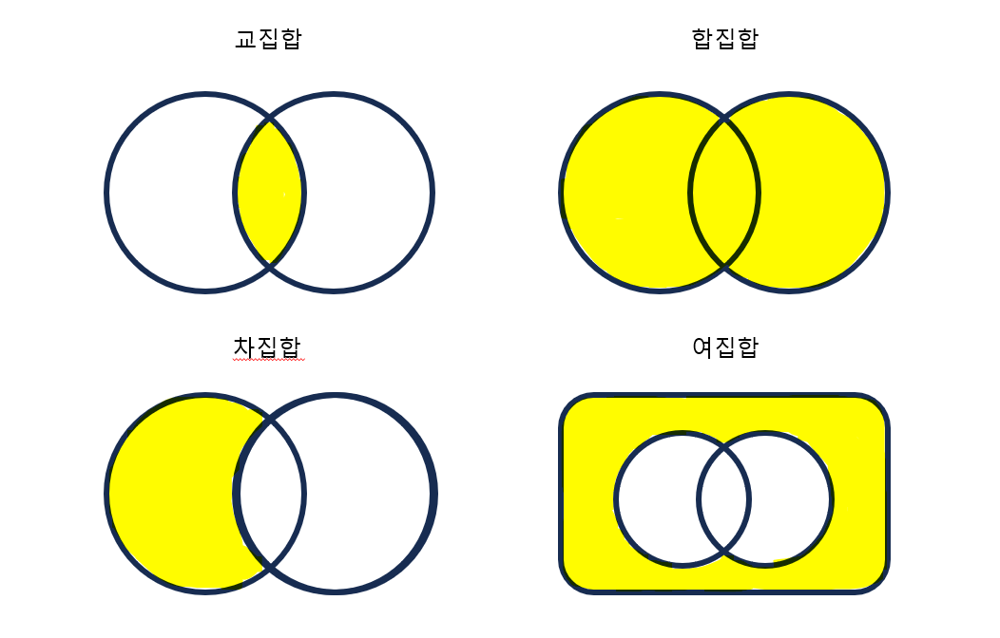

# [제로베이스] Java 기초수학 - 집합

*출처 : 제로베이스 백엔드 스쿨*





## Java HashSet으로 표현하기

```java
import java.util.HashSet;

public class Practice {
    public static void main(String[] args) {
        HashSet hashSet1 = new HashSet();
        HashSet hashSet2 = new HashSet();

        for (int i = 1; i < 5; i ++) {
            hashSet1.add(i);
        }

        for (int i = 3; i < 8; i ++) {
            hashSet2.add(i);
        }

        System.out.println("hashSet1 = " + hashSet1);
        // hashSet1 = [1, 2, 3, 4]
        System.out.println("hashSet2 = " + hashSet2);
        // hashSet2 = [3, 4, 5, 6, 7]
        
        // 합집합
        hashSet1.retainAll(hashSet2);
        System.out.println("합집합 = " + hashSet1);

        // 교집합
        hashSet1.addAll(hashSet2);
        System.out.println("교집합 = " + hashSet1);

        // 차집합
        hashSet1.removeAll(hashSet2);
        System.out.println("차집합 = " + hashSet1);
    }
}
```

#### 단! HashSet을 사용하고, 메서드를 사용했을 경우 객체가 수정이 된다

- 위는 예시지만, 주석 없이 합집합, 교집합, 차집합을 사용하게 되면, 원하는 값을 가져올 수 없다


## 집합을 직접 만들어보기

```java
class MySet {
    ArrayList<Integer> list;

    MySet () {
        this.list = new ArrayList<Integer> ();
    }

    MySet (int[] arr) {
        this.list = new ArrayList<Integer> ();
        for (int num : arr) {
            this.list.add(num);
        }
    }

    public void add(int i) {
        for (int num : this.list) {
            if (num == i) {
                return;
            }
        }
        this.list.add(i);
    }
        
    // 교집합
    public MySet retainAll(MySet B) {
        MySet result = new MySet();
        for (int num1 : this.list) {
            for (int num2 : B.list) {
                if (num1 == num2) {
                    result.add(num1);
                    break;
                }
            }
        }
        return result;
    }
        
    // 합집합
    public MySet addAll(MySet B){
        MySet result = new MySet();
        for (int num1 : this.list) {
            result.add(num1);
        }
        for (int num2 : B.list) {
            result.add(num2);
        }
        return result;
    }
        
    // 차집합
    public MySet removeAll(MySet B) {
        MySet result = new MySet();
        for (int num1 : this.list) {
            boolean isSame = false;
                
            for (int num2 : B.list) {
                if (num1 == num2) {
                    isSame = true;
                    break;
                }
            }
                
            if (!isSame) {
                result.add(num1);
            }
        }
            
        return result;
    }
}
