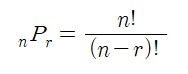
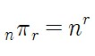
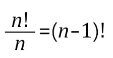

# [제로베이스] Java 기초수학 - 경우의 수, 순열

*출처 : 제로베이스 백엔드 스쿨*

## 경우의 수

#### 사건이 일어날 수 있는 가지의 수다

- 예) 주사위는 1부터 6까지, 일어날 수 있는 가짓수가, 6가지다

## 합의 법칙

#### 사건 A와 B가 일어날 수 있는 경우의 수

- 둘이 겹치는 부분에서는 이중으로 겹쳐, 한번 빼줘야 한다

## 곱의 법칙

#### 사건 A와 B가 동시에 일어날 수 있는 경우의 수

- A가 나올 수 있는 경우의 수, B가 나올 수 있는 경우의 수를 곱하면 된다

## 순열

#### 팩토리얼

- **N!**   = >   1에서 N까지 곱하는 것
- 4! = 4 * 3 * 2 * 1

#### 순열 (Permutation)

- n 개 중에 r 개를 선택할 경우
  - 4명이 2명씩 짝짓는 방법
  - 여기서 나올 수 있는 경우는 중복이 되더라도, 순서가 다르면 상관 없다 (즉 순서 상관 있음)

#### 중복 순열

- 중복 가능한 n개중에 r개를 선택하는 경우
  - 후보를 2명 뽑는데, 유권자가 10명이다 (유권자들이 뽑는 후보가 겹쳐도 상관이 없다)

#### 원 순열

- 원으로 되어 있어, 한 칸 씩 옆으로 앉아도, 순서는 똑같다

