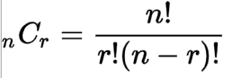

# [제로베이스] Java 기초수학 - 조합

*출처 : 제로베이스 백엔드 스쿨*

## 조합

#### 조합 (Combination)

- 서로 다른 n개 중 r개를 선택하는 경우의 수
  - 순서와 중복은 상관이 없다
- 예) A, B, C, D 중 2 명이 청소 담당이 된다
  - A,B 가 됐든, B,A가 됐든, 똑같은 값은 값이라서, 두 개가 아닌 하나의 경우의 수가 된다

#### 중복 조합

- 중복 가능한 n개의에서 순서를 생각하지 않고 r개를 택하는 경우
- 예시) A B C D 중 2명을 뽑는다 (중복 허용)
  - A A / A B /  A C / A D
  - B B / B C / B D
  - C C / C D
  - D D

 
