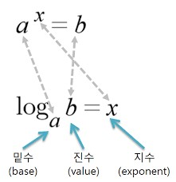

# [제로베이스] Java 기초수학 - 점화식과 재귀함수, 지수와 로그

*출처 : 제로베이스 백엔드 스쿨*


## 점화식과 재귀함수


### 점화식

#### 수열에서 이웃하는 두개의 항 사이에서 성립하는 관계를 나타내는 관계식이다

- 피보니치 수열도 점화식이다
  - 1, 1, 2, 3, 5, 8, 13, 21 => 앞에 두 개의 숫자를 더하는 식이다


### 재귀함수

#### 함수가 자기 자신을 호출하는 것이다

- 함수가 자기 자신을 호출하는 것이기 때문에, 꼭 종료 조건이 있어야 한다 (없으면 무한 루프)


```java
반환타입 함수이름 (매개변수) {
    종료 조건;
    
    함수이름(매개변수);
}
```


#### 피보나치 수열

```java
static int fibo(int num) {
    if (num <= 2) {
        return 1;
    }

    return fibo(num - 1) + fibo(num - 2);
}
```


## 지수와 로그




#### 제곱 : a 를 한번 더 곱한 것 (a * a)

#### 거듭제곱 : a를 n번 곱한 것

#### 제곱근 : a를 제곱하여 b가 될 때, a를 b의 제곱근이라고 한다

#### 로그 : a 가 b가 되기 위해 제곱을 해야 하는 수

```java
// =============== Math 이용하기=================

// ------제곱------ 지수
// 2의 3 제곱
// 2의 -3 제곱
Math.pow(2, 3);
Math.pow(2, -3);


// ------제곱근------
Math.sqrt(16);
// output : 4.0

Math.pw(16, 1.0/2);
// output : 4.0
    
    
// ------절대 값------
Math.abs(-7);


// ------로그------
Math.log(4) / Math.log(2);
//output : 2.0

Math.log10(1000);
//output : 3.0
```


