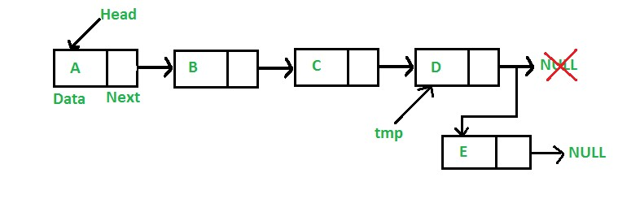
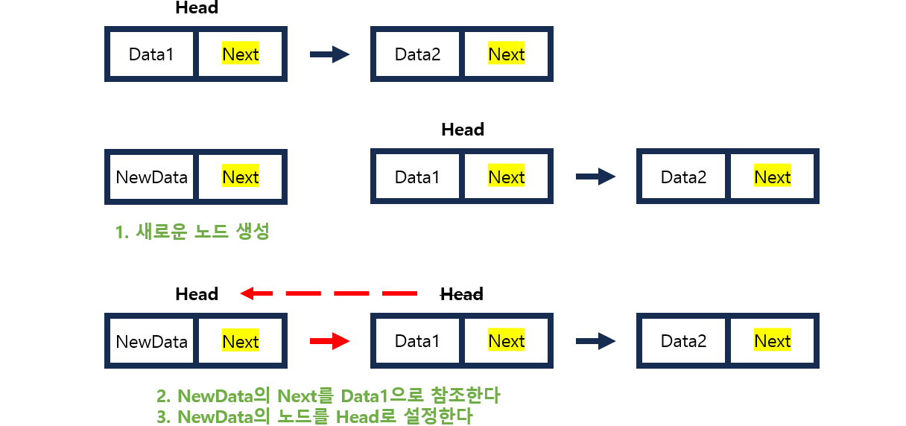
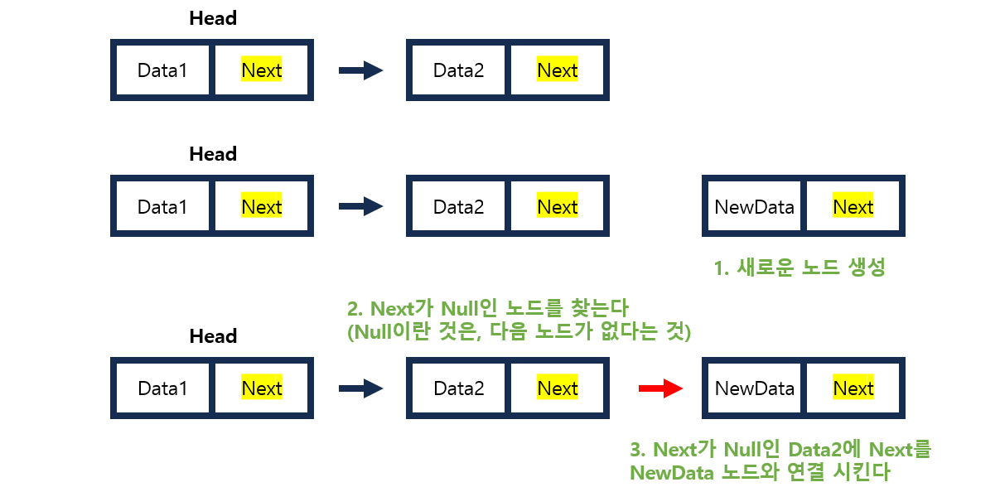
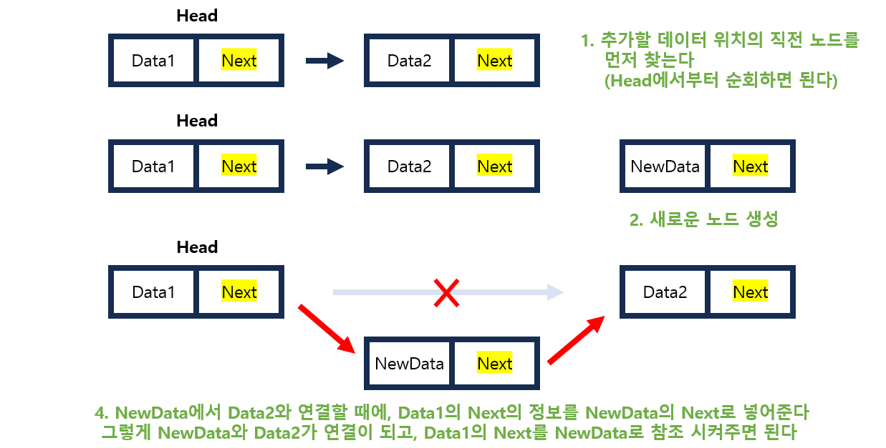
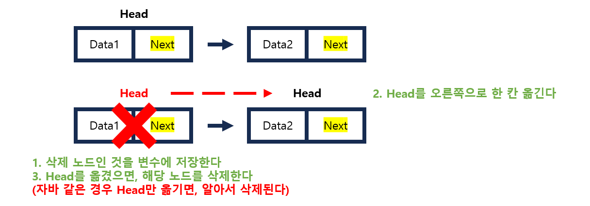
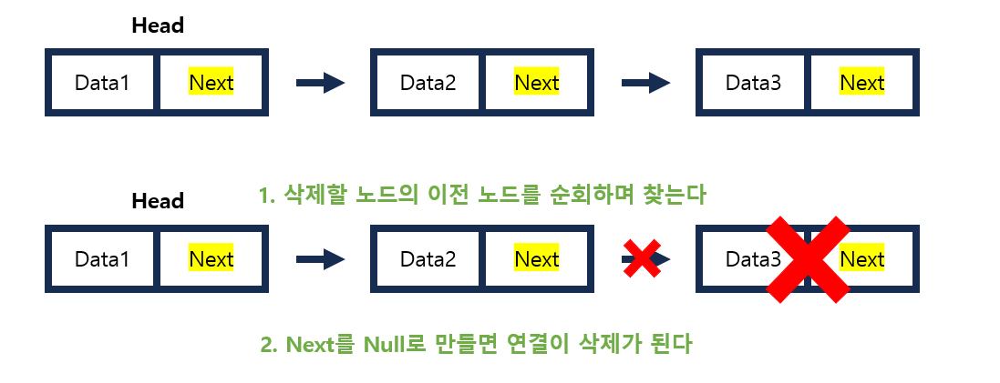
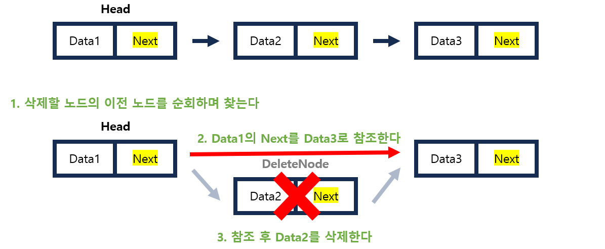

# [제로베이스] Java 자료구조 - 연결리스트

*출처 : 제로베이스 백엔드 스쿨*

## 연결리스트 (Linked List)

#### 각 노드에 데이터와, 포인터가 있고, 노드끼리 연결되어 있는 것을 연결리스트라고 한다

- 여기서 포인터는, 이전 노드 또는 다음 노드와의 연결을 담당한다

#### 제일 처음에 있는 노드를 Head라고 한다

- 제일 마지막 노드의 포인터는 NULL과 연결이 되어 있다

#### 데이터 추가/삭제는 비교적 쉽게 실행되지만, 인덱스가 없다는 점에서, 데이터를 찾으려면 Head부분부터 순회를 해야 한다 (탐색 속도 저하)

### 연결 리스트 종류

- **단일 연결 리스트 (Single Linked List)**
  - 노드에 다음 노드가 참조된 제일 간단한 형태의 연결 리스트다
  - 일반적으로 큐를 구현할 때에 사용이 된다
  - Head가 제일 중요하여, Head를 잃어버린다면, 데이터 전체를 사용을 못 한다

- **이중 연결 리스트 (Double Linked List)**
  - 노드끼리 양방향으로 연결이 되어 있다
  - 특히 이전 노드와 다음 노드를 참조 하고 있는 것이 이중 연결 리스트의 특징이다
  - 이중으로 연결되어 있어, 삭제할 때에는 데이터 손상이 덜 하지만, 추가 또는 정렬을 할 때에는 더 많은 작업량이 소모된다

- **원형 연결 리스트 (Circular Linked List)**
  - 제일 끝의 노드와 제일 앞의 노드가 연결되어 있다는 것이 특징이다

## 연결 리스트 기본 연산

#### 제일 앞에 데이터 추가

#### 제일 뒤에 데이터 추가

#### 노드와 노드 사이에 데이터를 추가하기

#### 첫 노드 삭제하기

#### 마지막 노드 삭제하기

#### 노드 사이에 있는 노드 삭제하기

