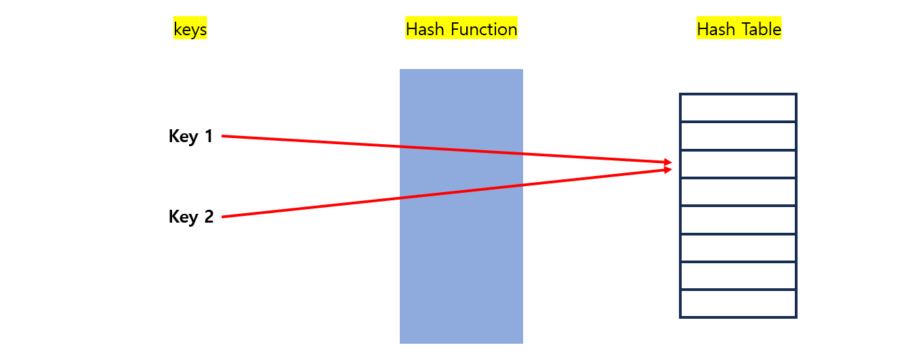
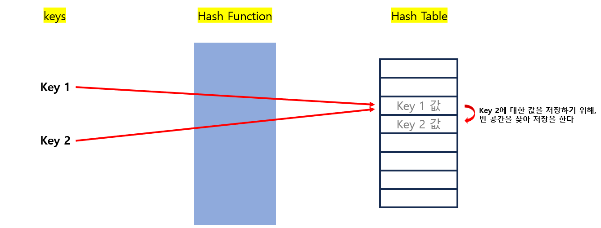
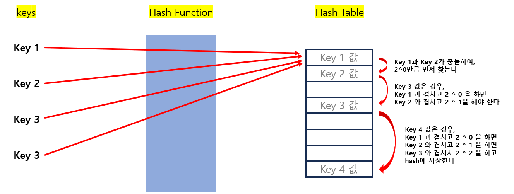
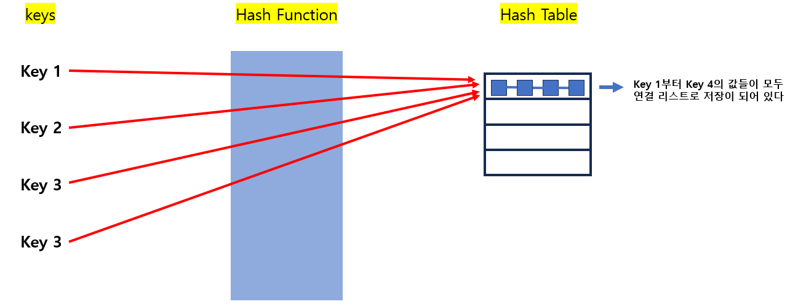

# [제로베이스] Java 자료구조 - 해시 테이블

*출처 : 제로베이스 백엔드 스쿨*


## 해시 테이블

#### key와 value를 저장하는 자료구조다 (순서는 중요하지 않다)

- key와 value를 묶어서 저장한다


.png)

#### Key 값에 Hash Function을 적용하여 배열의 고유한 index를 생성하고, 그 index를 통해 값을 저장 또는 검색을 한다

- 저장 되는 공간을 bucket이라고도 부른다


## 해시 충돌



- 위에서 **Key 1**을 함수를 통해 나온 값과 **Key 2**를 해시 함수를 통해 나온 값이 동일하게 나온다면 충돌이 일어난다
  - **개방 주소법**과 **분리 연결법**으로 이러한 충돌을 해결하려고 한다


#### 개방 주소법

- hash와 value가 1대1 관계를 유지한다
- 만약에 충돌이 일어났을 경우, 다른 빈 공간의 hash를 찾고, 저장을 한다
- 선형 탐사법, 제곱 탐사법, 이중 해싱 등이 개방 주소법으로 분류가 된다


- **선형 탐사법**
  - 충돌시 비어있는 공간을 순차적으로 찾게 된다
  - 하지만, 지속적으로 충돌이 발생하면, 하나의 공간을 중심으로 값들이 몰리게 된다




- **제곱 탐사법**
  - 해시의 저장순서 폭을 제곱으로 저장한다 (첫 번째 충돌이면 1만큼, 두 번째면 2 ^ 1, 그 뒤로 2 ^ 3만큼 찾게 된다)




- **이중 해싱**
  - 해싱 함수를 이중으로 사용하는 것이다
    - 해싱 함수 1 : 어느 hash에 저장할지 구해 준다
    - 해싱 함수 2 : 충돌이 발생할 경우의 함수다


#### 분리 연결법

- 1 대 n 관계이다
- 개방 주소법은 만약에 충돌이 생기면, 비어있는 해시를 찾는다
- 반대로 분리 연결법은 충돌이 생겨도, 연결 리스트로 같은 해시에 값을 저장한다
  - 나중에 값을 검색할 때에, 속도가 비교적 느리다





## 시간 복잡도

#### 각각의 Key값은 고유한 index를 가지고 있어 조회를 할 때에 O(1)이다

- 하지만 충돌이 일어났을 경우, 연결된 리스트까지 순회를 해야 해서 O(N)으로 증가할 수 있다


## HashMap 사용법

#### 

```java
Map <String, Integer> map = new HashMap();

// ==== 저장하기 ====
map.put("J", 7);
map.put("K", 8);
map.put("L", 9);

// ==== 읽기 (key를 통해서 값을 읽어낸다) ====
map.get("J");

// ==== 삭제하기 ====
map.remove(key값 입력);
map.remove(key, value);

// ==== 값 교체 ====
map.replace(key, value);
map.replace(key, oldValue, newValue); // oldValue가 일치할 때만 교체해준다

// ==== 키가 맵에 있는지 확인한다 (true or false 출력) ====
map.containsKey("J");

// ==== 값이 맵에 있는지 확인 ====
map.contains(7);

// ==== 맵 크기 출력 ==== 
map.size();

// ==== 맵이 비어 있는지 확인 ====
map.isEmpty();

// ==== 맵에 있는 데이터 모두 삭제 ====
map.clear();

// ==== 하나의 맵에 다른 맵을 추가 ====
map.putAll(다른 맵);

// ==== key를 순회하는 방법 (.keySet()) ====
for (String key : map.keySet()) {
}

// ==== key와 value를 순회하는 것 (.forEach() 사용) ====
map.forEach((key, value) -> {
    System.out.printf("%s - %d", key, value);
});
```

