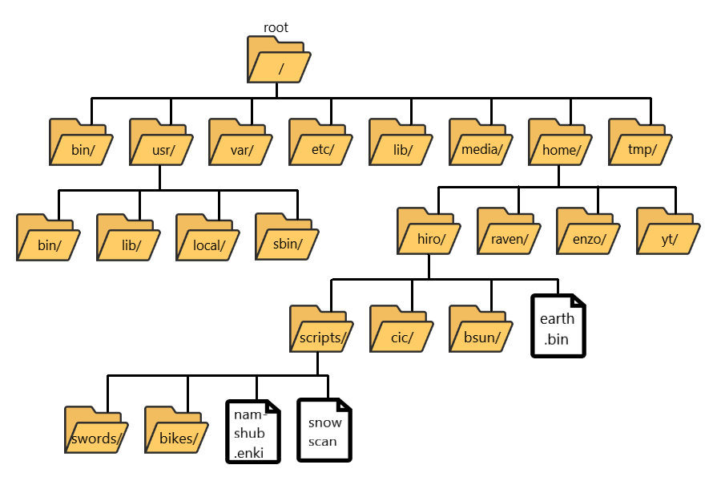
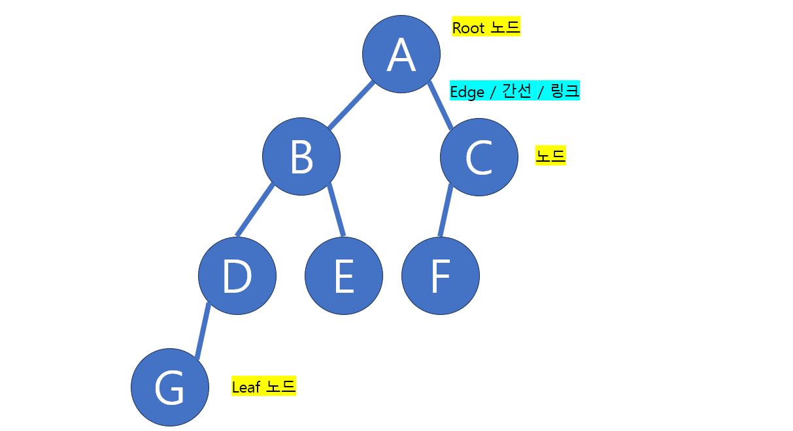
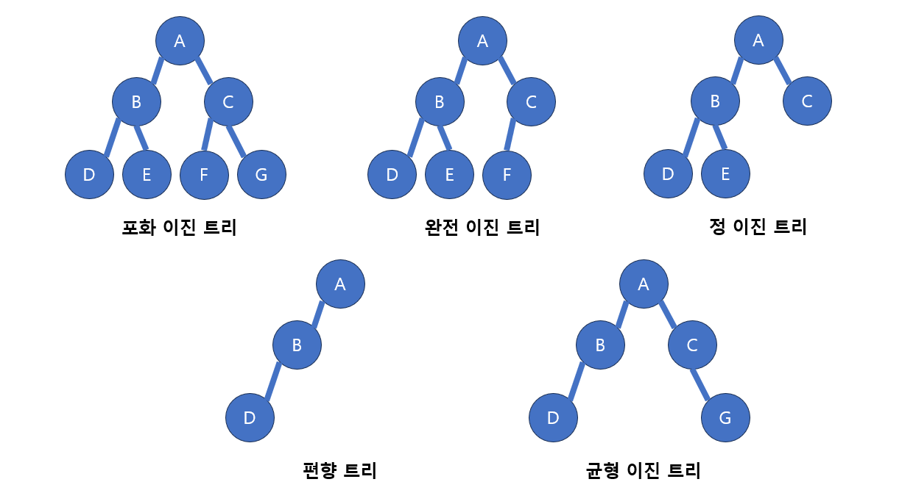
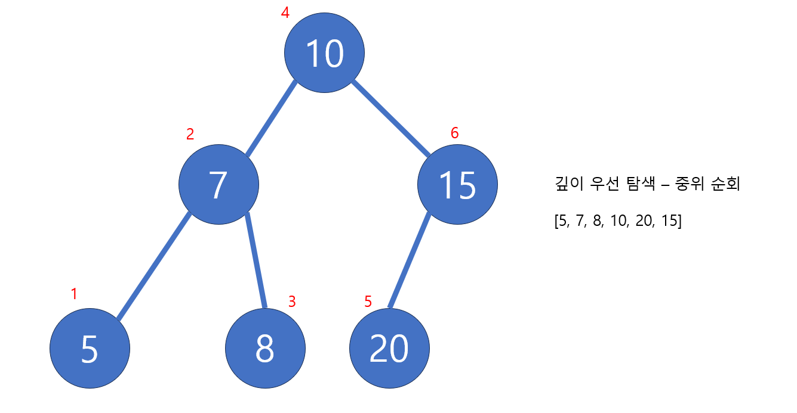

# [Java] 자료구조 - 트리, 이진 트리

#### 트리는 노드와 간선 (링크)로 만들어진 자료구조다

#### 트리는 사이클이 없고, 계층적 구조를 나타낼 때 사용된다

#### 트리는 모든 노드들이 연결이 되어 있어야 한다

- 만약 끊기게 된다면 새로운 트리가 만들어지는 것이다

#### 노드가 N개 이면 간선의 갯수는 N-1이다

## 트리 용어

**노드 (Node)** : 트리 안의 데이터 또는 값

**에지 (Edge)** : 노드를 연결하는 링크

**루트 노드 (Root)** : 트리의 제일 상단에 위치한 하나 밖에 없는 노드 (루트 노드는 부모 노드가 없다)

**Leaf 노드** : 트리의 제일 하단에 위치한 노드 (자식 노드가 없다)

**부모 노드** : **A** 는 **B**와 **C**의 부모 노드다. 연결된 노드의 상위 노드

**자식 노드** : **B**와 **C**는 **A**의 자식 노드다. 연결된 노드의 하위 노드들

**형제** : **B**와 **C**는 형제 노드다. 같은 부모 노드를 가지고 있으면 형제 노드라고 한다

**깊이 (Depth)** :  트리의 깊이, 즉 루트 노드에서 리프 노드의 깊이를 뜻한다

## 이진 트리 (Binary Tree)

#### 각 부모 노드는 2개의 자식 노드만 있을 수 있다

- 그냥 트리 같은 경우 부모 노드가 여러 자식 노드를 가질 수 있다

#### 부모 노드 기준 왼쪽과 오른쪽 노드로 구분한다

- **포화 이진 트리** : 트리가 모두 꽉 차있는 경우
- **완전 이진 트리** : 리프 노드들을 빼고, 모든 노드들이 채워져 있는 트리
- **정 이진 트리** : 모든 부모 노드들이 0개 또는 2개의 자식 노드를 가지고 있을 경우
- **편향 트리** : 노드들이 한 쪽으로 쏠렸을 경우
- **균형 이진 트리** : 왼쪽과 오른쪽으로 노드들의 개수가 같을 경우

## 이진 트리 순회

#### 전위 순회

- 현재 노드 => 왼쪽 노드 => 오른쪽 노드

- 현재 노드를 반환 후, 왼쪽 자식 노드를 탐색을 한다 (왼쪽 자식 노드가 있을 때마다, 그 값을 반환 한다)

#### 중위 순회

- 왼쪽 노드 => 현재 노드 => 오른쪽 노드
- 왼쪽을 우선 탐색을 하며, 왼쪽 노드가 자식 노드가 없을 때까지 탐색을 한다
- 자식이 없으면 출력을 하고, 부모 노드로 올라가 부모 노드를 출력하며, 오른쪽 노드가 있으면 오른쪽 노드를 탐색한다

#### 후위 순회

- 왼쪽 노드 => 오른쪽 노드 => 현재 노드
- 왼쪽 노드를 자식 노드가 없을 때까지 먼저 탐색을 하고, 그 노드를 반환을 한다
- 부모 노드로 올라가 오른쪽 노드가 있는지 확인을 한다 (있으면 오른쪽 노드를 탐색을 하고, 자식 노드가 없으면, 그 노드를 반환한다)

#### 레벨 순회

- 위의 3개의 방법은 DFS, 깊이 우선 탐색을 할 때에 사용이 된다
- 레벨 순회는 BFS, 넓이 우선 탐색을 할 때에 사용된다
- 위를 예를 들면 10을 탐색한 후, 그 다음 깊이에 있는 7과 15를 탐색하고 그 다음 깊이에 있는 5, 8, 20을 탐색을 한다

## 이진 트리 배열로 구현

#### 왼쪽 자식 노드

- 인덱스 0 시작 기준 : **2n + 1**
- 인덱스 1 시작 기준 : **2n**

#### 오른쪽 자식 노드

- 인덱스 0 시작 기준 : **2n + 2**
- 인덱스 1 시작 기준 : **2n + 1**

