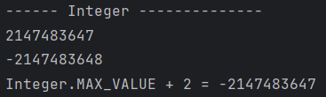
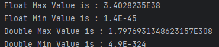

# [제로베이스] Java 변수와 자료형

*출처 : 제로베이스 백엔드 스쿨*


## Java란?

#### 자바는 선호도가 높은 프로그래밍 언어 중, 하나다

#### 객체 지향 프로그래밍 언어다

#### 다른 운영체제라도, 같은 코드를 사용해도 된다


- Java Compiler 는 Java 코드를 바이트 코드로 컴파일, 즉 반환해 준다
- 바이트 코드 (ByteCode) 는, 기계가 알아들을 수 있는 언어다
- JVM 은 Java Virtual Machine으로, 각 운영체제에 맞게, 바이트 코드를 반환해 주는 소프트웨어다


## 변수와 자료형

> #### 변수는 영어로 Variable

```java
int number = 77;
String name = "Alex";
```

#### **(자료형)  (변수 이름) = (값);**

- 변수 이름은 숫자로 시작하거나, 공백이 있을 수 없다
- 대소문자 모두 구분을 한다
- 주로 카멜 표기법을 사용한다 (예. firstNumber, secondNumber)
- 클래스를 표기할 때에는 파스칼 표기법을 사용한다 (예. AddNum, DivideNum)


### 자료형

- **숫자 (Number)** 

  - **정수** : int / long (int 와 long의 최댓값과 최솟값)
    - Integer 보다, 더 큰 값이 나오면, Long으로 자료형을 바꿔줘야 한다
    
    
    
    - Integer의 최대값을 넘을 경우 (Integer의 최소 값으로 바뀐 후, 남은 만큼 더해준다)
    
    
    
    

  ```java
  // Integer의 최대값을 넘는 경우, long으로 변환해줘야 한다
  long longNum = (long) Integer.MAX_VALUE + 10;
  ```

  

  

  - **실수** : float / double (float 와 double의 최댓값과 최솟값)

  

  ```java
  // 뒤에 f 를 안 붙이면, double로 인식을 한다
  float floatNum = 1.23f;
  double doubleNum = 1.23;
  ```

  

  

  - **2, 8, 16 진수**
    - 0b 로 시작 / 0 으로 시작 / 0x 로 시작


```java
// 2, 8, 16 진수
int numBase2 = 0b1100;
int numBase8 = 014;
int numBase16 = 0xC;
// 모두 12를 반환한다

// 2, 8, 16 진수로 반환하기
System.out.println("0b" + Integer.toBinaryString(numBase2));
System.out.println("0" + Integer.toOctalString(numBase8));
System.out.println("0x" + Integer.toHexString(numBase16));
```


- **부울 (Boolean)**
  - **boolean** : true 또는 false


- **문자 (Character)**

  - **char** : 한 개의 문자만 저장할 수 있음


- **문자열 (String)**
  - Character가 문자 하나면, String은 문자들이다
  - " "  안에 들어가야 한다

```java
String str1 = "abca";
String str2 = "bcd";

str1.equals(str2);
// str1과 str2를 비교해준다. output: false
// 값, 그 자체를 비교하는 것이다
// == 값은 경우, 객체를 비교하는 것이라서, 값이 같다고, 무조건 true가 아니다
// 즉 같은 값이라도, 다른 객체일 수 있다

str1.indexOf("a");
// 해당 값의 위치를 알려준다. output: 0
// 인덱스는 0부터 시작
// 중복되는 값이 있으면, 첫 번째부터 출력해준다

str1.indexOf("a", str1.indexOf("a") + 1);
// 두번째 a를 출력. output : 3

str1.replace("abca", "abc");
// abca 를 abc로 바꿔주는 것이다

str1.substring(0, 2);
// 문자열의 인덱스 0부터 1까지 출력해주는 것이다
// output : ab

str1.toUpperCase;
// 대분자로 반환해준다

str1.toLowerCase;
// 소문자로 반환해준다
```


- **StringBuffer**
  - String은 값을 변경을 못 한다. 값을 직접적으로 변경을 하기 위해서는 StringBuffer 자료형을 사용한다
  - 변경을 할 때에는, 새로운 객체를 만들어서, 그 객체를 변경을 하고, 기존 객체에 저장을 하는 것이다
    - 메모리 소모 up

```java
StringBuffer strB1 = new StringBuffer();

strB1.append("add string");
// strB1 ==> add string
```


- **Array**
  - 여러 값/데이터들을 저장할 수 있다

```java
int[] array1 = new Array[5];
// array1 ==> {0, 0, 0, 0, 0}

int[] array2 = {1, 2, 3, 4, 5};
// array2 ==> {1, 2, 3, 4, 5}
```


- **ArrayList**
  - 여러 값/데이터를 저장하면서, 리스트에 대한 값을 변경할 수 있다 (추가, 삭제)
  - **.add(value)** : value를 리스트에 추가해준다
  - **.get(index)** : index의 값을 반환해준다
  - **.size()** : 리스트의 값의 개수를 출력해준다
  - **.remove(index)** : index 값의 데이터를 지워준다
    - **.remove(Integer.valueOf(2))** : value에 대한 값을 지워준다
  - **.clear()** : 리스트 안에 모든 데이터를 삭제해준다
  - **.sort()** : 오름차순으로 정렬을 해준다
    - **.sort(Comparator.reverseOrder())** : 내림차순으로 정렬을 해준다
  - **.contains(value)** : value가 리스트 안에 존재하는지 확인해준다

```java
// ====== 어느 자료형이 들어와도 에러가 안 생긴다 =========
ArrayList list1 = new ArrayList();
list1.add("hello");
list1.add("world");
// list1 ==> ["hello", world]

list1.add(1, "!");
// 인덱스 1번째에 !를 넣는 것이다
// list1 ==> ["hello", "!", "world"]

// ====== 특정 자료형만 들어올 수 있도록 만들기 ==========
ArrayList <Integer> list2 = new ArrayList <Integer> ();
list2.add(1);
list2.add(3);
list2.add(7):
// list2 ==> [1, 3, 7]
// list2는 Integer만 넣을 수 있다
```


- **map**
  - 파이썬의 딕셔너리와 비슷한 형태로, key와 value가 있다
  - **.put(key, value)** : key와 value를 HashMap에 넣어준다
  - **.get(key)** : key에 대한 value를 출력해준다 
  - **.size()** : HashMap에 몇 개의 데이터가 있는지 반환해준다
  - **.remove(key)** : key에 대한 데이터를 지우는 것이다
  - **.containsKey(key)** : key에 대한 데이터가 존재하는지 확인해준다

```java
HashMap<Integer, String> map1 = new HashMap<Integer, String> ();
```

