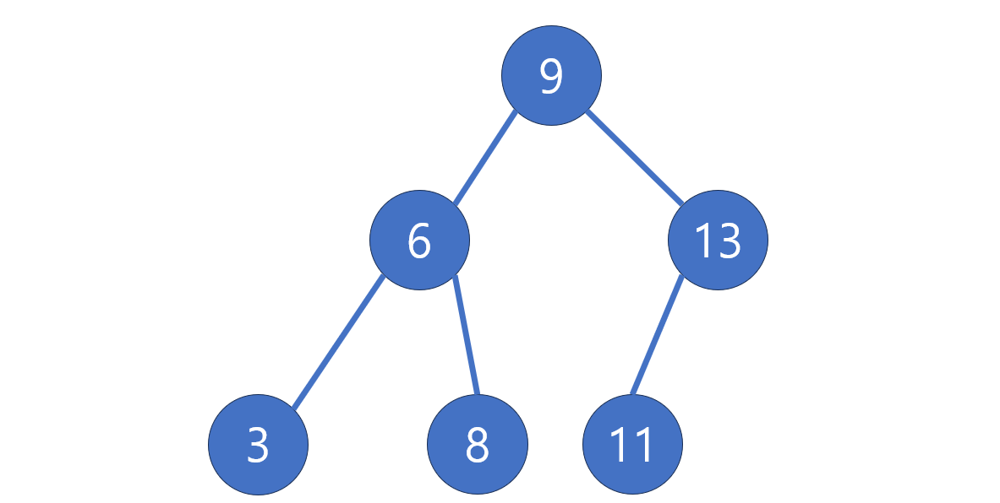
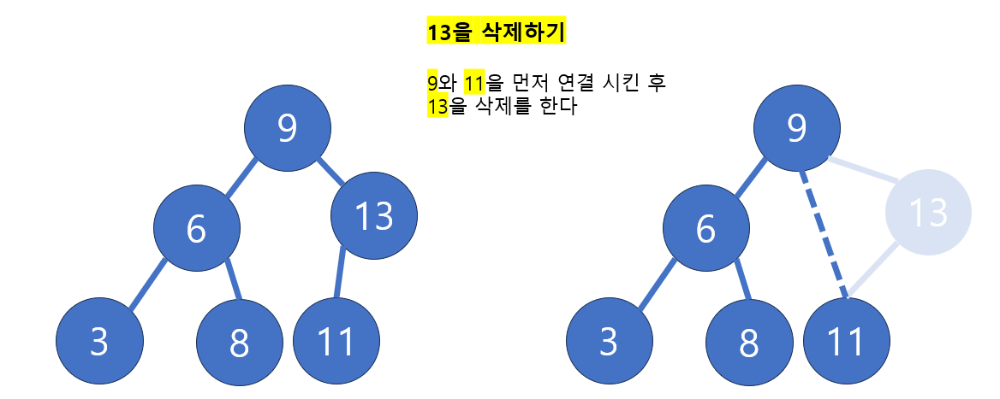
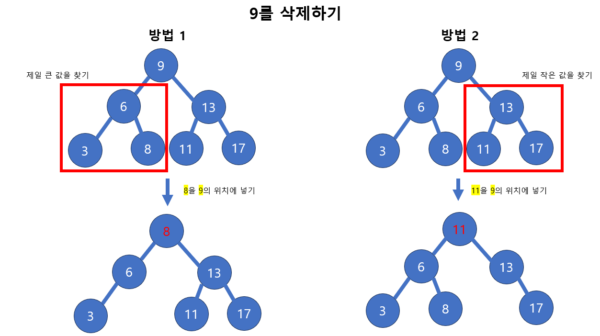

# [Java] 자료구조 - 이진 탐색 트리

## Binary Search Tree

#### 이진 검색 트리는 이진 트리로 만들어져 있다

#### 부모 노드 기준에서 왼쪽의 자식 노드는 부모 노드보다 값이 적고, 오른쪽의 자식 노드는 부모 노드보다 값이 크다

#### 중복된 값은 존재할 수 없다

#### 중위 순회를 하게 되면, 이진 검색 트리를 통해 오름차순으로 정렬을 할 수 있다

## 탐색, 삽입, 삭제

#### 탐색 (트리 높이 만큼만 탐색을 하면 된다)

- 루트 노드와 비교를 시작한다
- 해당 노드보다 작으면 왼쪽 자식 노드로, 크면 오른쪽 자식 노드로 계속 탐색한다
- 찾으려 하는 숫자를 위처럼 지속적으로 반복하고, 자식 노드가 없다면, null을 반환 한다

#### 삽입

- 삽입도 루트 노드부터 숫자를 비교한다
- 비교하는 노드보다 작으면 왼쪽으로, 크면 오른쪽 자식 노드로 내려간다
- 그렇게, 만약 같은 값이 발견되었다면, 삽입을 중단한다
- 탐색 중에 자식 노드가 없다면, 그 곳에 해당 숫자를 넣는다

#### 삭제

- 삭제할 노드를 먼저 탐색을 한다 (**Leaf 노드일 경우, 그 노드를 그냥 null 값을 바꾸면 된다**)

- **삭제할 노드에 자식 노드가 하나 있는 경우**
  - 자식 노드가 하나라는 것은, 자식 노드가 **Leaf 노드**라는 것이다

- **삭제할 노드에 자식이 2개가 있는 경우**

  - 2가지 방법이 있다 
    - 왼쪽 서브 트리 기준, 제일 큰 노드를 삭제한 노드에 올려 놓기
    - 오른쪽 서브 트리 기준, 제일 작은 노드를 삭제한 노드에 올려 놓기

  

