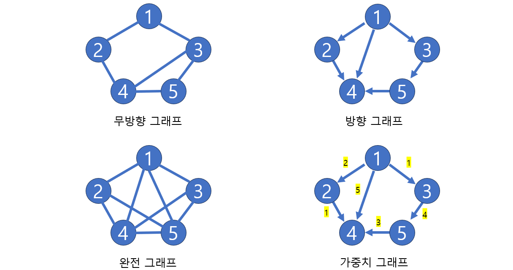
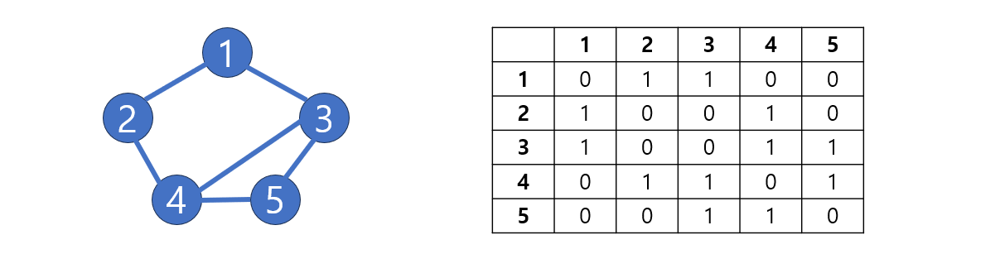
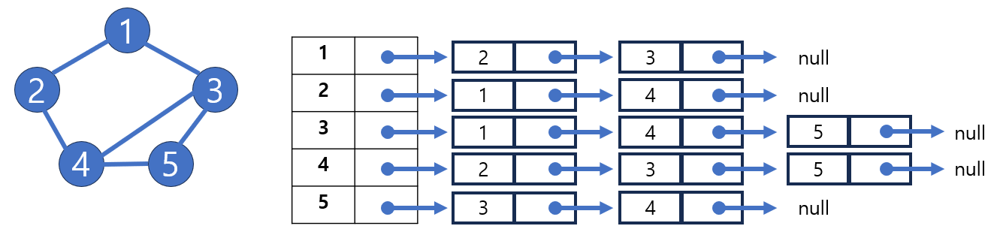
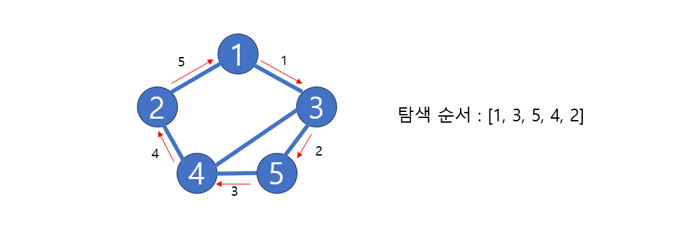
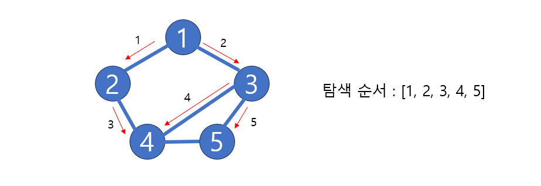

# [Java] 자료구조 - 그래프


 

## 그래프란?

#### 정점 (Vertex, Node)와 간선 (Edge)로 이루어져 있다

- 트리, 이진트리도 그래프의 한 종류인다


#### 그래프는 무방향 그래프와, 방향 그래프가 있다

- 무방향 그래프는 정점과 정점 사이에 방향이 없는 그래프이다 (즉 모든 정점들은 서로 왕복을 할 수 있다)
- 방향 그래프 같은 경우 정점에서 어느 정점으로 갈 수 있는 방향이 정해져 있다 (방향이 정해져 있으면, 그 방향 밖에 갈 수 없다)


- **정점 (Vertex)** : 노드(Node)라고도 하고, 값 또는 데이터를 저장한다
- **간선 (Edge)** : 정점을 연결하는 선이다
- **분지수 (차수, degree)** : 무방향 그래프에서 하나의 정점과 연결되어 있는 간선의 수
- **내향 분지수 (진출 차수, in-degree)** : 방향 그래프에서 들어오는 간선의 수
  - 예시) 위에 4의 내형 분지수는 3개다
- **외향 분지수 (진입 차수, out-degree)** : 방향 그래프에서 나가는 간선의 수
  - 예시) 방향 그래프에서 1의 집입 차수는 3개이
- **인접**
  - **인접 (adjacent)** : 정점 사이 간선이 있다
  - **부속 (Incident)** : 정점과 간선 사이 관계
- **경로 (Path)** : 출발지에서 목적지로 가는 순서
- **단순 경로 (Simple path)** : 경로 중에 반복되는 정점이 없다
- **사이클 (Cycle)** : 단순 경로의 출발지와 목적지가 같은 경우를 사이클이라 한다


## 그래프 종류





#### 무방향 그래프

- 정점이 간선으로 이어져 있고, 방향이 없다
  - 즉 1번에서 2번으로 간선이 이어져 있으면, 반대로 2번에서 1번으로 갈 수 있다 (모든 간선은 왕복이 가능하다)


#### 방향 그래프

- 정점이 간선으로 이어져 있고, 간선은 방향이 있다
  - 방향에 따라 왕복도 가능하지만, 1번에서 2번으로 가는 간선만 있으면, 2번에서 1번으로 돌아오지는 못 한다


#### 완전 그래프

- 모든 정점들이 간선으로 이어져 있다


#### 가중치 그래프

- 간선에 비용이 들어가 있다
  - 1에서 2로 가려면 2만큼의 비용이 들어간다


## 그래프 구현


### 인접 행렬

- 행렬 (Matrix)를 사용한다
- 정점이 이어져 있다면 1을 넣어주고, 아니면 0을 넣어준다
  - 아래에서 1에서 2로 가는 것은 무방향이기 때문에 1 -> 2 와 2 -> 1은 1이 들어가 있다
  - `matrix[1][2] = 1`  && `matrix[2][1] = 1`
- 탐색이 빠르다
- 하지만 메모리 공간을 비교적으로 많이 차지한다 (행렬을 이용한 것이라서)




```java
public class graphPractice {
    public static void main(String[] args) {
        int[][] edge = {{1, 2}, {1, 3}, {2, 4}, {3, 4}, {3, 5}, {4, 5}};

        int nodeNum = 5;

        int[][] matrix = new int[nodeNum + 1][nodeNum + 1];

        for (int i = 0; i < edge.length; i ++) {
            int[] link = edge[i];

            matrix[link[0]][link[1]] = 1;
            matrix[link[1]][link[0]] = 1;
        }

        for (int i = 1; i <= nodeNum; i++) {
            for (int j = 1; j <= nodeNum; j++) {
                System.out.print(matrix[i][j] + " ");
            }
            System.out.println();
        }
    }
}

/* output
0 1 1 0 0 
1 0 0 1 0 
1 0 0 1 1 
0 1 1 0 1 
0 0 1 1 0
*/
```


### 인접 리스트

- 배열안에 리스트, 또는 리스트 안에 리스트를 넣는 것이다 (각각의 장단점이 있음)
  - 배열은 탐색할 때에 빠르고, 리스트는 추가 삭제하는 것이 빠르다
  - 즉 정점을 탐색할 때에는 배열 + 리스트를 사용하는 것이 좋을 것이다
  - 반대로 추가 삭제할 것이 많으면 리스트 + 리스트를 사용하는 것이 좋을 것
- 이어진 정점을 추가만 하면 되는 것이라서 메모리는 필요한 만큼만 사용하게 된다

​	



```java
import java.util.*;
public class graphPractice {
    public static void main(String[] args) {
        int[][] edge = {{1, 2}, {1, 3}, {2, 4}, {3, 4}, {3, 5}, {4, 5}};

        int nodeNum = 5;

        ArrayList<ArrayList<Integer>> adjList = new ArrayList<ArrayList<Integer>>();

        for (int i = 0; i <= 5; i++) adjList.add(new ArrayList<>());

        for (int i = 0; i < edge.length; i++) {
            adjList.get(edge[i][0]).add(edge[i][1]);
            adjList.get(edge[i][1]).add(edge[i][0]);
        }

        for (int i = 1; i < adjList.size(); i++) {
            System.out.print(i + "의 인접 정점 :  ");
            for (int j = 0; j < adjList.get(i).size(); j++) {
                System.out.print(adjList.get(i).get(j) + " ");
            }
            System.out.println();
        }
    }
}

/* output
1의 인접 정점 :  2 3 
2의 인접 정점 :  1 4 
3의 인접 정점 :  1 4 5 
4의 인접 정점 :  2 3 5 
5의 인접 정점 :  3 4 
*/
```


## 그래프 탐색

#### DFS와 BFS와 구현 방식은 매우 비슷하다. 단 DFS는 Stack을 이용하고, BFS는 Queue를 이용한다


### DFS (깊이 우선 탐색)

- 연결된 인접 노드 하나를 기준으로 계속 안쪽으로 탐색을 하는 것이다 (탐색이 다 끝나면 주변 노드를 탐색하기 시작한다)





#### DFS를 구현을 할 때에 스택을 사용한다

```java
// ========== 인접 행렬 사용 ==========
public static void dfs(int start, int[][] matrix){

    Stack<Integer> stack = new Stack<>();

    int[] visited = new int[matrix.length + 1];
    int current;
    visited[start] = 1;

    stack.add(start);

    while (stack.size() != 0) {
        current = stack.pop();
        System.out.print(current + " ");

        for (int cur = 0; cur < matrix[current].length ; cur++) {
            if (matrix[current][cur] == 1 && visited[cur] == 0) {
                stack.push(cur);
                visited[cur] = 1;
            }
        }
    }
}


// ========== 인접 리스트 사용 ==========
public static void dfs(int start, ArrayList<ArrayList<Integer>> adjList){
    Stack<Integer> stack = new Stack<Integer>();

    int[] visited = new int[adjList.size() + 1];
    int current;
    visited[start] = 1;

    stack.push(start);

    while (stack.size() != 0) {
        current = stack.pop();
        System.out.print(current + " ");

        for (int cur : adjList.get(current)) {
            if (visited[cur] == 0) {
                stack.push(cur);
                visited[cur] = 1;
            }
        }
    }
}
```


### BFS (넓이 우선 탐색)

- 인접 노드들을 최우선적으로 탐색을 하면서 내려가는 것이다



#### BFS는 Queue를 사용한다

- Queue를 통해 제일 먼저 들어오는 노드, 즉 인접 노드들을 찾으면서 탐색이 가능하다


```java
// ========== 인접 리스트 사용 ==========
public static void bfs(int start, ArrayList<ArrayList<Integer>> adjList){
    Queue<Integer> queue = new LinkedList<>();

    int[] visited = new int[adjList.size() + 1];
    int current;
    visited[start] = 1;

    queue.offer(start);

    while (queue.size() != 0) {
        current = queue.remove();
        System.out.print(current + " ");

        for (int cur : adjList.get(current)) {
            if (visited[cur] == 0) {
                queue.offer(cur);
                visited[cur] = 1;
            }
        }
    }

}

// ========== 인접 행렬 사용 ==========
public static void bfs(int start, int[][] matrix){
    Queue<Integer> queue = new LinkedList<>();

    int[] visited = new int[matrix.length + 1];
    int current;
    visited[start] = 1;

    queue.offer(start);

    while (queue.size() != 0) {
        current = queue.remove();
        System.out.print(current + " ");

        for (int cur = 0; cur < matrix[current].length; cur++) {
            if (matrix[current][cur] == 1 && visited[cur] == 0) {
                queue.offer(cur);
                visited[cur] = 1;
            }
        }
    }

}
```

