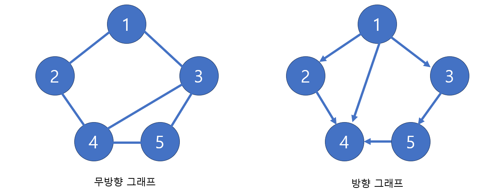

# [Java] 자료구조 - 그래프

 

## 그래프란?

#### 정점 (Vertex, Node)와 간선 (Edge)로 이루어져 있다

- 트리, 이진트리도 그래프의 한 종류인다

#### 그래프는 무방향 그래프와, 방향 그래프가 있다

- 무방향 그래프는 정점과 정점 사이에 방향이 없는 그래프이다 (즉 모든 정점들은 서로 왕복을 할 수 있다)
- 방향 그래프 같은 경우 정점에서 어느 정점으로 갈 수 있는 방향이 정해져 있다 (방향이 정해져 있으면, 그 방향 밖에 갈 수 없다)

- **정점 (Vertex)** : 노드(Node)라고도 하고, 값 또는 데이터를 저장한다
- **간선 (Edge)** : 정점을 연결하는 선이다
- **분지수 (차수, degree)** : 무방향 그래프에서 하나의 정점과 연결되어 있는 간선의 수
- **내향 분지수 (진출 차수, in-degree)** : 방향 그래프에서 들어오는 간선의 수
  - 예시) 위에 4의 내형 분지수는 3개다
- **외향 분지수 (진입 차수, out-degree)** : 방향 그래프에서 나가는 간선의 수
  - 예시) 방향 그래프에서 1의 집입 차수는 3개이
- **인접**
  - **인접 (adjacent)** : 정점 사이 간선이 있다
  - **부속 (Incident)** : 정점과 간선 사이 관계
- **경로 (Path)** : 출발지에서 목적지로 가는 순서
- **단순 경로 (Simple path)** : 경로 중에 반복되는 정점이 없다
- **사이클 (Cycle)** : 단순 경로의 출발지와 목적지가 같은 경우를 사이클이라 한다
