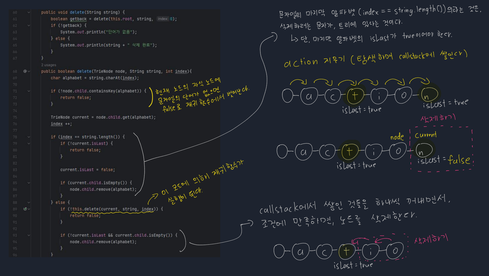

# [Java] 자료구조 - 트라이


#### 트리 형태의 자료구조로 문자열을 저장, 삭제, 탐색을 빠르게 하기 위해 만들어졌다

- 비슷한 문자를 굳이 따로따로 저장할 필요가 없어진다
- 예) act 와 action을 따로 저장하는 것 보단, action을 저장하고, action 안에 있는 act를 사용할 수 있게 만드는 것이다


## 단어를 트리에 추가

> #### 3가지 상황이 있다
>
> #### 3 가지 상황 모두, 끝의 알파벳을 단어의 마지막인 것을 표시해야 한다


#### 단어가 트리에 아예 없거나, 단어가 다른 하나의 단어에 포함 되어 있을 때에


#### 부분 적으로 같은 알파벳을 두 단어가 가지고 있을 때


## 단어를 트리에서 삭제


## 트라이 구현


#### 트라이 노드 만들기

- 트라이 노드에는 현재 노드가 단어의 마지막 알파벳인지 아닌지, 표시할 수 있는 속성을 넣는다
- 그리고 현재 노드의 자식 노드에 대한 정보를 넣는다
  - 자식 노드의 알파벳
  - 자식 노드 (TrieNode)

```java
import java.util.*;
class TrieNode {
    HashMap<Character, TrieNode> child;
    boolean isLast;

    TrieNode() {
        this.child = new HashMap<Character, TrieNode>();
        this.isLast = false;
    }

}

class Trie {
    TrieNode root;

    Trie() {
        this.root = new TrieNode();
    }
    
    ... insert, search, delete 메서드 ...
}
```


#### 트라이 insert

- current 노드는 무조건 루트 노드에서 시작한다
- 그리고 for문을 돌면서 **current** 노드의 자식 노드를 비교를 한다
  - 만약 자식 노드에 같은 알파벳이 없다면, 새로운 알파벳이 포함 되어 있는 노드를 생성한다
  - 그것이 아니면 **current** 노드를 **current.child.get(alphabet)** 노드로 바꾼다
    - **current**노드를 자식 노드로 바꾸는 것이다
  - 만약 문자열을 다 돌았다면, 마지막 알파벳의 노드에는 마지막 알파벳이라는 표시를 해준다
    - **current.isLast = true;**

```java
public void insert(String string) {
    TrieNode current = this.root;

    for (int i = 0; i < string.length(); i++) {
        char alphabet = string.charAt(i);

        // 새로운 노드를 생성해야 할 때에
        if (!current.child.containsKey(alphabet)) {
            current.child.put(alphabet, new TrieNode());
        }

        current = current.child.get(alphabet);

        if (i == string.length() - 1) {
            current.isLast = true;
            return;
        }
    }
}
```


#### 트라이 search (단어가 있는지 없는지 확인하는 것)

- Insert와 매우 비슷하다. 일단 **current**를 루트 노드로 지정하고, 문자열을 순회하면서 자식 노드와 비교를 하는 것이다
- 만약 자식 노드에 순회하는 문자열의 알파벳이 없다면, 바로 false를 반환한다
- 그게 아니면 **current**를 자식 노드로 갱신 시킨다
  - **current = current.child.get(alphabet);**
- 마지막 문자열에 도달 했을 때에, 해당 알파벳에 마지막 알파벳이라는 표시가 없으면, 해당 단어는 존재하지 않는 것이다
  - 즉 false를 반환
- for문을 무사히 빠져 나오게 되면 바로 true를 반환해주면 된다 (해당 단어가 트리에 존재한다는 뜻이다)

```java
public boolean search(String string) {
    TrieNode current = this.root;

    for (int i = 0; i < string.length(); i++) {
        char alphabet = string.charAt(i);

        if (!current.child.containsKey(alphabet)) {
            return false;
        }

        current = current.child.get(alphabet);

        if (i == string.length() - 1) {
            if (!current.isLast) {
                return false;
            }
        }
    }
    return true;
}
```


#### 트라이 노드 삭제 (그림 설명)

```java
    public void delete(String string) {
        boolean getback = delete(this.root, string, 0);
        if (!getback) {
            System.out.println("단어가 없음");
        } else {
            System.out.println(string + " 삭제 완료");
        }
    }

    public boolean delete(TrieNode node, String string, int index){
        char alphabet = string.charAt(index);

        if (!node.child.containsKey(alphabet)) {
            return false;
        }

        TrieNode current = node.child.get(alphabet);
        index ++;

        if (index == string.length()) {
            if (!current.isLast) {
                return false;
            }

            current.isLast = false;

            // 현재 노드에서, 자식 노드가 비었는지 확인
            // 안 비워있다면, 그냥 마지막 알파벳을 false 처리하고, 끝내면 된다
            if (current.child.isEmpty()) {
                node.child.remove(alphabet);    // node는 current 노드의 부모 노드 (current 노드를 삭제)
            }
        } else {
            if (!this.delete(current, string, index)) {
                return false;
            }

            if (!current.isLast && current.child.isEmpty()) {
                node.child.remove(alphabet);
            }
        }

        return true;
    }

}
```


