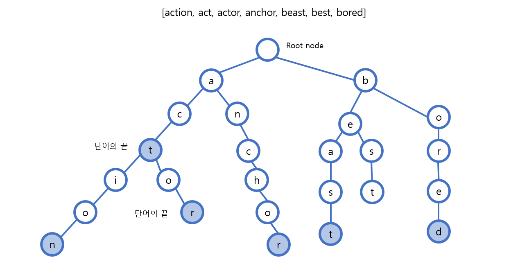
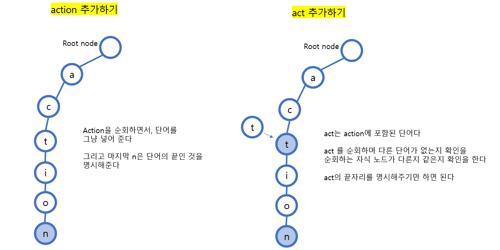
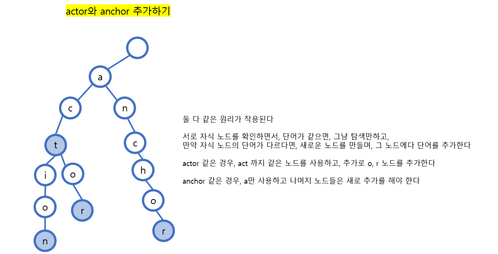
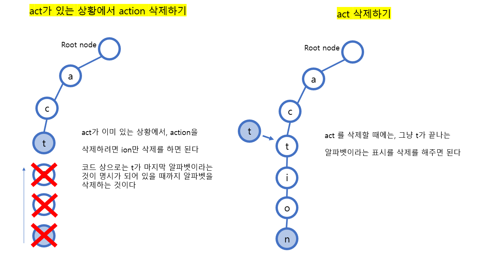

# [Java] 자료구조 - 트라이


#### 트리 형태의 자료구조로 문자열을 저장, 삭제, 탐색을 빠르게 하기 위해 만들어졌다

- 비슷한 문자를 굳이 따로따로 저장할 필요가 없어진다
- 예) act 와 action을 따로 저장하는 것 보단, action을 저장하고, action 안에 있는 act를 사용할 수 있게 만드는 것이다




## 단어를 트리에 추가

> #### 3가지 상황이 있다
>
> #### 3 가지 상황 모두, 끝의 알파벳을 단어의 마지막인 것을 표시해야 한다


#### 단어가 트리에 아예 없거나, 단어가 다른 하나의 단어에 포함 되어 있을 때에




#### 부분 적으로 같은 알파벳을 두 단어가 가지고 있을 때




## 단어를 트리에서 삭제




## 트라이 구현

```java
```

