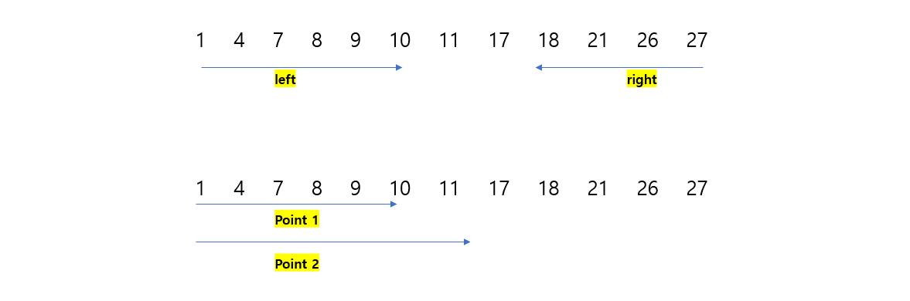
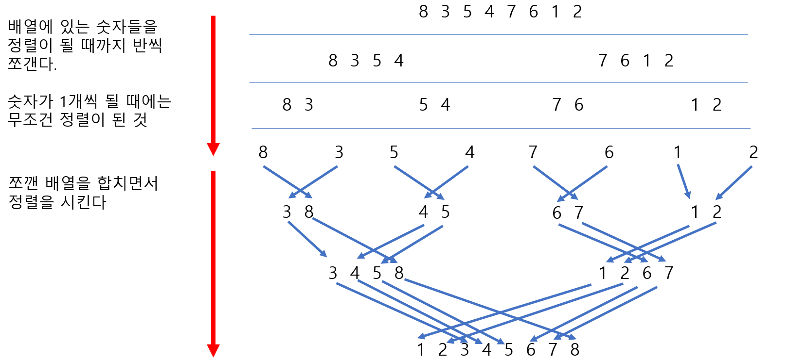

# [Java] 알고리즘 투포인터, 그리디, 분할정복


## 투포인터

#### 투포인터는 주로 배열에서 두 개의 포인트를 만들어서 포인트에 대한 정보를 가지고 데이터를 찾아내는 것이다


#### 투포인터는 양 옆에서 안쪽으로 들어오는 형태로 순회가 가능하다


#### 또한 같은 지점에서 탐색을 할 수 있도록 할 수 있다

- 기본적으로 문제에 따라 적절하게 사용을 하면 될 것 같다




```java
// ======= 양쪽에서 안 쪽으로 들어오는 방식 =========
// 2개의 숫자를 가지고, target을 만드는 것

private static boolean isPairSum(int[] array, int target) {
	int left = 0;
	int right = array.length - 1;
	while (left < right) {
		if (array[left] + array[right] == target) return true;
		else if (array[left] + array[right] > target) right--;
		else left++;
	}
	return false;
}


// ======= 같은 방향에서 시작하기 ===========
// 정해진 특정 숫자가 아닌, 연속된 숫자들끼리 target을 만들 수 있는 경우의 수

private static int sum(int[] array, int target) {
	int left = 0;
	int right = 0;
    int answer = 0;
    int tempAdd = array[left];
    
	while (left < right) {
        if (tempAdd <= target) {
            if (tempAdd == target) answer += 1;
            if (right + 1 < array.length) {
                right ++;
                tempAdd += array[right];
            } else {
                tempAdd -= array[left];
                left ++;
            }
        } else if (tempAdd > target) {
            tempAdd -= array[left];
            left ++;
        }
        
	}
	return answer;
}
```


## 그리디

#### 현재 상황에서 최적의 결과물을 만들어내는 것이다

- 그래서 문제를 파악을 더 잘 해야 그리디라는 것을 알 수 있다


#### 다른 알고리즘처럼 구현 또는 외울 코드는 정해져 있지 않다


#### 하지만 잘 못 사용했다가, 제대로 된 결과가 안 나올 수 있다


https://jejoonlee.tistory.com/325 - 동전 O

- 대표적인 그리디 문제 중 하나다


#### 그 외에도 하나의 강의실을 최대한 많이 사용할 수 있는 경우 등도 문제로 나올 수 있다

- 아래에는 최대한 많은 활동을 할 수 있도록 알아내는 것이다
- 종료 시간이 빠르게 이루어지는 대로 정렬을 할 필요가 있다

| 활동      | 가   | 나   | 다   | 라   | 마   | 바   |
| --------- | ---- | ---- | ---- | ---- | ---- | ---- |
| 시작 시간 | 7    | 5    | 3    | 1    | 6    | 10   |
| 종료 시간 | 8    | 7    | 6    | 2    | 9    | 11   |


- 처음부터 순회를 하고, 겹치지 않는 시간들을 나열하면 된다
- D - C - A - F

| 활동 이름 | 라   | 다   | 나   | 가   | 마   | 바   |
| --------- | ---- | ---- | ---- | ---- | ---- | ---- |
| 시작 시간 | 1    | 3    | 5    | 7    | 6    | 10   |
| 종료 시간 | 2    | 6    | 7    | 8    | 9    | 11   |


## 분할정복

#### 문제를 분할해서 해결하는 것이다

- 합병 정렬 - 먼저 배열을 하나의 값으로 분할 한 다음, 합치면서 정렬했던 것
- 이진 검색 - 정렬에서 중간 지점을 지속적으로 만들면서 값을 찾는 것이다





