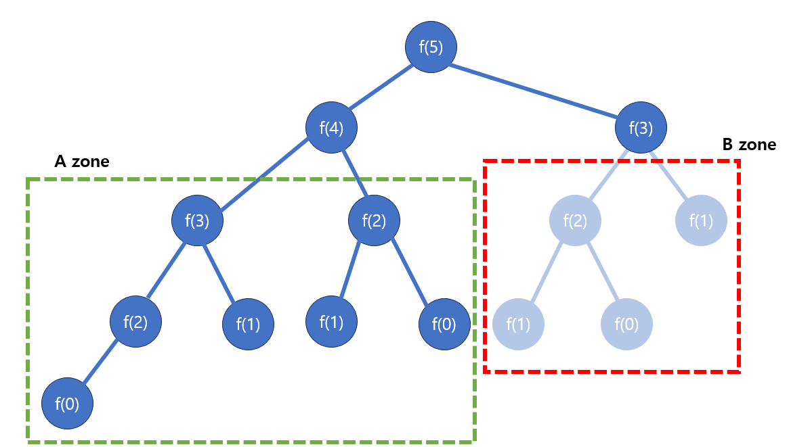

# [Java] 알고리즘 다이나믹 프로그래밍


## 다이나믹 프로그래밍


#### 큰 문제를 작은 문제로 쪼개서 앞에 저장을 하고, 해결해 나가는 것이다


#### 피보나치 수열 예시)

- 1, 1, 2, 3, 5, 8, 13, 21 - 이렇게 순서대로 공식대로 계산을 하면서 문제를 해결하는 방식이 있다 (시간이 오래 걸릴 수 있다)


| f(1) | f(2) | f(3) | f(4) | f(5) | f(6) | f(7) | f(8) | f(9) | f(10) |
| :--: | :--: | :--: | :--: | :--: | :--: | :--: | :--: | :--: | :---: |
|  1   |  1   |  2   |  3   |  5   |  8   |  13  |  21  |  34  |  55   |

- 위와 같이 f(10) 까지 저장이 되어 있으면, f(11)을 구할 때 f(1)부터 다시 구하는 것이 아니라 f(9)와 f(10)만 찾아서 더해주면 된다




- 피보나치 수열을 구할 때에, 재귀를 사용할 때에는, 위와 같이 A zone과 B zone 모두 작동하게 된다
  - 즉 B zone에 f(3)을 구할 때에, f(0)부터 다시 계산해야 하는 것이다
  - 그렇게 되면 실행 시간이 증가하게 된다
- 반대로 DP를 사용하게 된다면 B zone을 없애고, f(4) 와, 이미 저장된 f(3)의 값을 찾아서 더해주면 f(5)의 값이 나오게 된다


#### DP 는 부분 문제가 겹칠 때, 사용하는게 좋다

- 위와 같이 피보나치 수열의 경우, 재귀함수를 사용했을 때, A zone과 B zone이 겹치는 것을 볼 수 있다
- 겹치는 부분을 DP를 통해 없애줄 수 있다


#### 구현할 때에는 Tabulation 방식과, Memoization 방식이 있다

- **Tabulation 방식**
  - Bottom-up 방식이라고도 한다. 반복문을 활용을 한다
  - 1차원 DP 배열을 만들고, 인덱스 0부터 구하려는 값까지 데이터을 채워나가는 것이다
- **Memoization 방식**
  - Top-Down 방식이고, 재귀를 활용한다
  - 이것도 DP배열에 데이터를 채운다
  - 일반 재귀 방식과 똑같지만, 만약에 찾으려는 값이 이미 DP 배열에 있다고 하면, 바로 그 답을 가지고 올 수 있다 (즉 A zone이 이미 만들어졌기 때문에 f(3)을 구할 때에, DP 배열에 있는 f(3) 값을 가지고 오게 된다)


#### 피보나치 코드 구현!

```java

public class Fibo {
    public static int FiboRecur(int num) {
        if (num == 0) return 0;
        if (num < 2) return 1;
        return FiboRecur(num - 1) + FiboRecur(num -2);
    }
	
    // ====== Tabulation 방식 ========
    public static int FiboOne(int num) {
        int[] fiboArray = new int[num + 1]; // dp 테이블
        if (fiboArray.length > 1) fiboArray[1] = 1;

        for(int i = 2; i <= num; i++) fiboArray[i] = fiboArray[i - 1] + fiboArray[i - 2];

        return fiboArray[num];
    }
	
    // ====== Memoization 방식 ========
    static int[] fiboDP= new int[1000];
    public static int FiboTwo(int num) {
        if (num == 0) return 0;
        if (num <= 2) return 1;

        if (fiboDP[num] != 0) {
            return fiboDP[num];
        }

        fiboDP[num] = FiboTwo(num - 1) + FiboTwo(num - 2);
        return fiboDP[num];
    }

    public static void main(String[] args) {
        System.out.println(FiboRecur(10));
        System.out.println(FiboOne(10));
        System.out.println(FiboTwo(10));
    }
}
```


