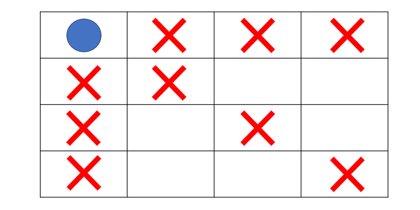

# [Java] 알고리즘 백트래킹


## 백트래킹

#### DFS와 백트래킹이 다른점

- DFS는 가능한 모든 경우의 수를 탐색을 한다 (그래서 시간이 많이 걸린다)
- 백트래킹은 탐색을 하다가, 불필요한 탐색이라고 생각하면, 다른 루트를 탐색을 한다
  - 백트래킹에서는 얼마나 가지치기를 잘 하느냐가 제일 중요하다


#### 용어

- **유망 (Promising)** :  목표의 값이 될 가능성이 있다는 것
- **가지치기 (Prunning)** : 목표의 값이 될 수 있는 가능성이 없어, 해당 노드를 제외
- **백트래킹 (Backtracking)** : 유망하지 않는 쪽으로 가지 않고 다시 돌아오는 것


```java
void dfs(int cnt, int idx) { // 현재까지의 결과, 탐색을 진행할 인덱스 
	// r개를 선택한 경우 
	if(cnt == r) { 
    	// 결과 처리 후 현재 가지에 대한 탐색 종료 
        return; 
    }
    
    // r개를 선택하지 않은 경우 재귀 호출 반복 
	for(int i = idx; i < n; i++){ 
    	if(!selected[i]){
			selected[i] = true; // 상태 변화 
			dfs(cnt + 1, i); // 재귀 호출
			selected[i] = false; // 다음 경우의 수를 위해 상태 복구 
		}
    }
}
```

[from : hxlhe46](https://velog.io/@jxlhe46/%EC%95%8C%EA%B3%A0%EB%A6%AC%EC%A6%98-%EB%B0%B1%ED%8A%B8%EB%9E%98%ED%82%B9-Back-tracking)


### N-Queen

- N X N인 체스판에 N개의 퀸을 배치하는 것이다 (서로 공격을 못 하도록)
- 여기서 퀸이 놓여진 곳에서 동서남북, 모든 대각선을 공격할 수 있다
- 퀸이 놓여진 곳 기준에서 공격을 할 수 있는 좌표들을 모두 가지치기를 한다
- 그렇게 놓을 수 있는 곳에 퀸을 놓고, 가지치키를 하면서 경우의 수를 찾는 것이다




#### N-Queen 문제 같은 경우 2중 배열 또는 리스트가 아니라 단일 배열을 사용해도 된다

- 퀸이 공격을 하는 특성 상, 같은 행과 열에는 다른 퀸을 놓을 수 없다


#### board[row] == board[i] || row - i == Math.abs(board[row] - board[i]

- **board[row] == board[i]**  :  퀸이 같은 열에 있다는 것이다
- **row - i == Math.abs(board[row] - board[i]**  :  퀸이 같은 대각선 위치에 있다는 것이다 (제일 이해가 안 갔던 부분)
  - **abs(x1 - x2) == abs(y1 - y2)** 라고 생각하면 된다 
  - 같은 대각선에 있다는 것은, 각각의 좌표의 행의 길이와 열의 길이가 같다는 것이다


```java

public class nQueen {
    static int n = 4;
    static int[] board = new int[n];
    static int count;

    public static int queen(int row) {
        if (row == n) {
            count ++;

            for (int i = 0; i < n; i++) {
                System.out.print(board[i] + " ");
            }
            System.out.println();
            return count;
        }

        for (int i = 0; i < n; i ++) {
            board[row] = i;

            if (isPromising(row)) {
                queen(row + 1);
            }
        }

        return count;
    }

    public static boolean isPromising(int row) {
        for (int i = 0; i < row; i++) {
            if (board[row] == board[i] || row - i == Math.abs(board[row] - board[i])) {
                return false;
            }
        }
        return true;
    }
    public static void main(String[] args) {
        System.out.println(queen(0));
    }
}

```

