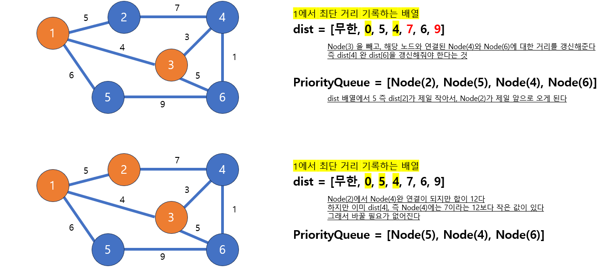
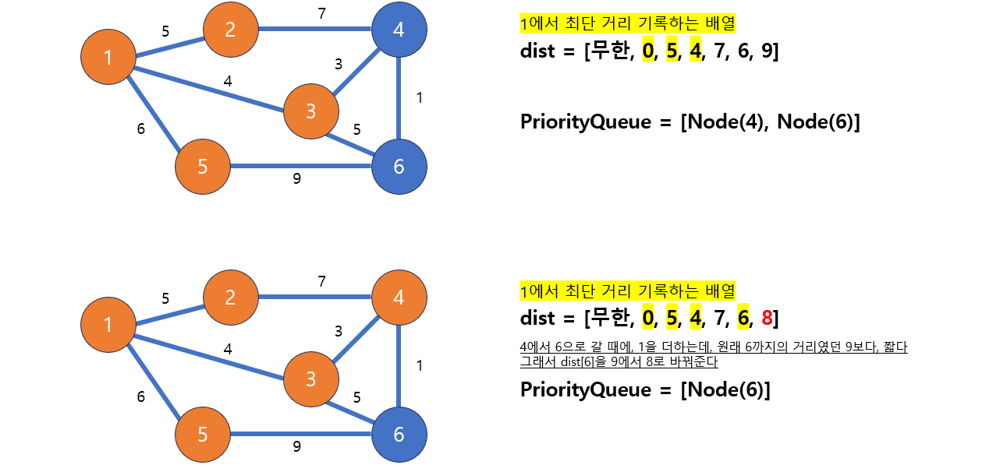

# [Java] 알고리즘 최단경로 (다익스트라)


## 최단 경로 알고리즘

#### 두 노드를 연결하는 가장 짧은 경로를 찾는다 (노드 사이의 간선 마다, 특정 값이 있다)

- 지도 탐색, 네트워크


## 다익스트라

#### 출발 노드 기준에서, 다른 모든 노드의 최단 경로를 구할 수 있다 (하지만 가중치 음수 값이 없어야 한다)


#### 다익스트라 알고리즘은, 우선순위 큐를 사용한다


### 그림으로 대략적인 설명








```java
import java.util.*;

public class Dijkstra {

    static class Node {
        int to;
        int distance;

        Node(int to, int distance) {
            this.to = to;
            this.distance = distance;
        }
    }

    public static void dijkstra(int nodes, int[][] data, int start) {
        ArrayList<ArrayList<Node>> graph = new ArrayList<>();
        PriorityQueue<Node> nodeQueue = new PriorityQueue<>((n1, n2) -> n1.distance - n2.distance);

        int[] dist = new int[nodes + 1];
        for (int i = 0; i < dist.length; i ++) dist[i] = Integer.MAX_VALUE;
        dist[start] = 0;

        for (int i = 0; i <= nodes; i++) graph.add(new ArrayList<Node>());

        for (int i = 0; i < data.length; i++) {
            graph.get(data[i][0]).add(new Node(data[i][1], data[i][2]));
        }

        nodeQueue.add(new Node(start, 0));

        while (!nodeQueue.isEmpty()) {
            Node curNode = nodeQueue.remove();

            if (dist[curNode.to] < curNode.distance) {
                continue;
            }

            for (int i = 0; i < graph.get(curNode.to).size(); i++) {
                Node nextNode = graph.get(curNode.to).get(i);

                if (dist[nextNode.to] > curNode.distance + nextNode.distance) {
                    dist[nextNode.to] = curNode.distance + nextNode.distance;
                    nodeQueue.add(new Node(nextNode.to, dist[nextNode.to]));
                }
            }

        }

        for (int i = 1; i < dist.length; i++) {
            System.out.print(dist[i] + " ");
        }
    }

    public static void main(String[] args) {
        int[][] data = {{1, 2, 5}, {1, 3, 4}, {1, 5, 6}, {2, 4, 7}, {3, 4, 3}, {3, 6, 5},{4, 6, 1}, {5, 6, 9}};
        dijkstra(6, data, 1);
    }
}
```
