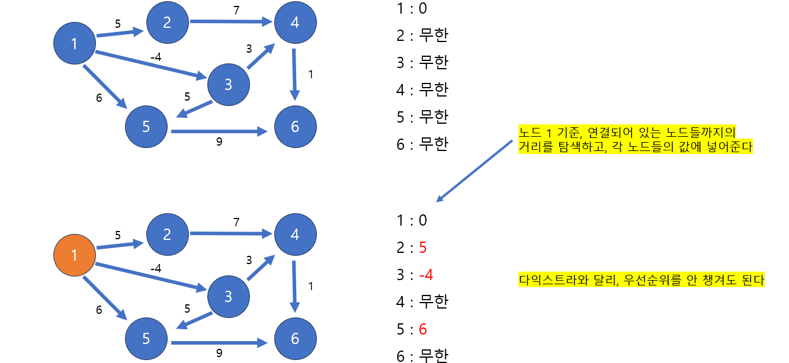
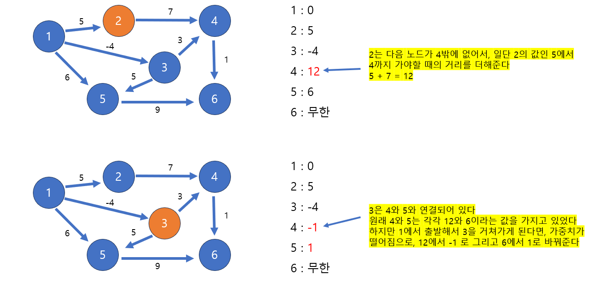
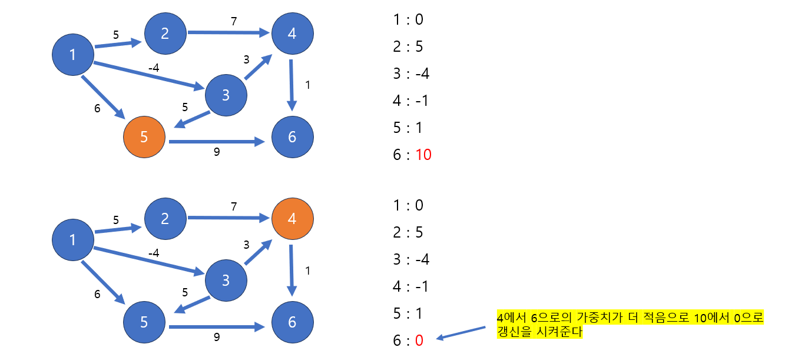
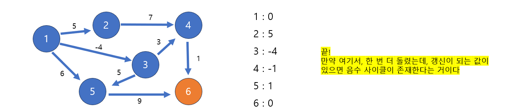

# [Java] 알고리즘 최단경로 (벨만-포드)


## 벨만-포드


#### 음수 가중치를 포함해서, 시작 정점에서 다른 정점까지 최단 거리를 구할 수 있다

- 추가로 벨만-포드 알고리즘을 통해서 음수 사이클 존재의 여부를 알 수 있다
  - 음수 사이클이란, 한 노드에서 다른 노드 사이의 간선이 2개가 존재하고, 왔다 갔는데, 가중치가 오히려 내려가는 것
  - A, B가 있는데 A -> B 는 8 이고 B -> A 는 -9 라고 하면, A와 B를 오고 가면 -1이 된다


#### 모든 간선을 순회한다!!!











```java
import java.util.*;
public class Main2 {

    static class Edge {
        int from;
        int to;
        int distance;

        Edge(int from, int to, int distance) {
            this.from = from;
            this.to = to;
            this.distance = distance;
        }
    }

    public static void bellmanFord(int vertex, int edge, int[][] data, int start) {
        Edge[] edgeArray = new Edge[edge]; // 모든 간선을 확인해야 한다. 그래서 모든 간선을 하나의 배열 안에 넣는다

        for (int i = 0; i < edge; i++) edgeArray[i] = new Edge(data[i][0], data[i][1], data[i][2]);

        int[] dist = new int[vertex + 1];

        for (int i = 0; i <= vertex; i++) dist[i] = Integer.MAX_VALUE;
        dist[start] = 0;

        boolean isNegCycle = false;

        for (int i = 0; i < vertex + 1; i++) {
            for (int j = 0; j < edge; j++) {
                Edge curEdge = edgeArray[j];

                if (dist[curEdge.from] != Integer.MAX_VALUE && 
                    dist[curEdge.to] > dist[curEdge.from] + curEdge.distance) {
                    
                    dist[curEdge.to] = dist[curEdge.from] + curEdge.distance;
                    
                    // 마지막 한 번을 돌았을 때에, 값이 갱신이 된다는 것은, 음수 사이클이 존재한다는 것이다
                    if (i == vertex) isNegCycle = true;
                }
            }
        }

        if (isNegCycle) {
            System.out.println("음수 사이클");
        } else {
            for(int i = 1; i < dist.length; i ++) System.out.print(dist[i] + " ");
        }
    }
    
    public static void main(String[] args) {
        int[][] data = {{1, 2, 5}, {1, 3, -4}, {1, 5, 6}, {2, 4, 7}, 
                        {3, 4, 3}, {3, 5, 5}, {4, 6, 1}, {5, 6, 9}};
        
        bellmanFord(6, data.length, data, 1);
    }
}

```

