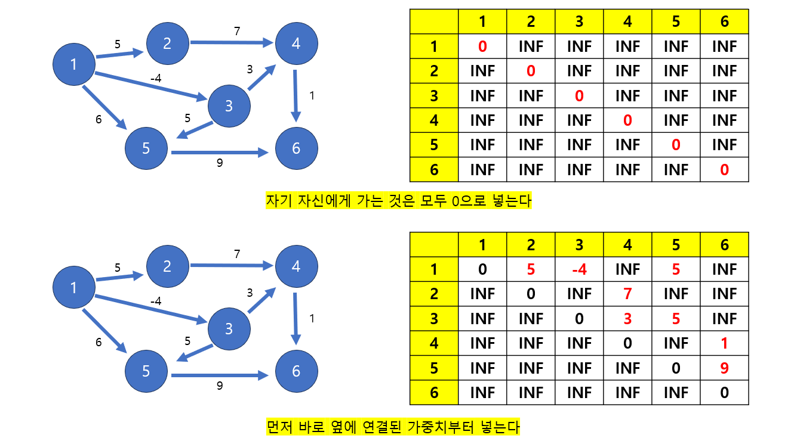
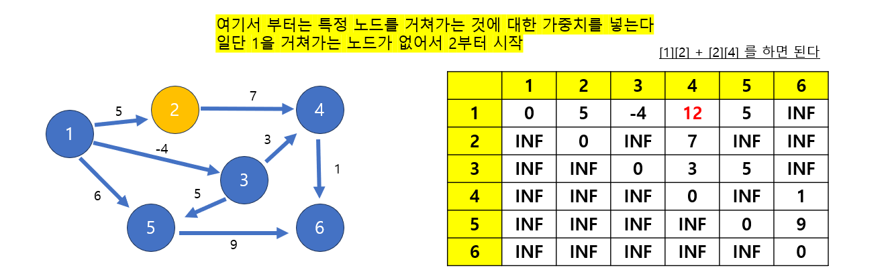
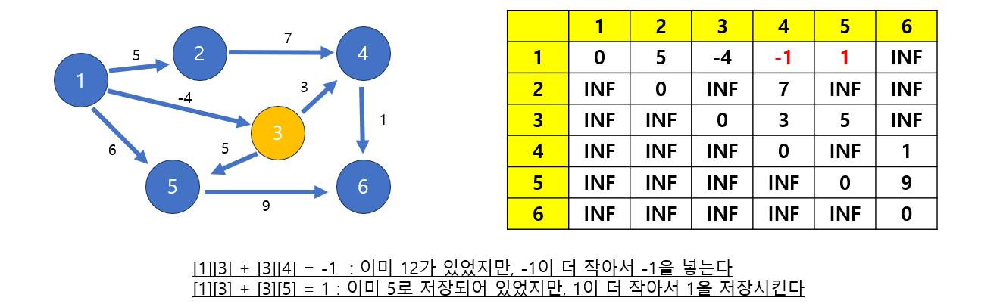
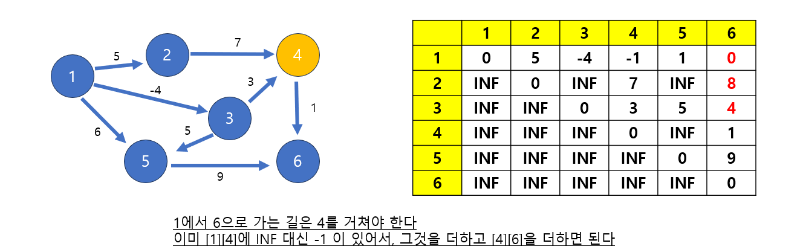

# [Java] 알고리즘 최단경로 (플로이드-워셜)


## 플로이드-워셜


#### 다익스트라와 벨만 포드는 하나의 시작점에서 모든 노드들 사이의 거리를 알아냈다면, 플로이드-워셜은 모든 노드들 사이의 최소 거리를 알아낼 수 있다


#### 음수가 있어도 가능하고, 자기 자신에게 가는 것이 만약 0 아래로 떨어지면 음수 사이클이라는 것을 확인할 수 있다


#### 단 3중 for문을 사용하기 때문에 다른 최단 경로 알고리즘에 비해 시간 복잡도가 높다











#### 이 다음에는 갱신할 데이터가 없다


```java
import java.util.*;
public class Main3 {

    static int[][] dist;
    static int INF = 1000000000;

    public static void floydWarshall(int nodes, int edge, int[][] data, int start){
        dist = new int[nodes + 1][nodes + 1];
        for (int i = 1; i <= nodes; i++) {
            for (int j = 1; j <= nodes; j++) {
                if (i != j) dist[i][j] = INF;
            }
        }

        for (int i = 0; i < edge; i++) {
            // data[i][0] 는 시작점
            // data[i][1] 는 바로 옆에 연결되어 있는 점
            // data[i][2] 가중치
            dist[data[i][0]][data[i][1]] = data[i][2];
        }

        // cross는 거쳐가는 번호
        for (int cross = 1; cross <= nodes; cross ++) {
            for (int i = 1; i <= nodes; i ++) {
                for (int j = 1; j <= nodes; j ++) {
                    if (dist[i][cross] != INF && dist[cross][j] != INF) {
                        dist[i][j] = Math.min(dist[i][j], dist[i][cross] + dist[cross][j]);
                    }
                }
            }
        }

        for (int i = 1; i <= nodes; i++) {
            for (int j = 1; j <= nodes; j ++) {
                if (dist[i][j] == INF) {
                    System.out.print("INF" + " ");
                }   else {
                    System.out.print(dist[i][j] + " ");
                }
            }
            System.out.println();
        }
    }
    
    public static void main(String[] args) {
        int[][] data = {{1, 2, 5}, {1, 3, -4}, {1, 5, 6}, {2, 4, 7}, 
                        {3, 4, 3}, {3, 5, 5}, {4, 6, 1}, {5, 6, 9}};
        floydWarshall(6, data.length,data, 1);
    }
}

```

