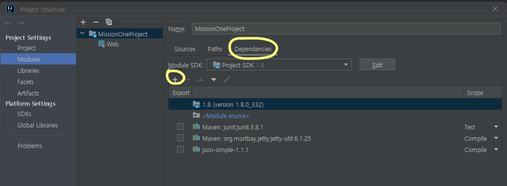

# [Java] Open API와 JSON 활용하기


## 서울 공공 WIFI Open API 가져오기

https://data.seoul.go.kr/dataList/OA-20883/S/1/datasetView.do

- 위 주소를 통해서 API를 사용하기 위한 key와 사용법에 대해 읽는다
- Open API 사용하기 PDF 파일에는 프로그래밍 언어마다 API를 사용하는 코드가 다 나와 있어서, 복사 붙여 넣기만 하면 된다


## JSON 활용하기

- JSON 라이브러리를 다운로드 받는다
  - https://code.google.com/archive/p/json-simple/downloads


#### File -> Project Stucture -> Dependencies -> + -> 라이브러리 선택




#### 코드

```java
package test;

import org.json.simple.JSONArray;
import org.json.simple.JSONObject;
import org.json.simple.parser.JSONParser;
import org.json.simple.parser.ParseException;
import org.mortbay.util.ajax.JSON;

import java.io.InputStreamReader;
import java.net.HttpURLConnection;
import java.net.URL;
import java.net.URLEncoder;
import java.io.BufferedReader;
import java.io.IOException;

public class test {
    public static void main(String[] args) throws IOException, ParseException {
        StringBuilder urlBuilder = new StringBuilder("http://openapi.seoul.go.kr:8088");
        StringBuilder sb = new StringBuilder();
        JSONObject result = null;


        /*URL*/
        urlBuilder.append("/" + URLEncoder.encode(인증키,"UTF-8") ); 
        /*인증키 (sample사용시에는 호출시 제한됩니다.)*/

        urlBuilder.append("/" + URLEncoder.encode("json","UTF-8") ); 
        /*요청파일타입 (xml,xmlf,xls,json) */

        urlBuilder.append("/" + URLEncoder.encode("TbPublicWifiInfo","UTF-8"));

        /*서비스명 (대소문자 구분 필수입니다.)*/
        urlBuilder.append("/" + URLEncoder.encode("1","UTF-8")); 
        /*요청시작위치 (sample인증키 사용시 5이내 숫자)*/

        urlBuilder.append("/" + URLEncoder.encode("5","UTF-8"));
        /*요청종료위치(sample인증키 사용시 5이상 숫자 선택 안 됨)*/

        // 상위 5개는 필수적으로 순서바꾸지 않고 호출해야 합니다.
        // 서비스별 추가 요청 인자이며 자세한 내용은 각 서비스별 '요청인자'부분에 자세히 나와 있습니다.
		// urlBuilder.append("/" + URLEncoder.encode("20220301","UTF-8")); /* 서비스별 추가 요청인자들*/

        try {
            URL url = new URL(urlBuilder.toString());

            HttpURLConnection conn = (HttpURLConnection) url.openConnection();
            conn.setRequestMethod("GET");
            conn.setRequestProperty("Content-type", "application/json");

            System.out.println("Response code: " + conn.getResponseCode()); 
            /* 연결 자체에 대한 확인이 필요하므로 추가합니다.*/

            BufferedReader rd;

            // 서비스코드가 정상이면 200~300사이의 숫자가 나옵니다.
            if (conn.getResponseCode() >= 200 && conn.getResponseCode() <= 300) {
                rd = new BufferedReader(new InputStreamReader(conn.getInputStream()));
            } else {
                rd = new BufferedReader(new InputStreamReader(conn.getErrorStream()));
            }

            String line;
            while ((line = rd.readLine()) != null) {
                sb.append(line);
            }
            rd.close();
            conn.disconnect();
            
        } catch (Exception e) {
            e.printStackTrace();
        }


        result = (JSONObject) new JSONParser().parse(sb.toString());

        JSONObject data = (JSONObject) result.get("TbPublicWifiInfo");

        JSONArray rowData = (JSONArray) data.get("row");


        for (int i = 0; i < rowData.size(); i ++) System.out.println(rowData.get(i));
    }
}

```


#### Json은 HashMap과 비슷하고, key와 value가 있다

- 그래서 .get() 을 통해서 key를 통해 value를 반환한다


##### JSONObject : Json의 Object를 가지고 온다 (순회가 불가능하다)

##### JSONArray : Json을 배열 형태로 가지고 온다 (순회가 가능하다)

