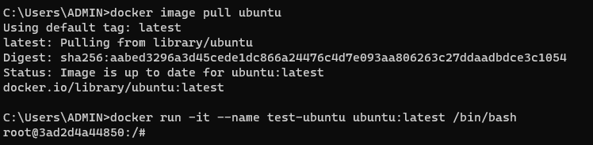

# [Java] Linux


#### 서버에 적합하고, 무료 Open Source 소프트웨어다


#### Linus Torvalds 라는 사람이 이 Linux OS를 만들었다


#### Linux는 Linux Kernel (리눅스 커널) 자체를 의미한다

- 커널은 CPU나 RAM을 포함한 컴퓨터 자원을 관리하고 할당하는 중요한 코어 소프트웨어다
- 이 Linux를 기반으로 커스터마이즈 된 OS를 만들 수 있다


#### Linux 계열에는 RedHat, Ubuntu, Debian이 있다


#### 리눅스 커널은 아래와 같은 디렉토리 구조를 가지고 있다

.png)


#### Docker를 이용해서 리눅스 사용하기




## Linux 명령어


#### 상대 경로 vs 절대 경로

- 상대 경로 : 현재 파일의 위치에서의 경로
- 절대 경로 : 최상위 위치에서의 경

```terminal
./			현재 위치
../			현재 위치에서 한단계 상단 위치
../../		현재 위치에서 두단계 상단 위치

/			루트 경로
```


#### cat

- 하나 혹은 그 이상 파일들의 내용 출

```terminal
# file1과 file2의 내용 출력
$ cat file1 file2

# /etc/passwd 의 내용 출력
$ cat /etc/passwd
```


#### ls

- 디렉토리 컨텐츠 열거

```terminal
# 단순 나열
$ ls
$ ls /dir

# 상세 목록 나열
$ ls -l

# 시간 역순 정렬 나열
$ ls -lrt
```


#### pwd

- 현재 작업 중인 디렉토리 위치 출력

```terminal
$ pwd
```


#### cp

- 파일 복사

```terminal
# file1을 file2라는 이름으로 복사
$ cp file1 file2

# n개의 파일을 dir 디렉토리로 복사
$ cp file1 .. fileN dir
```


#### mv

- 파일 이동
- 파일명 변경

```terminal
# file1을 file2로 이름을 변경
$ mv file1 file2

# 여러 파일을 dir로 이동
$ mv file1 .. fileN dir
```


#### touch

- 파일 생성
- 이미 파일명이 존재할 경우, 마지막 수정 날짜가 업데이트 됨

```terminal
# 빈 파일 생성
$ touch file
```


#### rm

- 파일 삭제
- 되살리기 어려우므로 주의해서 사용

```terminal
# file 삭제
$ rm file

# dir 디렉토리 내 모든 파일 삭제
$ rm -rf / dir

# 절대 쓰면 안되는 명령어 (컴퓨터 리셋...)
$ rm -rf * 
```


#### mkdir

- 새로운 디렉토리 생성

```terminal
$ mkdir dir
```


#### cd

- 현재 작업 중인 디렉토리 변경

```terminal
# dir 디렉토리로 이동
$cd dir

# home 디렉토리로 이동
$ cd
```


#### grep

- 표현과 일치하는 입력 스트림의 라인을 출력

```terminal
# root 라는 단어를 포함하고 있는 /etc 디렉토리 내 모든 파일 확인
$ grep root /etc/*

# file 내에 ERROR가 포함되어 있는 라인 출력
$ cat file | grep "ERROR"
```


#### head

- 파일의 내용을 확인해야 할 경우, 파일의 앞부분만 확인

```terminal
$ head file

# file 앞에서부터 10행까지만 출력
$ head -n 10 file
```


#### tail

- 파일 내용을 확인해야 할 경우, 파일의 뒷부분만 확인

```terminal
$ tail file

$ tail -n 100 file

# file을 모니터링 하면서 실시간으로 출력
# 예) 로그 파일
$ tail -f file
```


#### wc

- 파일의 행, 단어 수를 출력

```terminal
# file의 행수 출력
$ wc -l file

# 파일의 단어 수 출력
$ wc -w file
```


#### pipe (|)

- 명령어 조합 및 연결

```terminal
$ ls -lrt | tail
```


## linux 사용자와 그룹

> #### 계정에 따라서, 파일에 대한 권한이 바뀔 수 있다


### 사용자


#### 루트 계정

- 모든 권한을 가진 관리자 계정


#### 사용자 계정

- 루트 계정으로부터 생성이 되고, 권한을 가질 수 있다
- 루트 계정 이상의 권한을 가질 수 없다


```terminal
# ==== 사용자 추가하기 ====
$> useradd alex

# ==== 사용자 조회 ====
# [사용자명]:[비밀번호]:[uid]:[gid]:[계정설명]:[홈디렉토리]:[셸]
# uid = user id
# gid = group id
$> cat /etc/passwd

# ==== 현재 사용자 ====
$> whoami

# ==== 계정 전환 ====
# - 는 루트 사용자
$> su -
$> su alex
```


### 그룹

> 사용자를 묶어서 관리할 수 있는 단위다
>
> 한 사용자가 여러 그룹에 속할 수 있다


```terminal
# ==== 그룹 조회 ====
$> cat /etc/group

# ==== 그룹 생성 ====
$> groupadd new_group

# ==== 그룹에 신규 사용자 추가 ====
# gid가 1002인 그룹에 alex를 넣기
$> useradd -g 1002 alex
```


### 권한 (Permission)

- 파일에 대해, 어떤 그룹이 어떤 권한을 가지고 있는지 아래와 같이 확인할 수 있


```terminal
# rwxr-xr-x
$> chmod -R 755 file

# rw-r--r--
$> chmod -R 644 file

#r-x--x---
$> chmod -R 510 file
```


### chown

- 파일/디렉토리의 소유자/그룹소유자를 변경

```terminal
# 소유권을 부여할 user와 group명을 입력하고, 변경할 타겟이 되는 파일 이름을 작성한다
# tmp.txt에 대한 파일은 user와 group 에게 소유권이 있다
$> chown user:group tmp.txt

$> chown -R user:group mydir
```


## Linux 셸 스크립트


#### 셸에서 돌아가도록 작성된 스크립트

- *.sh 라는 확장자를 갖게 된다


#### 서버에서 반복해서 실행되어야 하는 작업들을 셸 스크립트로 정의해 놓고, 작업을 수행한다

- 서버에서는 반복적인 작업들이 많다


#### Shebang

- 어떤 셸로 스크립트를 수행하는지 정한다
- echo 는 print라고 생각하면 된다

```shell
# !/ bin/bash

echo "hello World"
```


#### 변수

```shell
# !/ bin/bash

NAME='Linux'
COUNT=10

echo $NAME
```


#### $

```shell
# !/ bin/bash

echo $$ 		# shell pid (프로세스 id)
echo $0			# shell script name
echo $1 - $9	# shell parameter
echo $#			# shell parameter count

echo $? 		# exit code
```


#### 예약변수

```shell
# !/ bin/bash

echo $HOME		# home directory
echo $PATH		# file path
echo $USER		# user account
```


#### if

```shell
# !/ bin/bash

if [condition]
then
	# do something
else
	# do something
fi
```


#### for

```shell
# !/ bin/bash

for VAR in LIST
do
	# do something
done
```


#### while

```shell
# !/ bin/bash

while [condition]
do
	# do something
done
```

