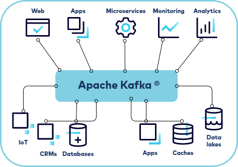
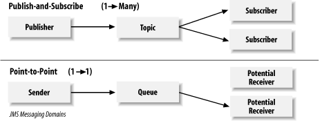
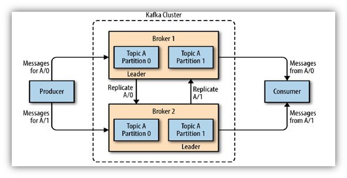
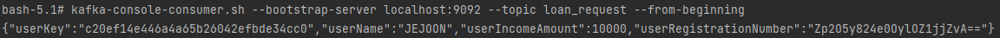

# [Java] Kafka


## Kafka?


#### 아파치 재단에서 운영하는 플랫폼이다


#### Kafka를 이해하기 위해서는 Message Oriented Middleware를 알아야 한다

- Middleware는 시스템과 컴포넌트 사이에 있는 중간자 역할을 해준다
- 두 시스템이 너무 강하게 결합되어 있으면, 서로 의존성이 높게 된다
  - A와 B가 너무 강하게 결합되어 있으면, A에서 에러가 났을때 B도 영향을 받는다
- 즉 의존성이 낮은게 더 좋고, 이것을 도와주는 것이 Middleware다
- 즉 Message Oriented Middleware는, message를 기반으로 중간자 역할을 해주는 것이다
  - 이 **Message Oriented Middleware** 하단에 **Message Queue**가 있는 것
  - 그리고 **Message Queue**를 사용하는 플랫폼이 **Kafka** 같은 플랫폼이 되는 것이다


#### Message Oriented Middleware > Message Queue > Kafka 등의 플렛폼

- Kafka는 대용량 처리에 특화되어 있고, 데이터가 날아가지 않는 비휘발성이다





#### Kafka가 없다면, 위 사진에 모든 어플리케이션은 서로 연결이 되어 있을 것이다

- 하나의 어플리케이션에 에러가 발생하면, 다른 어플리케이션에 영향을 끼칠 수 있다


#### 그렇게 어플리케이션들은 Kafka를 통해서 데이터를 주고 받게 된다


## Message Queue


#### Message를 담는 큐

- 큐는 먼저들어온 데이터가 먼저 빠져 나가는 것이다


#### 메세지 큐를 사용하는 이유

- Asychronous -  비동기 처리가 가능하다
  - 성능 차이를 만들 수 있다 (성능 UP)
  - Sychronous 할 때에는 하나의 서버가 실행 중에는 다른 서버가 실행이 안 된다
  - 메세지 큐를 사용한다면, 하나의 서버가 메세지 큐에 보내지게 되고 프로세스를 쭉 진행한다
- Decoupling
  - 두 컴포넌트의 결합도가 줄어든다
  - 서버 서로 장애가 전이가 되지 않는다
- Scalability
  - Scale up 또는 Scale in이 자유롭다
  - 메세지가 많으면, 메세지 큐를 늘리고, 메세지가 적으면 메세지 큐를 줄이면 된다




#### Point-to-Point

- 하나의 receiver가 메세지를 받게 되면 (consume이 되면), 다른 receiver는 메세지를 볼 수 없다
- Fire and Forget
  - Sender가 메세지를 보내고 메세지에 대한 데이터를 잊어버린다
  - 매우 효율적이지만, 안정적이지 못 하다 (상대방이 메세지를 잘 받았는지 모른다)
- Request and Reply 
  - Sender가 메세지를 보내고, Receiver로부터 잘 받았다는 답변을 받는다 
  - 잘 받았는지 Sender는 기다렸다가, 다음을 진행할 수 있다


#### Publish-and-Subscribe (kafka)

- Publisher는 Message Queue에 메세지/토픽을 보낸다 
- Subscriber는 Message Queue에 연결되어 있는 어플리케이션/서버고 그 메세지/토픽을 받게 된다


## Kafka in Detail




#### 여러 Broker를 통해 하나의 Kafka Cluster를 구성한다 

- Broker는 Kafka를 구성한 서버다

- Broker는 가용성은 높이기 위해, 여러 Broker가 있을 수 있다

- 하나의 Broker에 문제가 생기면 Kafka를 사용할 수 없어 여러 Broker를 두게 된다
  - 권장은 최소 3대 이상 
  - 하나의 서버가 내려가게 되면, 다른 Broker를 사용할 수 있게 된다


#### Broker 안에는 여러 Topic이 존재할 수 있고, Topic 안에는 여러 Partition이 있다

- Partition은 주로 Consumer와 비교하여 수를 맞춘다
- **Partition을 병렬 처리를 통해 메세지가 처리가 되고, 시스템의 효율성을 높인다**


#### 각 Topic에 Leader Partition이 있고, 나머지는 Follower Partition이 된다

- Leader : Producer와 Consumer와 직접 통신한다
- Follower : Leader Partition에 있는 메세지를 복제 (Replicate)를 한다


#### 여러 브로커 중에 하나가 컨트롤러 역할을 맡는다

- 다른 브로커에서 비정상적으로 응답이 나오게 되면, 해당 브로커에 대한 Leader Partition을 바꿔줄 수 있다
- 즉 컨트롤러들은 브로커의 장애를 감지한다


#### 코디네이터

- 컨슈머 (Consumer) 그룹의 장애를 감지한다
- 특정 컨슈머에 장애가 감지가 되면 해당 컨슈머가 구독한 토픽들을 다른 컨슈머에 보내게 된다
  - 즉 장애가 발생한 컨슈머에 메세지를 안 보내고 다른 컨슈머에 보내게 된다


#### Replication Factor는 브로커 개수보다 같거나 적어야 한다


#### Partition과 Consumer의 개수를 맞추는 이유

- Partition이 더 적으면 Consumer 중, 아무것도 안 하는 컨슈머가 생긴다
- 여러 개의 Consumer가 하나의 Partition을 구독할 수 없다
- 반대로 여러 개의 Partition이 한 개의 Consumer와 연결될 수 있다
- 1(Consumer) : N (Partition)


#### Ack

- 0 인 경우
  - Producer -> Leader Partition 에 전송 후 응답값 받지 않음
- 1 인 겨우
  - Producer -> Leader Partition 에 전송 후 Leader Partition의 응답을 받는다
- all 인 경우
  - Producer -> Leader Partition 에 전송 후 Replication 정상 응답까지 기다린다


#### Disk I/O

- 디스크에 메세지를 저장을 한다
- Disk I/O만 있으면 성능이 저하될 수 있지만 Page Cache가 있다


#### Page Cache를 통하여 성능 개선

- OS를 사용하는 캐시이다
- 한번 사용하면, 나중에 더 빠르게 실행을 할 수 있게 된다


#### Kafka와 서비스는 분리해주는 것이 좋다 

- 같은 메모리를 사용하는데, 모든 것을 합쳐서 실행하면 성능 저하가 생긴다
- Kafka가 메모리를 많이 잡아 먹는다 / 서비스에 영향을 준다


#### 데이터 전송을 배치 처리

- 데이터 발행하고 구독을 할 때마다 묶어서 보내며 리소스 소모를 최소화 한다
- 데이터를 개별적으로 발행하고 구독을 하면 성능이 저하될 수 있다


#### KAFKA / Zookeeper 연동

- docker-compose.yml 파일 만들기

```yaml
version: '2'
services:
  zookeeper:
    image: wurstmeister/zookeeper
    container_name: zookeeper
    ports:
      - "2181:2181"

  kafka:
    image: wurstmeister/kafka:2.12-2.5.0
    container_name: kafka
    ports:
      - "9092:9092"
    environment:
      KAFKA_ADVERTISED_HOST_NAME: 127.0.0.1
      KAFKA_ZOOKEEPER_CONNECT: zookeeper:2181
    volumes:
      - /var/run/docker.sock:/var/run/docker.sock
```

- docker에 세팅이 되면, `docker exec -it kafka bash`로 Kafka 실행하기


#### 토픽 생성하기

```bash
# Kafka 토픽을 localhost:9092에 파티션 1개와 복제본 1개로 이름이 test로 생성하여라

kafka-topics.sh --create --bootstrap-server localhost:9092 --replication-factor 1 --partitions 1 --topic test

# Kafka 토픽 조회
 kafka-topics.sh --list --bootstrap-server localhost:9092
 
# 발행이 잘 됬는지 확인하기
kafka-console-consumer.sh --bootstrap-server localhost:9092 --topic loan_request --from-beginning
```




