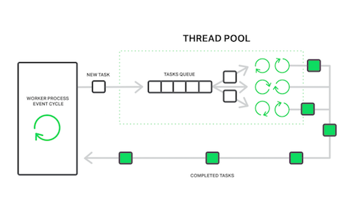

# [Java] Nginx

## NginX

#### 굉장히 가벼운 웹 서버고, 많은 요청이 들어와도 좋은 성능을 보이고 있다

#### Apache vs NginX

- **Apache**
  - 요청이 아파치 웹서버로 들어올 때마다, 프로세스를 생성을 하여, 프로세스가 하나의 요청을 처리한다
  - 요청이 들어올 때마다 프로세스를 생성하여 오버해드가 발생할 수 있다 
  - 비교적 무겁고,  성능이 NginX에 비해 떨어진다
- **NginX**
  - master 또는 worker 프로세스를 configuration에 따라서 미리 생성해 놓는다
  - Task Queue에다가 요청을 쌓아두고, 한 개의 프로세스가 여러 개의 요청을 처리한다
    - Task Queue에다가 요청을 쌓아두면서, 비동기 처리도 가능해진다 
    - 미리 프로세스를 적게 두면 Task Queue 쌓이는 요청이 많아 응답이 느려진다
    - 반대로 너무 많이 두면, 놀고 있는 프로세스들이 많아진다
  - 오버해드가 적고, 여러 개의 요청이 들어올 때에, 더 좋은 성능을 띄게 된다

#### NginX는 프록시 서버로 많이 사용이 된다

- 프록시 서버는 중간에 대리로 요청을 받아주고, 요청을 원래 보내려고 했던 목적지로 보내준다
- 프록시는 두 가지가 있다
  - **Forward Proxy : 프록시 위치가 클라이언트/유저 바로 앞에 있다**
    - 클라이언트/유저의 요청이 프록시로 바로 보내지게 되고, 프록시가 바로 서버로 요청을 보낸다
    - 요청이 반복적으로 들어오면, 프록시에서 캐싱을 해둔다 (서버까지 요청이 가지 않아도 된다)
    - 프록시를 통해서 개인 정보를 보호 받을 수 있다 (서버는 유저가 아닌 프록시와 직접적으로 연결이 되어 있다)
  - **Reverse Proxy** : 서버에 관점에서 프록시가 설치가 되어 있다 (인터넷과 서버 사이)
    - 어느 서버에 요청을 보낼지 결정해 줄 수 있다
    - 보안적인 장점이 있다 (대부분의 서버는 DB와 직접적으로 연결이 되어 있는데, reverse proxy를 통해서 유저가 서버에 직접적으로 다을 수 없도록 만들어준다)

