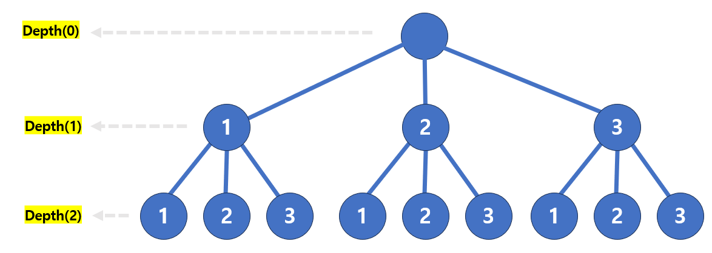

# [Java] DFS


#### 전위 순회

```java
class Solution {
    public void DFS(int v) {
        if (v > 7) return;
        else {
            System.out.print(v + " ");
            DFS(v * 2);
            DFS(v * 2 + 1);
        }
    }
    
    public static void main(String[] args) {
        Solution T = new Solution();
        T.DFS(1);
    }
}

// return : 1 2 4 5 3 6 7
```


#### 중위 순회

```java
class Solution {
    public void DFS(int v) {
        if (v > 7) return;
        else {
            DFS(v * 2);
            System.out.print(v + " ");
            DFS(v * 2 + 1);
        }
    }
    
    public static void main(String[] args) {
        Solution T = new Solution();
        T.DFS(1);
    }
}

// return : 4 2 5 1 6 3 7
```


#### 후위 순회

```java
class Solution {
    public void DFS(int v) {
        if (v > 7) return;
        else {
            DFS(v * 2);
            DFS(v * 2 + 1);
            System.out.print(v + " ");
        }
    }
    
    public static void main(String[] args) {
        Solution T = new Solution();
        T.DFS(1);
    }
}

// return : 4 5 2 6 7 3 1
```


### 중복 순열


#### - [1, 2, 3] 에서 2개를 뽑아서 순열을 만든다 (중복 가능)



```java
public class DFS {

    private static int[] result;
    public static void permutationOne(int[] num, int depth) {

        if (depth == result.length) {
            for (int r : result) System.out.print(r + " ");
            System.out.println();
            return;
        }

        for (int i = 0; i < num.length; i ++) {
            result[depth] = num[i];
            permutationOne(num, depth + 1);
        }
    }

    public static void main(String[] args) {

        int[] numbers = new int[]{1, 2, 3};
        int limit = 2;
        result = new int[limit];

        permutationOne(numbers, 0);
    }
}
```


### 순열 (중복 X)


```java
public class DFS {

    private static int[] result;
    private static boolean[] visited;
    
	public static void permutationTwo(int[] num, int depth) {
        if(depth == result.length) {
            for (int r : result) System.out.print(r + " ");
            System.out.println();
            return;
        }

        for (int i = 0; i < num.length; i ++) {

            if (!visited[i]) {
                visited[i] = true;
                result[depth] = num[i];
                permutationTwo(num, depth + 1);
                visited[i] = false;
            }
        }
    }

    public static void main(String[] args) {

        int[] numbers = new int[]{3, 6, 9};
        int limit = 2;
        result = new int[limit];
        visited = new boolean[numbers.length];

        permutationOne(numbers, 0);
        System.out.println("======================");
        permutationTwo(numbers, 0);
    }
}
```


### 조합

- 서로 다른 n 개에서 순서 없이 r 개를 뽑는 경우
  - [1, 2] 와 [2, 1] 은 같음

