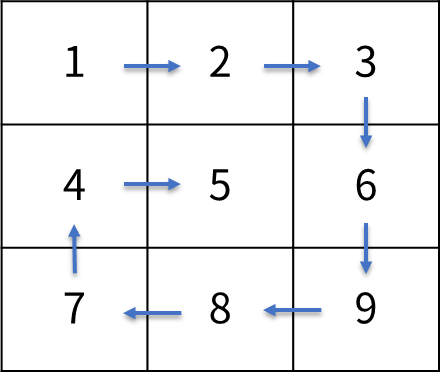

Practice4
===

문제 설명
---

MxN 행렬 정보가 2차원 정수형 배열 matrix 에 주어지면  
아래 그림과 같이 나선형 모양으로 출력하는 프로그램을 작성하세요.

입출력 예시
---
|입력|출력|
|---|---|
|{{1, 2, 3}, {4, 5, 6}, {7, 8, 9}}|1, 2, 3, 6, 9, 8, 7, 4, 5|
|{{1, 2, 3, 4}, {5, 6, 7, 8}, {9, 10 ,11 ,12}}|1, 2, 3, 4, 8, 12, 11, 10, 9, 5, 6, 7|
