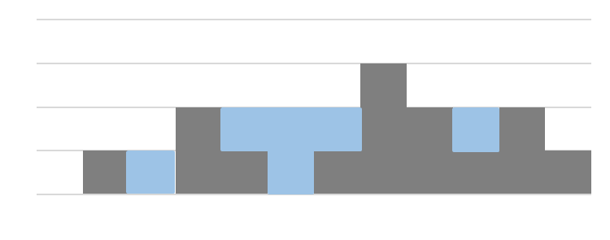

Practice5
===

문제 설명
---
n개의 정수형 데이터가 height 배열에 주어졌다.  
height 배열의 각각의 원소는 아래 그림과 같이 각 벽에 대한 높이를 의미한다.

이와 같이 높이 값들이 주어졌을 때,  
벽 사이사이의 빈 공간에 담을 수 있는 물의 총량을 출력하세요.

입출력 예시
---
|입력|출력|
|---|---|
|0, 1, 0, 2, 1, 0, 1, 3, 2, 1, 2, 1|6|
|4, 2, 0, 3, 2, 5|9|
