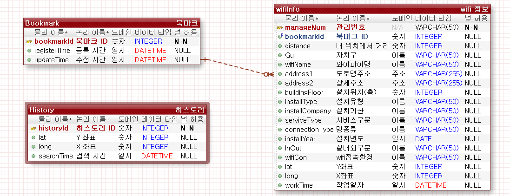
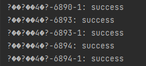
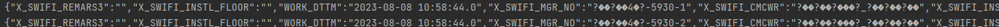
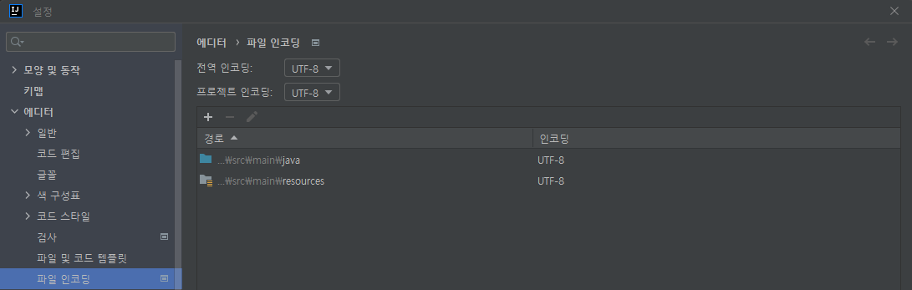

# Mission 1

**서울시 공공 와이파이 서비스 위치 정보 분석**

- https://data.seoul.go.kr/dataList/OA-20883/S/1/datasetView.do

**SQLite DB 연결하고 테이블 생성하기**

- **와이파이와 관련된 정보 :** 내 위치와의 거리 / 관리번호 / 자치구 / 와이파이명 / 도로명주소 / 상세주소 / 설치위치(층) / 설치유형 / 설치기관 / 서비스구분 / 망종류 / 설치년도 / 실내외구분 / WIFI접속환경 / X좌표 / Y좌표 / 작업일자
- **위치 히스토리** : ID / x좌표 / y좌표 / 조회일자
- **북마크** : ID / 북마크이름 / 등록일자 / 수정일자

**CRUD 중 Create를 통해 와이파이 Open API에 있는 데이터를 Table에 저장하기**

## ERD, 데이터 모델링

- History 같은 경우, '나의 위치'를 불러올 때마다, 저장을 하는 것이라서 wifiInfo 테이블과는 크게 상관없다고 판단했다
  - '나의 위치'를 기준으로 wifiInfo에서 가까운 20개의 와이파이를 찾으면 된다
  - 그것을 연관 지어서 데이터를 저장하고, 그럴 필요는 없다

- 추후 wifiInfo에서 변경 사항
  - 작업 일자 : String으로 변환
  - Year : Integer로 변환
  - 설치위치 : String으로 변

## Issues

### **Index.jsp에서 Open API 와이파이 정보 가져오기**

- 위를 누르면, DB를 업데이트 할 수 있도록 만드려고 했다
- 하지만 Open API의 key값에 한글이 포함이 되어 있는데, 한글이 깨지면서, 새로운 데이터라고 인식하여, 추가로 데이터를 넣게 되었다
- 포멧을 하는 방법을 찾고 있다
- 아래처럼 키 값이 한글이 아닌, 깨진 형태로 DB에 저장이 되었다

#### 1차적으로 SQLITE 부분에서 잘 못 된 것 같았다

- 데이터를 SQLite에 넣는 DataInput.java 부분에서 시간을 많이 썼다

#### 생각을 해보니 Open API를 받아서, ArrayList에 저장하는 과정에서 잘 못 된 것 같다!

#### 결과 : 세팅에서 UTF-8을 바꾸면 되었다

- 기본적으로 JSP 파일에 **<%@ page language="java" contentType="text/html; charset=UTF-8" pageEncoding="UTF-8" %> **을 넣는다
- **파일 -> 설정 -> 에디터 -> 파일 인코딩**
  - 전역 인코딩, 프로젝트 인코딩을 UTF-8 으로 바꾼다

