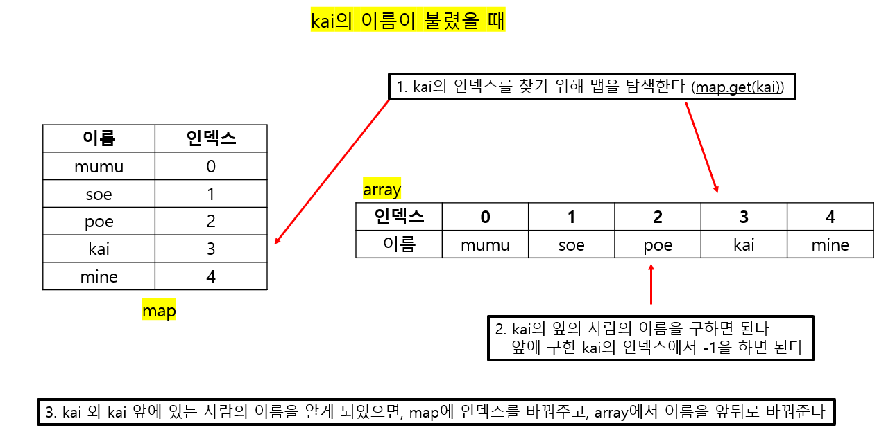

# 20230628 [Java] 문제풀이 


## 달리기 경주

#### players 배열은, 경주가 시작할 때에, 선수들이 배치된 순서다

#### callings는, 선수 이름이 불릴 때마다, 앞에 선수와 순위가 바뀌는 것이다

- 즉 선수 이름이 불리면, 앞에 선수를 추월한 것이다


#### 처음에는 너무 배열로 하겠다는 생각만 해서, 시간 초과가 나왔다


#### 추후에 map을 사용해서 앞의 선수의 이름, 그리고 등수를 찾으면서, 배열에서 선수의 자리를 바꿔주었더니, 시간 초과를 해결할 수 있었다




```java
import java.util.*;
class Solution {
    public String[] solution(String[] players, String[] callings) {
        
        HashMap<String, Integer> map = new HashMap<String, Integer>();
        
        for (int i = 0; i < players.length; i++) {
            map.put(players[i], i);
        }
        
        for (String call : callings) {
            int curIdx = map.get(call); // 이름 불린 사람의 인덱스
            String frontRun = players[curIdx - 1]; // 이름 불린 사람의 앞의 사람
            
            players[curIdx] = frontRun;
            players[curIdx - 1] = call;
            
            map.put(call, curIdx - 1);
            map.put(frontRun, curIdx);
        }
        
        return players;
    }
}
```


## 추억 점수

#### 그리워 하는 사람들의 이름이 포함된 배열과, 그 사람들을 그리워하는 정도의 정수가 적힌 배열이 주어진다


#### 그리고 사람 이름이 들어간 2중 배열이 주어진다


#### 2중 배열에서 각 배열에, 그리워 하는 사람들의 점수들을 더해서 새로운 배열에 출력을 하는 것이다

- 이 2중 배열에는 그리워하지 않은 사람들이 있을 수 있다 (그 사람들은 0점)


```java
import java.util.*;

class Solution {
    public int[] solution(String[] name, int[] yearning, String[][] photo) {
        int[] answer = new int[photo.length];
        HashMap<String, Integer> missMap = new HashMap<String, Integer>();
        
        // 맵에 이름과 보고싶어하는 정도를 넣기 (key, value)
        for (int i = 0; i < name.length; i++) missMap.put(name[i], yearning[i]);
        
        for (int i = 0; i < photo.length; i++) {
            int tempAdd = 0;
            
            for (int j = 0; j < photo[i].length; j++) {
                // 맵에 이름이 있으면, tempAdd에 더하기
                if (missMap.containsKey(photo[i][j])) {
                    tempAdd += missMap.get(photo[i][j]);  
                }
            }
            answer[i] = tempAdd;
        }
        return answer;
    }
}
```


