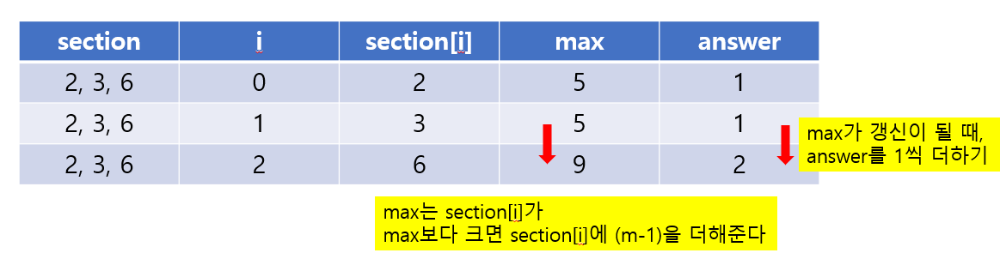

# 20230702 [Java] 문제풀이 


## [프로그래머스] 덧칠하기

#### 페인트 칠을 하는 것이고, 칠해야 하는 구역 section이 주어지고, 한번에 칠할 수 있는 길이 m이 주어진다


#### 여기서, 페인트 칠은, 칠해야 하는 구역은 무조건 칠해야 하고, 이미 칠해진 곳에 덧칠할 수 있다


#### max 라는 변수를 만들어서, 페인트 칠을 할 수 있는 마지막 구역을 정해준다

- max 안에 들어간 구역들은, 한번에 페인트 칠이 될 수 있는 공간이다
- **section[i] <= max** : 이 구역들은 그냥 넘어가도 된다


#### 처음에 section[0] + (m - 1) 을 하여 max를 구해주고, 그 이후 계속 갱신을 시켜주면 몇 번의 페인트 칠을 해야 하는지 구해준다 





```java
class Solution {
    public int solution(int n, int m, int[] section) {
        int answer = 1;
        int max = section[0] + (m - 1);
        
        for (int i = 0; i < section.length; i++) {
            if (section[i] <= max) {
                continue;
            }
            
            max = section[i] + (m-1);
            answer += 1;
        }
        
        return answer;
    }
}
```


## [프로그래머스] 대충 만든 자판

#### HashMap을 사용해서 풀었던 문제


#### HashMap에 key로는 알파벳을 저장하고, value에는 keymap에서 주어진 알파벳 위치를 저장한다


#### 여기서 제일 중요한 것은 keymap에 같은 알파벳이 여러 번 주어지는 것이다

- **그 뜻은 같은 알파벳이 주어진다면, 제일 앞에 있는 알파벳의 위치를 HashMap에 저장하는 것이다**


#### 그리고 targets를 순회하면서, 나온 HashMap의 value를 더하는 것을 누적 시켜주면 정답이 나온다


```java
import java.util.*;

class Solution {
    public int[] solution(String[] keymap, String[] targets) {
        int[] answer = new int[targets.length];
        HashMap<Character, Integer> map = new HashMap<Character, Integer>();
        
        
        for (int i = 0; i < keymap.length; i++) {
            for (int j = 0; j < keymap[i].length(); j++) {
                
                char alphabet = keymap[i].charAt(j);
                
                if (!map.containsKey(alphabet)) {
                    map.put(alphabet, j + 1);
                } else {
                    int idx = map.get(alphabet);
                    
                    map.put(alphabet, Math.min(idx, j + 1));
                }
            }
        }
        
        for (int i = 0; i < targets.length; i++) {
            for (int j = 0; j < targets[i].length(); j++) {
                char alpha = targets[i].charAt(j);
                if (!map.containsKey(alpha)) {
                    answer[i] = -1;
                    break;
                } else {
                    answer[i] += map.get(alpha);
                }
            }
        }
        
        return answer;
    }
}
```


## [프로그래머스] 햄버거 만들기


#### 주어진 배열 ingredient를 순회하면서 stack에 재료들을 넣는다


#### stack에 4개 이상의 재료들이 있을 때에, 1, 3, 2, 1 로 뒤에서부터 배치가 되어 있을 때에, answer에 1을 더한다

- 즉 1, 2, 3, 1 이 성사되는 것으로 햄버거 하나를 만들 수 있다는 것이다


#### stack.get()을 사용하여, 맨 뒤에서부터 뒤에서 4번째까지의 재료를 파악한다


```java
import java.util.*;

class Solution {
    public int solution(int[] ingredient) {
        int answer = 0;
        Stack<Integer> stack = new Stack<Integer> ();
        
        for (int ingr : ingredient) {
            stack.push(ingr);
            
            if (stack.size() >= 4) {
                if (stack.get(stack.size() - 1) == 1 &&
                   stack.get(stack.size() - 2) == 3 &&
                   stack.get(stack.size() - 3) == 2 &&
                   stack.get(stack.size() - 4) == 1) {
                    for (int i = 0; i < 4; i ++)  {
                        stack.pop();
                    }
                    answer += 1;
                }
            }
        }
        
        return answer;
    }
}
```

