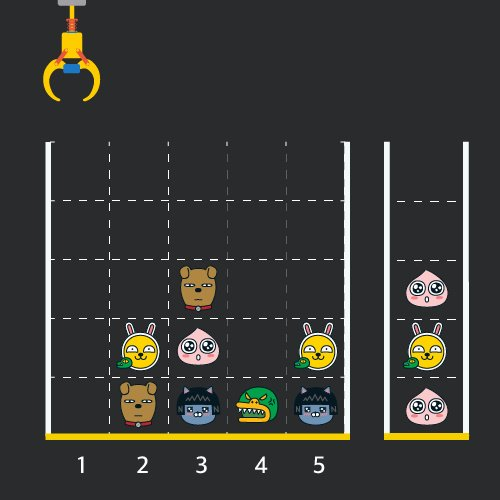

# 20230708 [Java] 문제풀이 


## [프로그래머스] 체육복

#### 체육복을 도난 당한 학생들의 배열과, 여벌이 있는 학생들의 배열이 주어진다


#### 여벌이 있는 학생은, 도난당한 학생에게 체육복을 빌려줄 수 있다

- 단 도난 당한 학생은, 자신보다 1 아래 또는 1 위에 있는 학생의 체육복을 빌릴 수 있다


#### 여벌이 있지만, 체육복을 도난 당했다면 (그 학생은 다른 학생에게 체육복을 빌려줄 수 없게 된다)


#### 일단 새로운 배열을 만들었다

- 학생들의 번호를 인덱스로 넣었다 (-1을 해줌)
- 그리고 값은
  - -1 : 도난 당함
  - 0 : 자기 자신의 체육복만 있음
  - 1 : 여벌이 있는 학생

#### 그리고 이 배열을 순회하면서, 도난 당한 학생의 index - 1 또는 index + 1의 값이 1이라면 1을 더해준다

- 더해줬다는 것은, 체육복을 빌렸다는 의미다


#### 배열의 0 또는 1의 개수를 세면, 정답을 구할 수 있다


```java
class Solution {
    public int solution(int n, int[] lost, int[] reserve) {
        int answer = 0;
        
        int[] student = new int[n];
        
        for (int st : lost) student[st - 1] -= 1;
        for (int st : reserve) student[st - 1] += 1;
        
        for (int i = 0; i < n ; i++) {
           if (i == 0 && student[i] == -1) {
               if (student[i + 1] == 1) {
                   student[i] ++;
                   student[i + 1] --;
               }
           } else if (i == n - 1 && student[i] == -1) {
               if (student[i - 1] == 1) {
                   student[i - 1] --;
                   student[i] ++;
               }
           } else {
               if (student[i] == -1 && student[i - 1] == 1) {
                   student[i] ++;
                   student[i - 1] --;
               } else if (student[i] == -1 && student[i + 1] == 1) {
                    student[i] ++;
                    student[i + 1] --;  
               }
           }
        }
        
        for (int num : student) {
            if (num == 0 || num == 1) {
                answer += 1;
            } 
        }
        
        return answer;
    }
}
```


## [프로그래머스] 크레인 인형 뽑기

#### 인형 뽑기 기계의 형태를 board라는 행열 배열로 구현을 했다


#### 그리고 moves를 통해, 인형 뽑기를 진행한다





#### 인형들을 뽑으면, 옆에 바구니에 쌓아둔다


#### 쌓아두면서, 제일 위에 있는 인형과 겹치게 된다면, 방금 뽑은 인형과, 바구니 제일 위에 있는 인형을 빼다

- 그렇게 뺀 인형의 개수를 구하는 문제이다


### 구현!!

#### 쌓아 두면서, 제일 위에 있는 인형을 없애고, 제일 위에 있는 인형부터 뽑는 것이라는 것은 Stack을 이용하는 문제라고 생각했다


#### 그래서 움직임, moves들을 빠르게 탐색을 하기 위해 HashMap을 사용을 했다

- HashMap key : 인형 뽑기 기계의 위치, 몇 번째 위치에서 인형을 뽑는지 위치 정보를 key에 저장한다
- HashMap value : 값에는 stack을 넣는다
  - 그렇게 해야 key를 찾고, 위치에 있는 인형들 중에 제일 위에 있는 인형을 바로 뽑을 수 있게 된다


#### HashMap에 데이터들을 저장하기 위해 board의 좌표를 순회했다

- 순회는 0,0 부터가 아닌, 제일 마지막의 좌표부터 0, 0 까지 순회를 했다
- 이 이유는 Stack은 LIFO(Last In First Out)으로, 마지막에 들어온 값이 먼저 빠지기 때문에, 마지막부터 순회를 했다
  - 밑에서가 아니라 위에서 인형을 뽑기 때문에


#### 이정도 구현을 하면 moves 배열을 순회하면서, 인형을 뽑고, 문제에서 구현하라는 대로, 구현을 하면 된다!


```java
import java.util.*;
class Solution {
    public int solution(int[][] board, int[] moves) {
        int answer = 0;
        
        HashMap<Integer, Stack> dolls = new HashMap<Integer, Stack>();
        Stack<Integer> basket = new Stack<Integer>();
        
        for (int i = 0; i < board.length; i ++) {
            dolls.put(i + 1, new Stack<Integer>());
        }
        
        for (int x = board.length - 1; x >= 0; x--) {
            for (int y = board[0].length - 1; y >= 0; y--) {
                if (board[x][y] > 0) {
                    Stack<Integer> tempStack = dolls.get(y + 1);
                    tempStack.push(board[x][y]);
                } 
            }
        }
        
        for (int move : moves) {
            Stack<Integer> slot = dolls.get(move);
            
            if (slot.size() > 0) {
                int doll = slot.pop();
                
                if (basket.size() > 0 && doll == basket.peek()) {
                    answer += 2;
                    basket.pop();
                } else {
                    basket.push(doll);
                }
            }
        }
        
        return answer;
    }
}
```

