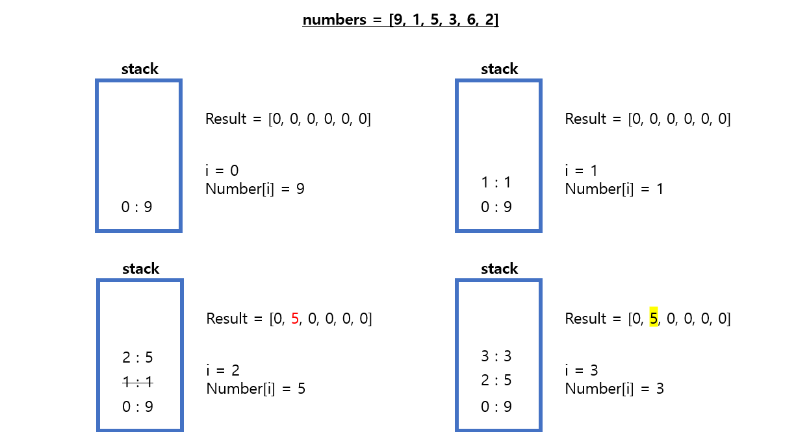
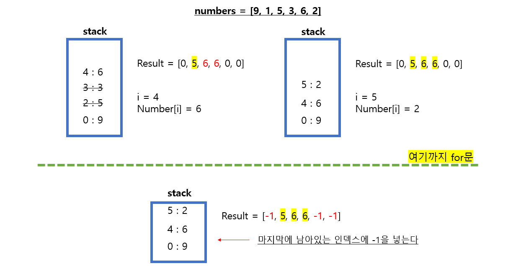

# 20230711 [Java] 문제풀이 


## [프로그래머스] 뒤에 있는 큰 수 찾기


#### 스택을 안 사용하고, 이중 for문을 사용하니깐 시간 초과가 나왔다


#### 스택을 이용하여 뒤에 있는 큰 수를 찾기 위해 스택을 사용할 수 있다







```java
import java.util.*;

class Solution {
    public int[] solution(int[] numbers) {
        int[] result = new int[numbers.length];
        Stack<Integer> stack = new Stack<>();
        
        for (int i = 0; i < numbers.length; i ++) {
            if (stack.isEmpty()) {
                stack.push(i);
            } else {
                if (numbers[stack.peek()] >= numbers[i]) {
                    stack.push(i);
                } else {
                    while (true) {
                        result[stack.pop()] = numbers[i];
                        if (stack.isEmpty()) {
                            break;
                        } else if (numbers[stack.peek()] >= numbers[i]) {
                            break;
                        }
                    }
                    stack.push(i);
                }
            }
        }
        
        while (!stack.isEmpty()) {
            result[stack.pop()] = -1;
        }
        
        return result;
    }
}
```


